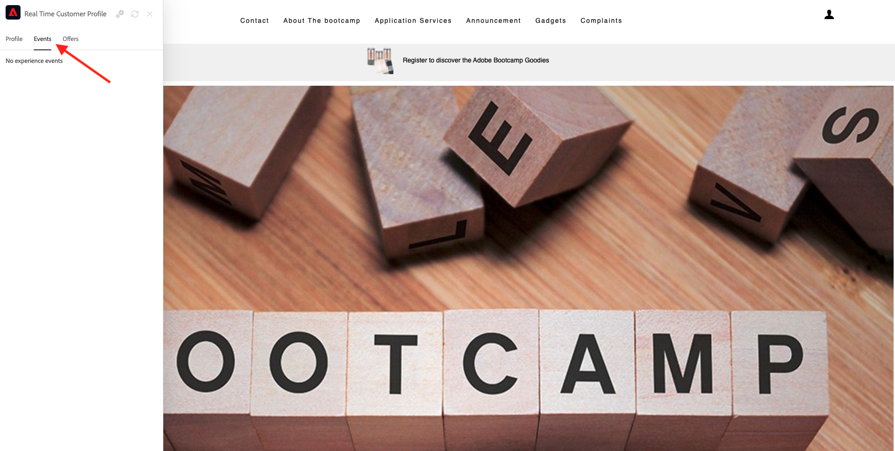

# 1.1. Site van desconhecido ao conhecido em nosso

## Contexto

A Adobe Experience Platform desempenha um papel importante nessa jornada. A plataforma é o cérebro da comunicação, o **ervaringssysteem**.

Plataforma é um ambiente em que a palavra cliente engloba mais do que clientes conhecidos. Ubezoekante desconhecido no site também é um cliente do ponto de vista da Plataforma e, como tal, todo o comportamento de um bezoekante desconhecido também é enviado à Plataforma. Graças a essa abordagem, quando esse bezoekante eventualmente se torna um cliente conhecido, uma marca também pode visualizar o que aconteceu antes daquele momento. Isso ajuda a partir de uma perspectiva de otimização de atribuição e experience ência.

## Fluxo da jornada do cliente

Acesse [https://bootcamp.aepdemo.net](https://bootcamp.aepdemo.net). Clique em **Alles toestaan**.

Clique no ícone do logotipo da Adobe no canto superior esquerdo da tela para abrir o Visualizador de perfil.

Verifique o chilel do Visualizador de perfil e no Perfil do cliente em tempo real com o **Experience Cloud-id** como o identificador primário para este cliente que ainda é desconhecido .

Você também pode ver todos os Eventos de Erência coletados com base no comportamento do cliente. A lista está vazia no momento, mas isso mudará em breve.

Een opção de-menu openen **Toepassingsservices** e clique no produto **Real-Time CDP**.

Você verá a página de detalhes do produto. Evento de Experience do tipo **Productweergave** agora foi enviado para a Adobe Experience Platform usando a implementação do Web SDK que você revisou no Módulo 1. Abra o chilel Visualizador de perfil e verificque seus **Experience Events**.

Een opção de-menu openen **Toepassingsservices** e clique no produto **Adobe Journey Optimizer**. Mais um Evento de experience ência foi enviado para a Adobe Experience Platform.

Abra o pijnel Visualizador de perfil. Agora você verá 2 Eventos de experience ência do tipo **Productweergave**. Embora o comportamento seja anônimo, cada clique é rastreado e armazenado na Adobe Experience Platform. Depois que o cliente anônimo se tornar conhecido, poderemos mesclar todo o comportamento anônimo automcamente ao perfil conhecido.

Agora vamos analisar seu perfil de cliente e usar seu comportamento para personalizar sua experience ência do cliente no site.

Próxima etapa: [1.2 Visualiseren seu próprio perfil de cliente em tempo real - UI](./ex2.md)

[Retornar para Fluxo de Usuário 1](./uc1.md)

[Retornar para Todos os Módulos](../../overview.md)
