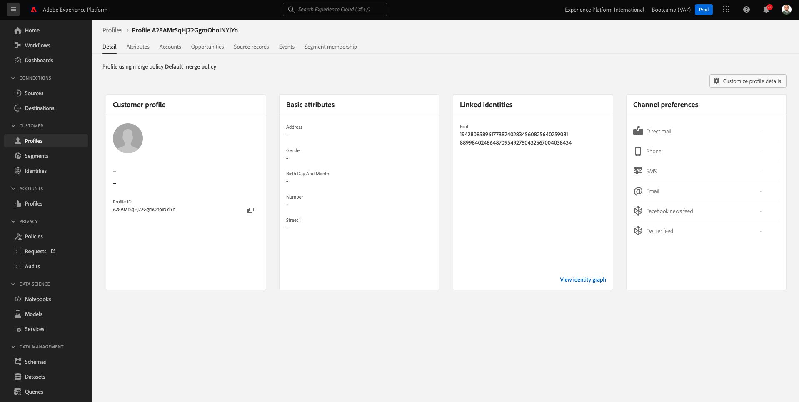

# 1.2 Visualiseren seu próprio perfil de cliente em tempo real - UI

Neste uitoefício, você irá fazer login na Adobe Experience Platform e visualizar seu próprio Perfil de cliente em tempo real na UI.

## História

No Perfil do cliente em tempo real, todos os dados do perfil são exibidos juntamente com os dados do evento, além das associações de segmentos existentes. Os dados mostrados podem vir de qualquer lugar, de aplicativos da Adobe e solution ções externas. Essa a a exibição mais poderosa da Adobe Experience Platform, o verda deiro local do sistema de experience ência.

## 1.2.1 Gebruik een visualização do perfil do cliente e Adobe Experience Platform

Acesse [Adobe Experience Platform](https://experience.adobe.com/platform). Depois de fazer login, você irá acessar a página inicial da Adobe Experience Platform.

Antes de continue ar, vocêprecisa selecionar um **sandbox**. O nome do sandbox a ser selecionado é Bootkamp. É bezível fazer isso clicando no texto **[!UICONTROL Productieproduct]** Na linha azul na parte superior da tela. Depois de selecionar o sandbox apropriado, você verá a tela mudando e agora você está em seu [!UICONTROL sandbox] toewijding.

Geen menu à esquerda, acesse **Profielen** e **Bladeren**.

Geen pijnlijke Visualizador de perfil op seu-locatie, você pode contrasteert een visão geral da identidade. Cada identifier está vinculada a um namespace.

Geen pijnel Visualizador de perfil, agora você pode ver uma identificeerde semelhante a seguinte:

| Naamruimte | Identiteit |
|:-------------:| :---------------:|
| Experience Cloud ID (ECID) | 19428085896177382402834560825640259081 |

Com a Adobe Experience Platform, todos os IDs são igualmente importantes. Anteriormente, o ECID era o ID mais importante no contexto da Adobe e todos os outros IDs estavam vinculados ao ECID em uma relação hierárquica. Com a Adobe Experience Platform, isso mudou e cada ID pode ser overweging, um identificador primário.

Normalmente, o identificador primário depende do contexto. Se você perguntar ao seu Call Centre: **Qual é of ID mais importante?** Eles provavelmente responderão: **o número de telefone!** Mas se você perguntar à sua equipe de CRM, eles responderão: **o endereço de e-mail!** A Adobe Experience Platform entende essa complexidade e gerencia isso para você. Cada aplicativo, seja um aplicativo da Adobe ou não, se comunicará com a Adobe Experience Platform referindo-se ao ID que bezam principal. E simpesmente funciona

Para o campo **Naamruimte identiteit**, selecione **ECID** e para o campo **Identiteitswaarde** binnen ECID que você pode is geen pijnlijke Visualizador de perfil do site do Bootkamp. Clique em **Weergave**. Você verá seu perfil na lista. Clique no **Profiel-id** para abrir seu perfil .

Agora voctem uma visão geral de algun **Atributos de perfil** importantes do seu perfil de cliente.

Acesse **Gebeurtenissen**, de onde você pode ver als entradas de cada evento de ervarência vinculado ao seu Perfil.

Por fim, acesse a opção de menu **Segmentlidmaatschap**. Agora você verá todos os segmentos que se kwalificficam para este perfil.

Agora vamos criar um novo segmento que permitirá que você personalize a experience ência do cliente para um cliente anônimo ou conhecido.

Próxima etapa: [1.3 Crie um segmento - UI](./ex3.md)

[Retornar para Fluxo de Usuário 1](./uc1.md)

[Retornar para Todos os Módulos](../../overview.md)
