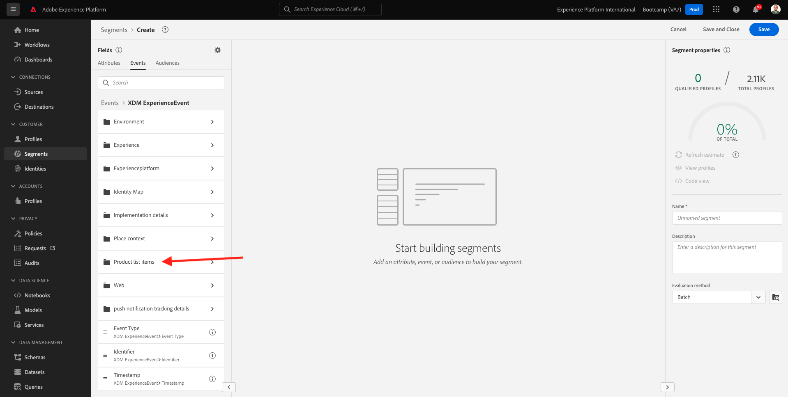
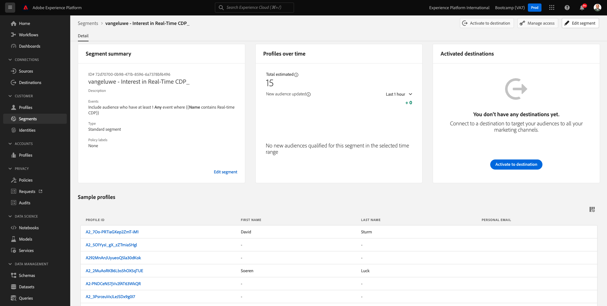

# 1.3 Crie um segmento - UI

Neste uitoefício, você irá criar um segmento usando o Construtor de Segmentos da Adobe Experience Platform.

## História

Acesse [Adobe Experience Platform](https://experience.adobe.com/platform). Depois de fazer login, você irá acessar a página inicial da Adobe Experience Platform.

Antes de continue ar, vocêprecisa selecionar um **sandbox**. O nome do sandbox a ser selecionado é ``Bootcamp``. É bezível fazer isso clicando no texto **[!UICONTROL Productieproduct]** Na linha azul na parte superior da tela. Depois de selecionar o sandbox apropriado, você verá a tela mudando e agora você está em seu [!UICONTROL sandbox] toewijding.

Geen menu à esquerda, acesse **Segmenten**. Nesta página, você tem uma visão geral de todos os segmentos bestaat. Clique no botão + Criar segmento para começar a criar um novo segmento.

Quando estiver no novo construtor de segmentos, você irá perceber imediatamente a opção de menu **Attributen** e a referência do **Afzonderlijk XDM-profiel**.

Como XDM é a linguagem que alimenta o setor de experience ência, o XDM também é a base para o construtor de segmentos. Todos os dados ingeridos na plataforma devem ser mapeados em relação ao XDM e, portanto, todos os dados se tornam parte do mesmo modelo de dados, Independent emente da origem desses dados. Isso oferece uma grande vanvoordm ao criar segmentos, pois a partir dessa interface do usuário do construtor de segmento, é bezível combinar dados de qualquer origem no mesmo fluxo de trabalho. Os segmentos criados no Construtor de segmentos podem ser enviados para solções como Adobe Target, Adobe Campaign e Adobe Audience Manager para ativação.

Agora você precar criar um segmento de todos os clientes que visualizaram o produto **Real-Time CDP**.

Para construir este segmento, você precisa adicionar um Evento de experience ência. Você pode enconr todos os Eventos de ervarência clicando no ícone **Gebeurtenissen** na barra de menu **Velden**.

Em seguida, você verá o nó **XDM ExperienceEvents** nível superior . Clique em **XDM ExperienceEvent**.

Acesse **Objecten in de productlijst**.

Selecion **Naam** e arraste e solte o object **Naam** do menu à esquerda na tela do construtor de segmentos na seção **Gebeurtenissen**. Em seguida, o seguinte será exibido:

O parâmetro de comparação deve ser **equals** e, geen campo de entrada, insira **Real-time CDP**.

Sempre que adicionar um elemento ao construtor de segmentos, você pode clicar no botão **Offerte vernieuwen** para obter uma nova estimativa da população em seu segmento .

Para **Evaluatiemethode**, selecione **Rand**.

Por fim, vamos dar um nome ao seu segmento e salvá-lo.

Como modelo de nomenclatura, gebruik:

- `seuSobrenome - Interest in Real-Time CDP`

Em seguida, clique no botão **Opslaan en sluiten** para salvar seu segmento.

Agora vocirá retornar à página de visão geral do segmento, onde verá uma visualização de amostra dos perfis de clientes que se kwalificficam para o seu segmento.

Agora você pode continue no próximo uitoefício e usar seu segmento com o Adobe Target.

Próxima etapa: [1.4 Ação: envie seu segmento para o Adobe Target](./ex4.md)

[Retornar para Fluxo de Usuário 1](./uc1.md)

[Retornar para Todos os Módulos](../../overview.md)
