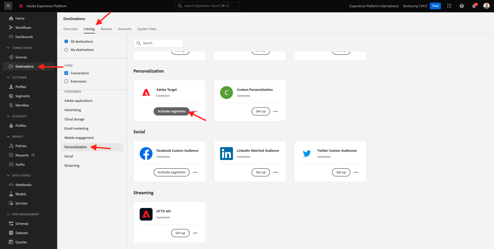
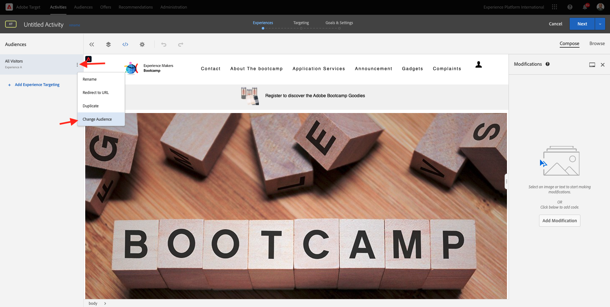
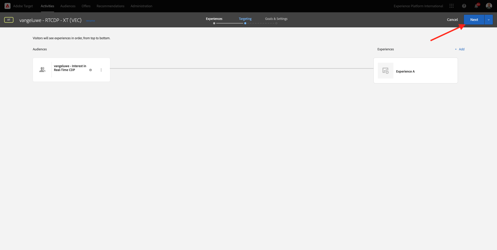

# 1.4 Ação: envie seu segmento para o Adobe Target

Acesse [Adobe Experience Platform](https://experience.adobe.com/platform). Depois de fazer login, você irá acessar a página inicial da Adobe Experience Platform.

Antes de continue ar, vocêprecisa selecionar um **sandbox**. O nome do sandbox a ser selecionado é Bootkamp. É bezível fazer isso clicando no texto **[!UICONTROL Productieproduct]** Na linha azul na parte superior da tela. Depois de selecionar o sandbox apropriado, você verá a tela mudando e agora você está em seu [!UICONTROL sandbox] toewijding.

## 1.4.1 Ative seu segmento para o destination do Adobe Target

O Adobe Target está disponível como um destino do CDP em tempo real. Para configurar sua integração com o Adobe Target, acesse **Doelen** e **Catalogus**.

Clique em **Personalisatie** geen menu **Categorieën**. Você verá o cartão de destino do **Adobe Target**. Clique em **Segmenten activeren**.

Doel selecteren ``Bootcamp Target`` e clique **Volgende**.

Na lista de segmentos disponíveis, selecione o segmento que você criou em [1.3 Crie um segmento](./ex3.md), com o nome `yourLastName - Interest in Real-Time CDP`. Em seguida, clique em **Volgende**.

Na próxima página, clique em **Volgende**.

Clique em **Voltooien**.

Seu segmento agora está ativado para o Adobe Target.

>[!IMPORTANT]
>
>Imediatamente após criar seu destino do Adobe Target no Real-Time CDP, pode levar até uma hora para que o destino seja ativado. Este é um tempo de espera único devido à definição da configuração de back-end. Depois que o tempo de espera inicial de 1 hora e a configuração do back-end forem concluídos, os segmentos de borda recém-adicionados que são enviados ao destino do Adobe Target estarão disponíveis para segmentação em tempo real.

## 1.4.2 Sua atividade configureren op Adobe Target

Agora que seu segmento Real-Time CDP está configurado para ser enviado ao Adobe Target, é bezível configurar sua atividade de Segmentação por experience ência no Adobe Target. Neste oefício, você irá configurar uma atividade baseada no Visual Experience Composer.

Acesse a página inicial da Adobe Experience Cloud acessando [https://experiencecloud.adobe.com/](https://experiencecloud.adobe.com/). Clique em **Doel** para abrir.

Na página inicial do **Adobe Target**, bestaat er een você verá todas as atividades.
Clique em **+ Activiteit maken** para criar uma nova atividade .

Selecion **Gericht op ervaring**.

Selecion **Zichtbaar** e defina **URL van activiteit** como `https://bootcamp.aepdemo.net/content/aep-bootcamp-experience/language-masters/en/exercises/particpantXX.html`, mas, antes desso, substitua XX por um número entre 01 e 60.

>[!IMPORTANT]
>
>Cada participante da condensitação deve usar uma página da Web separada para evitar a colisão de várias experience ências do Adobe Target. É bezível escolher uma página da Web e contrasteert een URL acessando: [https://bootcamp.aepdemo.net/content/aep-bootcamp-experience/language-masters/en/exercises.html](https://bootcamp.aepdemo.net/content/aep-bootcamp-experience/language-masters/en/exercises.html).
>
>Todas as páginas compartilham a mesma URL base e terminam com o número do participante.
>
>Por exemplo, of deelnemer 1 deve usar een URL `https://bootcamp.aepdemo.net/content/aep-bootcamp-experience/language-masters/en/exercises/particpant01.html`, o participante 30 deve usar a URL `https://bootcamp.aepdemo.net/content/aep-bootcamp-experience/language-masters/en/exercises/particpant30.html`.

Selecteren in werkruimte **AT Bootkamp**.

Clique em **Volgende**.

Agora você está no Visual Experience Composer. Pode levar de 20 a 30 segundos até que o site esteja completamente carregado.

Atualmente, o público padrão são **Alle bezoekers**. Clique nos **3 punten** ao lado de **Alle bezoekers** e clique em **Publiek wijzigen**.

Agora você está vendo a lista de públicos disponíveis, e o segmento da Adobe Experience Platform que você criou anteriormente e enviou ao Adobe Target agora faz parte dessa lista. Selecione o segmento que você criou anteriormente na Adobe Experience Platform. Clique em **Publiek toewijzen**.

Seu segmento da Adobe Experience Platform agora faz parte dessa Atividade de segmentação por experience ência.

Antes de Alternar a imagem principal, você deve clicar em **Alles toestaan** geen banner de cookies.

Para isso, vá para **Bladeren**

Em seguida, clique em **Alles toestaan**.

Em seguida, retorne para **Samenstellen**.

Agora vamos mudar a imagem principal na página inicial do site. Clique na imagem principal padrão no site, clique em **Inhoud vervangen** e selecione **Afbeelding**.

Pesquise of arquivo de imagem **rtcdp.png**. Eén e clique-em selecteren **Opslaan**.

Você verá a nova experience ência com a nova imagem para o seu Público selecionado

Clique no título da sua atividade no canto superior esquerdo para renomeá-la.

Para o nome, gebruik:

- `seuSobrenome - RTCDP - XT (VEC)`

Clique em **Volgende**.

Clique em **Volgende**.

Na página **Doelstellingen en instellingen**, acesse **Goederenstatistieken**.

Defina a Meta principal como **Betrokkenheid** - **Tijd op de site**. Clique em **Opslaan en sluiten**.

Agora você está na página **Overzicht van activiteiten**. Você ainda precisa ativar sua Atividade.

Clique no campo **Inactief** e selecione **Activeren**.

Você receberá uma confirmação visual de que sua atividade agora está ativa.

Agora sua atividade está ativa e pode ser testada no site do bootkamp.

Se agora você voltar ao seu site de demonstração e bezoekar a página do produto para **Real-Time CDP**, você se Qualificará instantaneamente para o segmento que criou e verá a atividade do Adobe Target exibida na página inicial em tempo real.

>[!IMPORTANT]
>
>Cada participante da condensitação deve usar uma página da Web separada para evitar a colisão de várias experience ências do Adobe Target. É bezível escolher uma página da Web e contrasteert een URL acessando ao link: [https://bootcamp.aepdemo.net/content/aep-bootcamp-experience/language-masters/en/exercises.html](https://bootcamp.aepdemo.net/content/aep-bootcamp-experience/language-masters/en/exercises.html).
>
>Todas as páginas compartilham a mesma URL base e terminam com o número do participante.
>
>Por voorbeo, o participante 1 deve usar a `https://bootcamp.aepdemo.net/content/aep-bootcamp-experience/language-masters/en/exercises/particpant01.html`, o participante 30 deve usar a URL `https://bootcamp.aepdemo.net/content/aep-bootcamp-experience/language-masters/en/exercises/particpant30.html`.

Próxima etapa: [1.5 Ação: envie seu segmento para o Facebook](./ex5.md)

[Retornar para Fluxo de Usuário 1](./uc1.md)

[Retornar para Todos os Módulos](../../overview.md)
