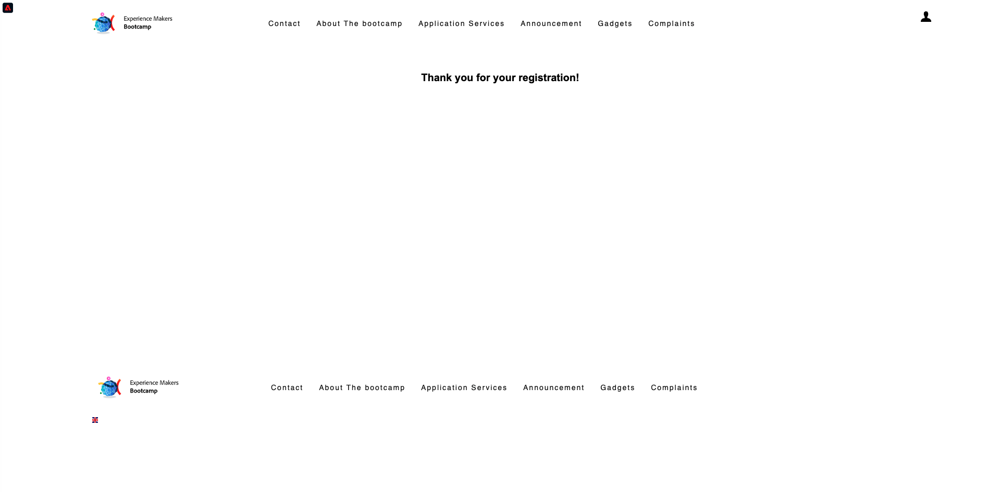

# 2.1 Visite op de website e cria sua conta

## Contexto

A jornada do desconhecido ao conhecido é um dos tópicos mais importantes para as marcas atualmente, assim como a jornada do cliente, da aquisição à retenção.

A Adobe Experience Platform desempenha um papel importante nessa jornada. A plataforma é o cérebro da comunicação, o **ervaringssysteem**.

Plataforma é um ambiente em que a palavra cliente engloba mais do que clientes conhecidos. Ubezoekante desconhecido no site também é um cliente do ponto de vista da Plataforma e, como tal, todo o comportamento de um bezoekante desconhecido também é enviado à Plataforma. Graças a essa abordagem, quando esse bezoekante eventualmente se torna um cliente conhecido, uma marca também pode visualizar o que aconteceu antes daquele momento. Isso ajuda a partir de uma perspectiva de otimização de atribuição e experience ência.

## Fluxo da jornada do cliente

Acesse [https://bootcamp.aepdemo.net](https://bootcamp.aepdemo.net). Clique em **Alles toestaan**. Com base no seu comportamento de navegação no fluxo de usuário anterior, você verá a personalização acontecer na página inicial do site.

Clique no ícone do logotipo da Adobe no canto superior esquerdo da tela para abrir o Visualizador de perfil. Verifique o chilel do Visualizador de perfil e no Perfil do cliente em tempo real com o **Experience Cloud-id** como o identificador primário para este cliente que ainda é desconhecido .

Você também pode ver todos os Eventos de ervarência coletados com base no comportamento do cliente.

Clique no ícone **Profiel** de superieure direito da tela is niet te vinden .

Clique em **Een account maken**.

Preencha todos os campos do formulário. Gebruik van um valor real para endereço de e-mail e número de telefone, pois será usado em uitoefícios posteriores para envio de e-mail e SMS.

Rol para baixo e clique em **Registreren**.

Em seguida, o seguinte será exibido.

Você também receberá o seguinte e-mail:

E algun minutos depois, você também receberá o seguinte e-mail:

Vamos conferir a seguir como essa jornada de onboarding foi configurada.

Próxima etapa [2.2 Crie seu evento](./ex2.md)

[Retornar para Fluxo de Usuário 2](./uc2.md)

[Retornar para Todos os Módulos](../../overview.md)
