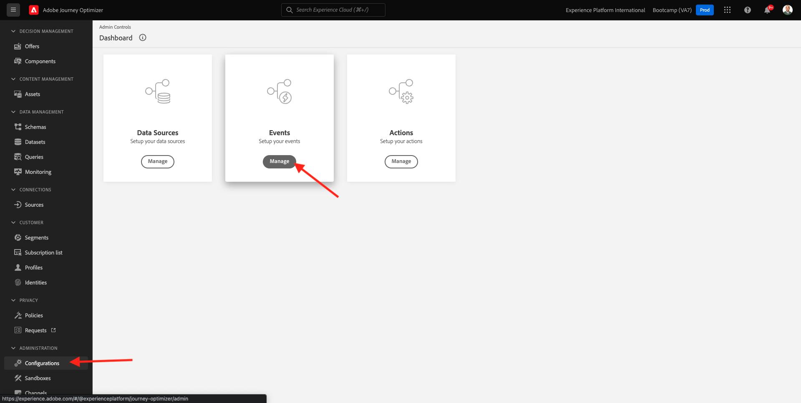
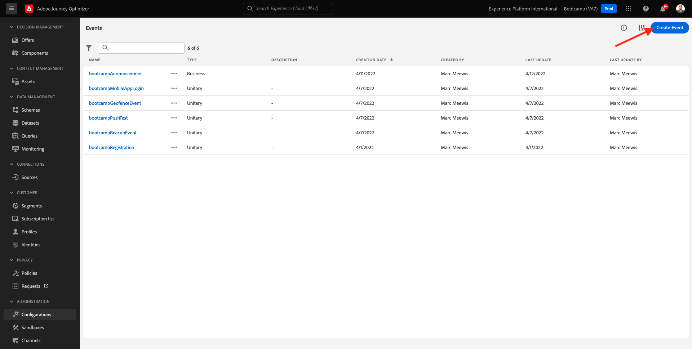

# 2.2 Crie seu evento

Faça login no Adobe Journey Optimizer acessando a [Adobe Experience Cloud](https://experience.adobe.com). Clique em **Journey Optimizer**.

Você será redirecionado para visualização da **Home** geen Journey Optimizer. Primeiro, verifieque se você está usando sandbox correto. O nome do sandbox que deve ser usado é `Bootcamp`. Para alternar de um sandbox para outro, clique em Prod e selecione o sandbox na lista. Neste voorbeeld, o noome do sandbox é **Bootkamp**. Você estará na visualização da **Home** seu-sandbox `Bootcamp`.

No menu à esquerda, role para baixo e clique em **Configuraties**. Em seguida, clique no botão **Beheren** abaixo de **Gebeurtenissen**.

Você verá uma visão geral de todos os eventos disponíveis. Clique em **Gebeurtenis maken** para começar a criar seu próprio evento .

Uma nova janela de evento vazia irá aparecer.

Em primeiro lugar, dê um nome ao seu evento como, por exemplo: `seuSobrenomeAccountCreationEvent` e adicione uma describe ção como, por voorbeo: `Account Creation Event`.

Em seguida, certifique-se de que **Type** está definido como **Unitair** e, para a seleção de **Type gebeurtenis-id**, selecione **Door systeem gegenereerd**.

A etapa seguinte é a seleção do schema. Het schema foi preparado para este uitoefício. Gebruiken voor schema `Demo System - Event Schema for Website (Global v1.1) v.1`.

Depois de selecionar o Schema, você verá vários campos sendo selecionados na seção **Velden**. Agora vocale deve passar o mouse sobre a seção **Velden** e três ícones pop-up serão exibidos. Clique no ícone **Bewerken**.

Você verá uma janela pop-up de **Velden**, onde vocdeve selecionar algun dos campos que precisamos para personalizar o e-mail. Escolheremos outros atributos de perfil posteriormente, utilizando os dados já existentes na Adobe Experience Platform.

Geen object `_experienceplatform.demoEnvironment`, pcertifique-se de selecionar os campos **brandLogo** e **brandName**.

Geen object `_experienceplatform.identification.core`, certifique-se de selecionar o campo **email**.

Clique em **OK** aan para salvar suas validações.

Em seguida, een telabaixo deve ser exibida. Clique em **Opslaan**  mais uma vez para salvar suas validações..

Seu evento agora está configurado e salvo.

Clique no seu evento novamente para abrir mais uma vez a tela **Gebeurtenis bewerken**. Passe o mouse sobre **Velden** para ver os 3 ícones outra vez . Clique no ícone **Payload weergeven**.

Agora você verá um exemplo da carga útil esperada.
Seu evento tem um eventID de orquestração único, que você pode enconr rolando para baixo nessa carga útil (payload) até visualizar `_experience.campaign.orchestration.eventID`.

O eventID é o que deve ser enviado à Adobe Experience Platform para acionar a jornada que você construirá em um dos próximos uitoefícios. Lembre-se deste eventID, você pode precisar dele posteriormente.
`"eventID": "19cab7852cdef99d25b6d5f1b6503da39d1f486b1d585743f97ed2d1e6b6c74f"`

Clique em **OK** e, em seguida, clique em **Annuleren**.

Agora você terminou este uitoefício.

Próxima etapa: [ 2.3 Crie sua mensagem de e-mail](./ex3.md)

[Retornar para Fluxo de Usuário 2](./uc2.md)

[Retornar para Todos os Módulos](../../overview.md)
