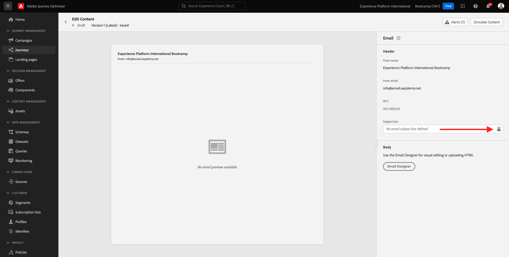
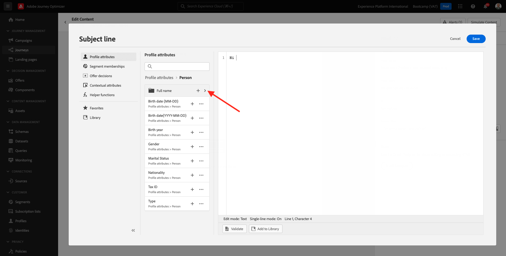

# 2.3 Crie sua jornada e mensagem de e-mail

Neste uitoefício, você irá configurar a jornada que precisa ser acionada quando alguém criar uma conta no site de demonstração.

Faça login op Adobe Journey Optimizer toegang tot a [ Adobe Experience Cloud ](https://experience.adobe.com). Clique em **Journey Optimizer**.

Você será redirecionado para a visualização da **Huis** geen Journey Optimizer. Primeiro, verifieque se você está usando sandbox correto. O nome do sandbox que deve ser usado é `Bootcamp` . Para alternar de um sandbox para outro, klique em **Prod** e selecione aan zandbak na lista. Neste voorbeeldig, o nome do zandbak é **Bootkamp**. Você estará na visualização da **Huis** do seu zandbak `Bootcamp`.

## 2.3.1 Crie a sua jornada

Geen menu à esquerda, klikem **Reizen**. Em seguida, kliek em **creeer de 1} parabijis van de Reis { jornada.**

Você verá uma tela de jornada vazia.

Geen uitoefício anterior, você criou um novo **Gebeurtenis**. Você nomeou o evento `seuSobrenomeAccountCreationEvent` e substituiu `seuSobrenome` pelo seu sobrenome. Este foi o resultado da criação do Evento:

Agora vocdeve aanzienlijke este evento como o início desta Jornada. Você pode fazer isso indo para o lado esquerdo da tela e procurando pelo seu evento na lista de eventos.

Selecione seu evento, arraste e solte o evento na tela de Jornada. Sua Jornada agora deve ser semelhante ao seguinte:

Como segunda etapa da jornada, você deve adicionar uma etapa curta de **Wacht**. Vá para o lado esquerdo da tela até a seção **Orchestration** para enconr isso. Você usará atributos de perfil e precisará garantir que eles sejam preenchidos no Perfil do Cliente em tempo real.

Sua jornada agora deve ser semelhante ao seguinte. Geen lado direito da tela você preca configurar o tempo de espera. Defina como 1 minuto. Isso dará bastante tempo para que os atributos do perfil estejam disponíveis após o disparo do evento.

Clique em **O.K.** para salvar suas alternatieve ações.

Como terceira etapa da jornada, você deve adicionar uma ação **E-mail**. Vá para o lado esquerdo da tela para **Acties**, verkione a ação **E-mail** e arraste e solte a ação no segundo nó da sua jornada. Agora o seguinte será exibido.

Definieer a **Categorie** como **marketing** e-mailoppervlakte van de gebruikersinterface **e-mail** toestemming om e-mail te envio. Neescaso, a **e-mailoppervlakte** e-mail van de gebruiker selecteionada e-mail. Certifique-se de que als caixas de seleção **klikt op e-mail** e **e-mail opent** estejam marcadas.

A próximo etapa é criar sua mensagem. Para isso, klikem **geeft inhoud** uit.

## 2.3.2 Crie a sua mensagem

Para criar sua mensagem, klikem **geeft inhoud** uit.

O seguinte será exibido.

De klem op campo de texto **Onderwerpregel**.

Na área de texto, comece **Olá**

A linha de assunto ainda não está pronta. Em seguida, você preca trazer o token de personalização para o **First name** que está armazenado em `profile.person.name.firstName`. Geen menu à esquerda, rolpara baixo para encontrar o elemento **Peron** e clique na seta para visualizar mais campos

Agora encontre aan elemento **Volledige naam** e clique na seta para visualizar mais campos.

Por fim, lokaliseer aan campo **Voornaam** e clique op símbolo **+** ao lado dele. Você verá o token de personalização aparecer no campo de texto.

Em seguida, adicione o texto, **agradecemos a sua inscrição!**. Clique em **sparen**.

Então, você irá retornar para esta tela. Clique em **e-mail Designer** para kriar aan conteúdo e-mail.

Na próxima tela, será solicitado que você forneça o conteúdo e-mail através de 3 métodos diferentes:

- **Ontwerp van kras**: Comece com uma tela em branco e use of redacteur WYSIWYG para arrastar e soltar a estrutura e os componentes de conteúdo para criar visualmente o conteúdo e-mail.
- **Code uw eigen**: Crie seu próprio modelo de e-mail codificando usando HTML
- **de HTML van de Invoer**: Importe um modelo HTML existente, que você poderá editar.

Clique em **de HTML van de Invoer**.

Arraste e solte aan arquivo **mailtemplatebootkamp.html**, de duidelijke você pode baixa [ aqui ](../../assets/html/mailtemplatebootcamp.html.zip). Clique em Importar

Você verá este modelo de e-mail padrão:

Vamos personalizar o e-mail. Clique ao lado doet texto **Olá** e, em seguida, klique no ícone **toevoegen Personalization**.

Em seguida, você preca trazer of token de personalização **Voornaam** que está armazenado em `profile.person.name.firstName`. Geen menu, lokaliseer aan elemento **Persoon**, faça uma busca detalhada geen element **Volledige naam** e clique no ícone **+** para adicionar aan campo **Voornaam** redacteur.

Clique em **sparen**.

Agora você verá como campo de personalização foi adicionado ao seu texto.

Clique em **sparen** para salvar sua mensagem.

Retorne para o pijnel de mensagens clicando na seta ao lado do texto da linha de assunto no canto superior esquerdo.

Agora você concluiu a criação do seu e-mail de cadastro. Clique na seta no canto superior esquerdo para retornar à sua jornada.

Clique em **OK**.

## 2.3.3 Publique a sua jornada

Você ainda precisa dar um Nome à sua jornada. Você pode fazer isso clicando no ícone **Eigenschappen** kan geen superieure direito da tela.

Você pode fazer is dus clicand o no item click no item &quot;Name&quot; e insert to seguinte nome `yourLastName - Account Creation Journey`. De klikem **O.K.** para salvar als mudanças.

Agora você pode publicar sua jornada clicando em **Publish**.

Clique em **Publish** novamente.

Você verá uma barra de confirmação verde informando que sua jornada agora está Publicada.

Você terminou este uitoefício.

Próxima etapa: [ 2.4 Teste sua jornada ](./ex4.md)

[Retornar para Fluxo de Usuário 2](./uc2.md)

[Retornar para Todos os Módulos](../../overview.md)
