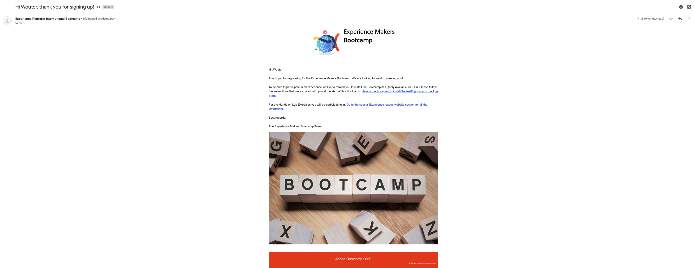

# 2.4 Test uw reis

## Vervoersstroom voor klanten

Open een nieuw, schoon, incognito browservenster en ga naar [https://bootcamp.aepdemo.net](https://bootcamp.aepdemo.net). Klikken **Alles toestaan**. Gebaseerd op uw het doorbladeren gedrag in de vorige gebruikersstroom, zult u personalisering zien gebeuren op de homepage van de website.

Klik op de knop **Profiel** in de rechterbovenhoek van het scherm.

Klikken **Een account maken**.

Vul alle velden van het formulier in. Gebruik een echte waarde voor e-mailadres en telefoonnummer, aangezien deze worden gebruikt bij latere oefeningen voor het verzenden van e-mail en SMS.

Omlaag schuiven. U moet nu de eventID invoeren van uw aangepaste gebeurtenis die u in oefening 2.2 hebt gemaakt. U vindt het hier:

De gebeurtenis-id is wat naar Adobe Experience Platform moet worden verzonden om de reis te activeren die u hebt gemaakt. Dit is de eventID in dit voorbeeld: `19cab7852cdef99d25b6d5f1b6503da39d1f486b1d585743f97ed2d1e6b6c74f`

De eventID in het veld invullen **Gebeurtenis-id voor aanmaken van account** en klik op **Registreren**.

Dan zie je dit.

U ontvangt deze e-mail ook. Dit is de e-mail die u zelf hebt gemaakt als onderdeel van deze exercitie.

Je hebt deze oefening nu afgerond.

Volgende stap: [2.5 De mobiele app installeren en gebruiken](./ex5.md)

[Ga terug naar Gebruikersstroom 2](./uc2.md)

[Terug naar alle modules](../../overview.md)
