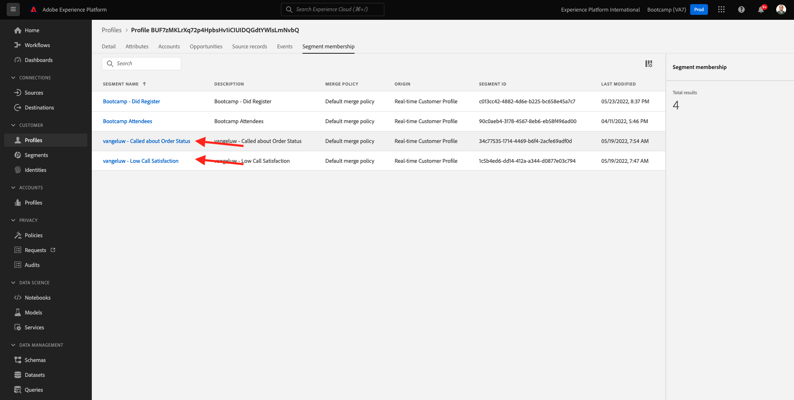

# 2.6 Personalização geen callcenter

Conforme discutido várias vezes durante o bootkamp, personalizar a experience ência do cliente é algo que deve acontecer de maneira omnichannel. Bel midden geralmente é bastante desconectado do restante da jornada do cliente e isso pode, com frequentieência, levar a experience fruantes do cliente, mas não preca ser assim. Vamos mostrar um voorbeo de como om center pode ser facilitmente conectado à Adobe Experience Platform, em tempo real te bellen.

## Fluxo da jornada do cliente

Geen uitoefício anterior, usando aplicativo móvel, você compromisu um produto clicando no botão **koop**.

Vamos supor que você tenha pergunta sobre o status do seu pedido, o que você faria? Normalmente, você ligaria para of call center.

Antes de ligar para om centrum, você nauwkeurige sabel seu **identiteitskaart van de Loyalty** te roepen. Você pode encontrar seu ID de fidelidade no Visualizador de Perfil do site.

Neesse caso, of **Loyalty identiteitskaart** é **5863105**. Como parte de nossa implementação personalizada do recurso de call center no ambiente de demonstração, você deve adicionar um prefixo ao seu **Loyalty ID**. O prefixo é **11373**, portanto, of identiteitskaart de fidelidade een ser usado neste voorbeeldee **11373 5863105**.

Vamos fazer isso agora. Gebruik seu telefone e ligue para o número **+1 (323) 745-1670** .

Será solicitado que você insira seu ID de fidelidade, seguido de **#** . Digite seu ID de fidelidade.

Você ouvirá **Hello, seu nome**. Esse nome é pensionrado do Perfil do Cliente em tempo real na Adobe Experience Platform. Você tem 3 escolhas. Pressione aan número **1**, **de Status van de Orde**.

Depois de ouvir o status do seu pedido, você terá a opção de pressionar **1** para voltar ao menu principal ou pressionar 2. Pressione **2**.

Em seguida, será solicitado que você avalie sua experience ência de call center, selecionando um número entre 1 e 5, sendo 1 baixo e 5 alto. Faça a sua escolha.

Sua chamada para om het centrum será encerrada te bellen.

Toegang tot [ Adobe Experience Platform ](https://experience.adobe.com/platform). Depois de fazer login, você irá acessar a página inicial da Adobe Experience Platform.

Antes de continuar, você nauwkeurige um **zandbak**. O nome do sandbox a ser selecionado é ``Bootcamp`` . É bezível fazer isso clicando no texto **[!UICONTROL Production Prod]** na linha azul na parte superior da tela. Depois de selecionar o [!UICONTROL sandbox] apropriado, você verá a tela mudando e agora você está em seu [!UICONTROL sandbox] toeado.

Geen menu à esquerda, toegang **Profielen** e **doorbladeren**.

Selecione aan **Identiteitsnaamruimte** **E-mail** e insira of endereço de e-mail do seu perfil de cliente. Clique em **Mening**. Clique para abrir seu perfil.

Você verá seu perfil de cliente novamente. Heb toegang tot **Gebeurtenissen**.

Em eventos, você verá 2 eventos com um eventType de **callCenter**. O primeiro evento é o resultaatado da sua resposta à pergunta **Beoordeel uw vraagtevredenheid** (avalie seu chamada).

Rol um pouco para baixo e você verá o evento que foi registrado quando você selecionou a opção de verificar o **Order Status** .

Heb toegang tot {het lidmaatschap van 0} Segment **.** Agora você verá que 2 segmentos se kwalificficam em seu perfil, em tempo real, com base nas interações que você teve por meio do call center. Essas associações de segmento podem e devem ser usadas para impactar qual comunicação e personalização acontece em qualquer outro canal.

Você terminou este uitoefício.

[Retornar para Fluxo de Usuário 2](./uc2.md)

[Retornar para Todos os Módulos](../../overview.md)
