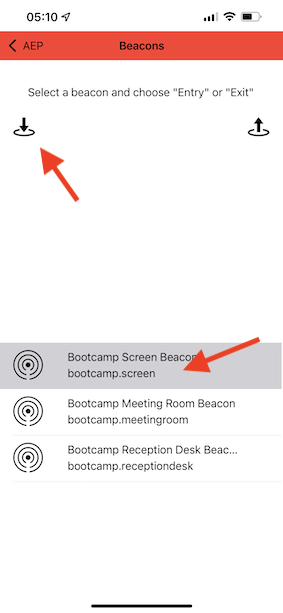

# 3.1 De mobiele app gebruiken en een baken-item activeren

## De mobiele toepassing installeren

Voordat u de app installeert, moet u **Tekstspatiëring** op uw iOS-apparaat. Ga hiertoe naar **Instellingen** > **Privacy en beveiliging** > **Tekstspatiëring** en ervoor zorgen dat de optie **Toepassingen mogen aanvragen om bij te houden**.

Ga naar de Apple App Store en zoek naar `aepmobile-bootcamp`. Klikken **Installeren** of **Downloaden**.

Klik op **Openen**.

Klikken **OK**.

Klikken **Toestaan**.

Klikken **Ik ga akkoord**.

Klikken **Toestaan tijdens gebruik van app**.

Klikken **Toestaan**.

U bent nu in de app, op de startpagina, klaar om de reis van de klant door te gaan.

## Vervoersstroom voor klanten

Allereerst moet u zich aanmelden. Klikken **Aanmelden**.

Nadat u uw account in de vorige oefeningen hebt gemaakt, hebt u dit op de website gezien. U moet nu het e-mailadres van het account dat u in de app hebt gemaakt, opnieuw gebruiken om u aan te melden.

Voer hier het e-mailadres in dat u op de website hebt gebruikt en klik op **Aanmelden**.

U ontvangt dan een bevestiging dat u bent aangemeld, en u ontvangt een pushmelding.

Ga terug naar de startpagina in de app en u ziet extra mogelijkheden.

Ga eerst naar **Producten**. Klik op een product in dit voorbeeld **Koffie om te gaan**.

U ziet de **Koffie om te gaan** productpagina in de app.

U zult nu een gebeurtenis van de bakeningang in een off-line opslagplaats simuleren. Het doel om dit te simuleren is de klantenervaring op de in-opslagschermen te personaliseren. Om de ervaring in-store te visualiseren, is een pagina gecreeerd die dynamisch de informatie zal tonen die voor de klant relevant is die enkel de opslag inging.

Open deze webpagina op uw computer voordat u doorgaat: [https://bootcamp.aepdemo.net/content/aep-bootcamp-experience/language-masters/en/screen.html](https://bootcamp.aepdemo.net/content/aep-bootcamp-experience/language-masters/en/screen.html)

U zult dan dit zien:

Ga vervolgens terug naar de startpagina. Klik op de knop **baken** pictogram.

Dan zie je dit. Eerst selecteert u **Bootamp Screen Beacon** en klik vervolgens op de knop **ingang** knop. Hierdoor kunt u een baken-item simuleren.

Kijk nu eens naar het scherm in de winkel. Het laatste product dat u hebt bekeken, wordt hier binnen 5 seconden weergegeven.

Ga vervolgens terug naar **Producten**. Klik op een product in dit voorbeeld **Stranddeken Tan**.

Ga vervolgens terug naar de startpagina. Klik op de knop **baken** pictogram.

Dan zie je dit. Eerst selecteert u **Bootamp Screen Beacon** en klik vervolgens op de knop **ingang** nogmaals. Hierdoor kunt u een baken-item simuleren.

Kijk nu eens naar het scherm in de winkel. Het laatste product dat u hebt bekeken, wordt hier binnen 5 seconden weergegeven.

Laten we nu ook naar uw profielviewer op de website kijken. U zult veel gebeurtenissen zien die daar werden toegevoegd, enkel om te tonen dat om het even welke interactie met een klant wordt verzameld en in Adobe Experience Platform opgeslagen.

In de volgende oefeningen, zult u uw eigen reis van het baken ingangen vormen en testen.

Volgende stap: [3.2 Uw gebeurtenis maken](./ex2.md)

[Ga terug naar gebruikersstroom 3](./uc3.md)

[Terug naar alle modules](../../overview.md)
