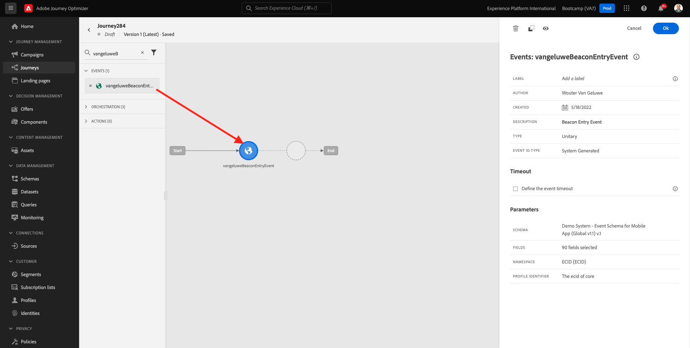

# 3.3 Maak uw reis en pushmelding

In deze oefening, zult u de reis en het bericht vormen die moeten worden teweeggebracht wanneer iemand een baken gebruikend mobiele app ingaat.

Aanmelden bij Adobe Journey Optimizer door naar [Adobe Experience Cloud](https://experience.adobe.com). Klikken **Journey Optimizer**.

U wordt omgeleid naar de **Home**  in Journey Optimizer. Eerst, zorg ervoor u de correcte zandbak gebruikt. De sandbox die moet worden gebruikt, wordt `Bootcamp`. Als u van de ene naar de andere sandbox wilt gaan, klikt u op **Prod** en selecteert u de sandbox in de lijst. In dit voorbeeld krijgt de sandbox een naam **Bootkamp**. Dan ben je in de **Home** weergave van de sandbox `Bootcamp`.

## 3.3.1 Uw reis maken

Klik in het linkermenu op **Reizen**. Klik op Volgende **Reis maken** om een nieuwe reis te maken.

Dan zie je een leeg reisscherm.

In de vorige oefening creeerde u een nieuw **Gebeurtenis**. U noemde het zo `yourLastNameBeaconEntryEvent` en vervangen `yourLastName` met uw achternaam. Dit was het resultaat van het maken van de gebeurtenis:

U moet deze gebeurtenis nu als begin van deze reis nemen. U kunt dit doen door naar de linkerkant van het scherm te gaan en naar uw gebeurtenis in de lijst met gebeurtenissen te zoeken.

Selecteer de gebeurtenis, sleep deze naar het canvas van de reis. Je reis ziet er nu zo uit. Klikken **OK** om uw wijzigingen op te slaan.

Als tweede stap in de reis, moet u toevoegen **Push** handeling. Naar de linkerkant van het scherm gaan **Handelingen**, selecteert u de **Push** actie, dan belemmering en laat vallen het op de tweede knoop in uw reis.

Rechts in het scherm moet u nu een pushmelding maken.

Stel de **Categorie** tot **Marketing** en selecteer een drukknop waarmee u pushmeldingen kunt verzenden. In dit geval moet het te selecteren drukknop **mmeewis-app-mobile-bootkamp**.

## 3.3.2 Uw bericht maken

Klikken **Inhoud bewerken**.

U zult dan dit zien:

Laten we de inhoud van de pushmelding definiëren.

Klik op de knop **Titel** tekstveld.

Begin met schrijven in het tekstgebied **Hallo**. Klik op het verpersoonlijkingspictogram.

U moet nu het personalisatietoken voor het veld introduceren **Voornaam** dat is opgeslagen onder `profile.person.name.firstName`. Selecteer in het linkermenu de optie **Profielkenmerken**, schuift u omlaag of navigeert u naar de **Persoon** -element en klik op de pijl om een niveau dieper te gaan totdat u het veld bereikt `profile.person.name.firstName`. Klik op de knop **+** pictogram om het veld aan het canvas toe te voegen. Klikken **Opslaan**.

Dan ben je hier weer. Klik op het pictogram voor aanpassen naast het veld **Lichaam**.

In het tekstgebied schrijft u `Welcome at the `.

Klik op Volgende **Contextafhankelijke kenmerken** en vervolgens **Journey Orchestration**.

Klikken **Gebeurtenissen**.

Klik op de naam van de gebeurtenis, die er als volgt moet uitzien: **yourLastNameBeaconEntryEvent**.

Klikken **Context plaatsen**.

Klikken **Interactie tussen POI**.

Klikken **POI-details**.

Klik op de knop **+** pictogram op **POI-naam**.
Dan zie je dit. Klikken **Opslaan**.

Uw bericht is nu klaar. Klik op de pijl in de linkerbovenhoek om terug te gaan naar uw reis.

Klikken **OK**.

## 3.3.2 Een bericht naar het scherm verzenden

Als derde stap in de reis, moet u toevoegen **sendMessageToScreen** handeling. Naar de linkerkant van het scherm gaan **Handelingen**, selecteert u de **sendMessageToScreen** actie, dan belemmering en laat vallen het op de derde knoop in uw reis. Dan zie je dit.

De **sendMessageToScreen** De actie is een douaneactie die een bericht aan het eindpunt zal publiceren dat door de in-opslagvertoning wordt gebruikt. De **sendMessageToScreen** handeling verwacht dat een aantal variabelen wordt gedefinieerd. U kunt deze variabelen zien door omlaag te schuiven totdat u ze ziet **Handelingsparameters**.

U moet nu de waarden voor elke handelingsparameter instellen. Volg deze tabel om te begrijpen welke waarden vereist zijn.

| Parameter | value |
|:-------------:| :---------------:|
| LEVERING | `'image'` |
| ECID | `@{yourLastNameBeaconEntryEvent._experienceplatform.identification.core.ecid}` |
| EERSTE NAAM | `#{ExperiencePlatform.ProfileFieldGroup.profile.person.name.firstName}` |
| EVENTSUBJECT | `#{ExperiencePlatform.ProductListItems.experienceevent.first(currentDataPackField.eventType == "commerce.productViews").productListItems.first().name}` |
| EVENTSUBJECTURL | `#{ExperiencePlatform.ProductListItems.experienceevent.first(currentDataPackField.eventType == "commerce.productViews").productListItems.first()._experienceplatform.core.imageURL}` |
| SANDBOX | `'bootcamp'` |
| CONTAINERID | `''` |
| ACTIVITYID | `''` |
| PLACEMENTID | `''` |

{style=&quot;table-layout:auto&quot;}

Als u deze waarden wilt instellen, klikt u op de knop **Bewerken** pictogram.

Selecteer vervolgens **Geavanceerde modus**.

Plak vervolgens de waarde op basis van de bovenstaande tabel. Klikken **OK**.

Herhaal dit proces om waarden toe te voegen voor elk veld.

>[!IMPORTANT]
>
>Voor het veld ECID is er een verwijzing naar de gebeurtenis `yourLastNameBeaconEntryEvent`. Vervang `yourLastName` op uw achternaam.

Het eindresultaat moet er als volgt uitzien:

Omhoog schuiven en klikken **OK**.

Je moet je reis nog steeds een naam geven. U kunt dat doen door op de knop **Eigenschappen** in de rechterbovenhoek van het scherm.

Je kunt hier de naam van de reis invoeren. Gebruik `yourLastName - Beacon Entry Journey`. Klikken **OK** om uw wijzigingen op te slaan.

U kunt uw reis nu publiceren door te klikken **Publiceren**.

Klikken **Publiceren** opnieuw.

Vervolgens ziet u een groene bevestigingsbalk met de mededeling dat uw reis nu is gepubliceerd.

Je reis is nu live en kan worden geïnitieerd.

Je hebt deze oefening nu afgerond.

Volgende stap: [3.4 Test uw reis](./ex4.md)

[Ga terug naar gebruikersstroom 3](./uc3.md)

[Terug naar alle modules](../../overview.md)
