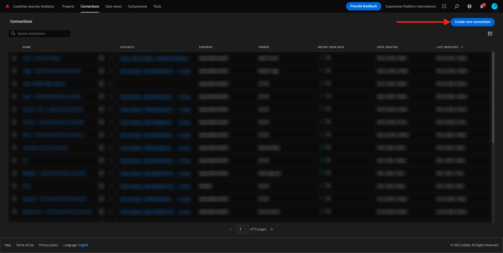
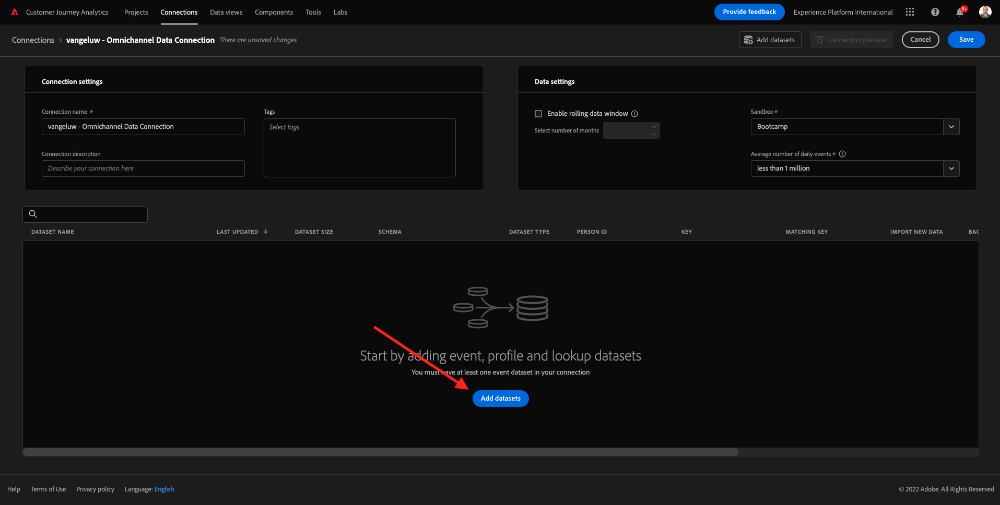

# 4.2 Conecte datasets da Adobe Experience Platform no Customer Journey Analytics

## Objetivos

- Compreenda a UI da conexão de dados
- Traga os dados da Adobe Experience Platform para o CJA
- Entenda a ID da pessoa e a compilação de dados
- Aprenda o conceito de streaming de dados no Customer Journey

## 4.2.1 Conexão

Toegang [ analytics.adobe.com ](https://analytics.adobe.com) para acessar aan Customer Journey Analytics.

Na página inicial doe Customer Journey Analytics, treedt **Verbindingen** toe.

Aqui você pode ver todas as diferentes conexões feitas entre o CJA e a Plataforma. Essas conexões têm o mesmo objetivo dos conjuntos de relatórios no Adobe Analytics. Geen entanto, een coleta dos dados é completamente diferente. Todos os dados vêm de datasets da Adobe Experience Platform.

Vamos criar sua primeira conexão. Clique em **creeert nieuwe verbinding**.

Você verá a UI **creeer Verbinding** UI.

Agora você pode dar um nome à sua conexão.

Gebruik Este modelo de nomenclatura: `yourLastName – Omnichannel Data Connection` .

Voorbeeld: `vangeluw - Omnichannel Data Connection`

Você também deve selecionar o sandbox correto para usar. Geen menusandbox, selecteer één seu zandbak, deve ser `Bootcamp`. Neste exemplo, of zandbak een gebruiker usado é van **Bootkamp**. E você também deve definir aan **Gemiddeld aantal dagelijkse gebeurtenissen** aan **minder dan 1 miljoen**.

Após selecionar seu sandbox, você pode começar a adicionar datasets a esta conexão. De Clique em **voegt datasets** toe.

## 4.2.2 Selectieve gegevenssets da Adobe Experience Platform

Voorbeeld van gegevensset `Demo System - Event Dataset for Website (Global v1.1)` . Clique em **+** para adicionar of dataset a esta conexão.

Agora pesquise e marque as caixas de seleção `Demo System - Event Dataset for Voice Assistants (Global v1.1)` and `Demo System - Event Dataset for Call Center (Global v1.1)` .

Em seguida, você verá a tela abaixo. Clique em **daarna**.

## 4.2.3 ID da pessoa e compilação de dados

### ID da pessoa

O objetivo agora é juntar esses datasets. Para cada dataset selecionado, você verá um campo chamado **identiteitskaart van de Persoon**. Cada dataset tem seu próprio campo de ID de pessoa.

Como você pode ver, a maioria deles tem o ID da pessoa selecionado automcamente. Isso ocorre porque um identificador principal é selecionado em cada esquema na Adobe Experience Platform. Como exemplo, aqui está o esquema para `Demo System - Event Schema for Call Center (Global v1.1)`, onde você pode ver que o Identificador Primário está definido como `phoneNumber` .

Geen entanto, você ainda pode influenciar qual identificador será usado para compar datasets para sua conexão. Você pode usar qualquer identificador configurado no esquema vinculado ao seu dataset. Clique no menu Susenso para explorar os IDs disponíveis em cada dataset.

Conforme mencionado, você pode definir diferentes IDs de pessoa para cada dataset. Isso permite reunir diferentes datasets de múltiplas origens no CJA. Stelt u zich eens voor dat trazer NPS ou dados de pesquisa que seriam muito interessantes e úteis para compender o context to e o motivo de um acontecimento.

O nome do campo ID da pessoa não é importante, desde que o valor nos campos ID da pessoa corresponda. Digamos que temos `email` em um dataset e `emailAddress` em outro dataset definido como ID da pessoa. Zie `delaigle@adobe.com` tiver o mesmo valor para o campo ID da pessoa em ambos os datasets, o CJA poderá compilar os dados.

Atualmente, existem algumas outras limitações, como compilar o comportamento anônimo para conhecido. Raadpleeg als perguntas bezoekt aqui: [ Veelgestelde vragen ](https://experienceleague.adobe.com/docs/analytics-platform/using/cja-overview/cja-faq.html).

### Compilando os dados usando o ID da pessoa

Agora que você compresende o conceito de compilar datasets usando ID da pessoa, vamos escolher `email` como ID da pessoa para cada dataset.

Acesse cada dataset para atualizar o ID da pessoa.

Agora preencha o campo ID da pessoa escolhendo `email` na lista Susensa.

Depois de compilar os três datasets, estamos prontos para continuar.

| gegevensset | Persoon-id |
| ----------------- |-------------| 
| Demosysteem - Dataset voor gebeurtenissen voor website (Global v1.1) | email |
| Demosysteem - Dataset van de Gebeurtenis voor de Medewerkers van de Stem (Globale v1.1) | email |
| Het Systeem van de manifestatie - de Dataset van de Gebeurtenis voor het Centrum van de Vraag (Globale v1.1) | email |

Você também precisa garantir que, para cada dataset, essas opções estejam habilitadas:

- Importar todos os novos dados
- Preencher todos os dados existentes
- Preencher tipo de fonte de dados com &quot;Others&quot;
- Preencher a describe ção com o mesmo nome do Dataset

De Clique em **voegt datasets** toe.

Clique em **sparen** e vá para o próximo uitoefício. Depois de criar sua **Verbinding, pode levar algumas horas até que seus dados estejam disponíveis no CJA.**

Próxima etapa: [ 4.3 Crie uma Visualização de Dados ](./ex3.md)

[Retornar para Fluxo de Usuário 4](./uc4.md)

[Retornar para Todos os Módulos](./../../overview.md)
