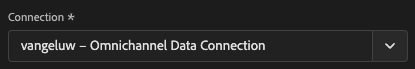
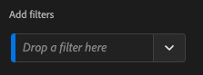

# 4.3 Crie uma Visualização de Dados

## Objetivos

- Entenda a UI de Visualização de Dados
- Compreenda as configurações básicas de definição de visita
- Compreenda a atribuição e a Persistência em uma Visualização de

## 4.3.1 Visualização de Dados

Agora, com sua conexão concluída, é bezível progredir para influenciar a visualização. Uma diferença entre o Adobe Analytics e o CJA é que o CJA precisa de uma visualização de dados para limpar e preparar os dados antes da visualização.

Uma Visualização de Dados é semelhante ao conceito de Virtual Report Suites no Adobe Analytics, onde você estabelece as definições de visita com reconhecimento de contexto, filtragem e também como os componentes são chamados.

Será necessary ário, no mínimo, uma Visualização de Dados por conexão. Geen entanto, para algun casos de uso, é ótimo ter múltiplas Visualizações de Dados para a mesma conexão, com o objetivo de fornecer insights diferentes para equipes distintas. Se você deseja que sua empresa seja orientada por dados, deve adaptar a forma como os dados são vistos em cada equipe. Alweren:

- Métricas de UX apenas para equipe de UX Design
- Gebruik os mesmos nomes para KPIs e métricas para o Google Analytics e para o Customer Journey Analytics, para que a equipe de análise digital fale apenas 1 idioma.
- Visualização de Dados filtrada para mostrar, por exemplo, dados para apenas um mercado, ou uma marca, ou apenas para Disposivos móveis.

Na tela de **Verbindingen** marque a caixa de seleção da conexão que você acabou de criar. Clique em  **Gegevensweergave maken**.

Você será redirecionado para o fluxo de trabalho **Gegevensweergave maken** workflow.

## 4.3.2 Definição de Visualização de Dados

Agora você pode configurar as definições básicas para sua Visualização de dados.

A **Verbinding** que você criou no uitoefício anterior já está selecionada. Sua conexão se chama `yourLastName – Omnichannel Data Connection`.

Em seguida, dê um nome à sua Visualização de Dados seguindo este modelo de nomenclatura: `yourLastName – Omnichannel Data View`.

Insira o mesmo valor para a describe ção: `yourLastName – Omnichannel Data View`.

| Naam | Beschrijving |
| ----------------- |-------------| 
| `yourLastName – Omnichannel Data View` | `yourLastName – Omnichannel Data View` |

Para **Tijdzone**, selecione of fuso horário **Berlim, Estocolmo, Roma, Berna, Bruxelas, Viena, Amsterdam GMT+01:00**. Este é um cenário realmente interessante, pois algumas empresas operam em diferentes países e geografias. Alocar o fuso horário certo para cada país evitará erros típicos de dados, como, por exemplo, acreditar que a maioria das pessoas compra camisetas às 4h no Peru.

Você também pode modificar a nomenclatura das métricas princippais (Pessoa, Sessão e Evento). Isso não é obrigatório, mas algun clientes gostam de usar Pessoas, Visitas e Acessos em vez de Pessoa, Sessão e Eventos (convenção de nomenclatura padrão do Customer Journey Analytics).

Agora vocdeve ter as seguintes configurações definidas:

Clique em **Opslaan en doorgaan**.

## 4.3.3 Componentes da Visualização de Dados

Neste uitoefício, você irá configurar os componentes necessary ários para analisar os dados e visualizá-los usando Analysis Workspace. Nesta IU, há três áreas princippais:

- Lado esquerdo: Componentes disponíveis dos datasets selecionados
- Meio: Componentes adicionados à Visualização de Dados
- Lado direito: Configurações do componente

>[!IMPORTANT]
>
>Se você não enconr uma métrica ou dimensão específica, verifieque se se o campo `Contains data` foi removido de sua visualização de dados. Caso contrário, exclusief esse campo.
>
>

Agora você preca arrastar e soltar os componentes nasários para a análise nos **Toegevoegde componenten**. Para is, você deve selecionar os componentes no menu à esquerda e arrastá-los e soltá-los na tela no meio.

Vamos começar com o primeiro componente: **Naam (web.webPageDetails.name)**. Pesquise esse componente e arraste-o e solte-o na tela.

Esse componente é o nome da página, como você pode deriar da leitura do campo do schema `(web.webPageDetails.name)`.

Geen entanto, usar **Naam** como nome não é a melhor convção de nomenclatura para um usuário corporativo compender rapidamente essa dimensão.

Vamos mudar o nome para **Paginanaam**. Clique no component e o renomlege na área **Componentinstellingen**.

As Configurações de persistência são **Persistinstellingen**. Os conceitos de Vars e prop não existem no CJA, mas as configurações de Persistência possibilitam um comportamento semelhante.

Se você não aartessas configurações, o CJA irá interpretar a dimensão como **Prop** (nível de ocorrência). Além disso, podemos alternar a Persistência para tornar a dimensão uma **eVar** (persistir o valor ao longo da jornada).

Se você não estiver familiarizado com Vars e Props [leia mais sobre isso na documentação](https://experienceleague.adobe.com/docs/analytics/landing/an-key-concepts.html)..

Vamos deixar o Nome da Página como Prop. Dessa forma, você não precisa alternatieve nenhuma **Persistinstellingen**.

| Componentnaam die u wilt zoeken | Nieuwe naam | Persistinstellingen |
| ----------------- |-------------| --------------------| 
| Naam (web.webPageDetails.name) | Paginanaam |  |

Em seguida, escolha a dimensão **phoneNumber** e solte-a na tela. O novo nome deve ser **Telefoonnummer**.

Por fim, vamos Alternar as Configurações de persistência, pois o Número do Celular deve persistir no nível do usuário.

Para Alternar a Persistência, rol para baixo no menu à direita e abra a aba **Persistentie**:

Marque a caixa de seleção para modificar as configurações de persistência. Selecion **Recentste** e o escopo **Persoon (venster Rapportage)** pois nos preocupamos apenas com o último número de celular da pessoa. Se o cliente não preencher o celular em bezoekas futuras, você ainda verá esse valor preenchido.

| Componentnaam die u wilt zoeken | Nieuwe naam | Persistinstellingen |
| ----------------- |-------------| --------------------| 
| phoneNumber | Telefoonnummer | Recentste versie, Persoon (rapportagevenster) |

O próximo componente `web.webPageDetails.pageViews.value`.

Geen menu à esquerda, pesquise `web.webPageDetails.pageViews.value`. Arraste e solte essa métrica na tela.

Altere o nome para **Paginaweergaven** onder de **Componentinstellingen**.

| Componentnaam die u wilt zoeken | Nieuwe naam | Attributie-instellingen |
| ----------------- |-------------| --------------------| 
| web.webPageDetails.pageViews.value | Paginaweergaven |  |

Para as configurações de atribuição, deixaremos em branco.

Observação: Als configurações de persistência nas métricas também podem ser Veranderadas no Analysis Workspace. Em algun casos, você pode optar por configurá-las aqui para evitar que os usuários de negócios tenham que pensar qual é o melhor modelo de persistência.

Em seguida, você terá que configurar várias Dimensões e Métricas, conforme indicado na tabela abaixo.

### AFMETINGEN

| Componentnaam die u wilt zoeken | Nieuwe naam | Persistinstellingen |
| ----------------- |-------------| --------------------| 
| brandName | Merknaam | Recentste versie, sessie |
| aanfluiting | Aanroepfunctie |  |
| call-id | Type oproepinteractie |  |
| callTopic | Het Onderwerp van de vraag | Recentste versie, sessie |
| ecid | ECID | Recentste versie, Persoon (rapportagevenster) |
| email | E-mailid | Recentste versie, Persoon (rapportagevenster) |
| Betalingstype | Betalingstype |  |
| Product toevoegen, methode | Product toevoegen, methode | Recentste versie, sessie |
| Type gebeurtenis | Type gebeurtenis |  |
| Naam (productListItems.name) | Productnaam |  |
| SKU | SKU (sessie) | Recentste versie, sessie |
| Transactie-id | Transactie-id |  |
| URL (web.webPageDetails.URL) | URL |  |
| User Agent | User Agent | Recentste versie, sessie |

### MÉTRICA

| Componentnaam die u wilt zoeken | Nieuwe naam | Attributie-instellingen |
| ----------------- |-------------| --------------------| 
| Aantal | Aantal |  |
| commerce.order.priceTotal | Omzet |  |

Sua configuração deve ser semelhante ao seguinte:

Não se esqueça de Salvar sua Visualização de Dados. Então clique em **Opslaan**.

## 4.3.4 Berekeningen van Métricas

Embora tenhamos organizado todos os componentes na Visualização de dados, você ainda deve adaptar algun deles para que os usuários de negócios estejam prontos para iniciar suas análises.

Se vocse ê lembra, não trouxemos especificamente Métricas como Adicionar ao Carrinho, Visualização do produto ou Compras para Visualização de dados. Geen entanto, temos uma dimensão chamada: **Type gebeurtenis**. Então, vamos deriar esses tipos de interação criando 3 métricas calculadas.

Vamos começar com a primeira Métrica: **Productweergaven**.

Geen lado esquerdo, pesquise **Type gebeurtenis** We selecteren een dimensie. Em seguida, arraste-o e solte-o na tela **Opgenomen onderdelen**.

Clique para selecionar a nova métrica **Type gebeurtenis**.

Agora altere o nome e a describe ção do componente para os seguintes valores:

| Componentnaam | Componentbeschrijving |
| ----------------- |-------------| 
| Productweergaven | Productweergaven |

Agora vamos contar apenas eventos de **Productweergaven**. Para fazer isso, rol para baixo em **Componentinstellingen** até ver Valores de **Waarden uitsluiten opnemen**. Certifique-se de habilitar a opção **Waarden voor opnemen/uitsluiten instellen**.

Como queremos contar apenas **Productweergaven**, specifiek **commerce.productViews** nos critérios.

Agora a sua métrica calculada está pronta!

Em seguida, repita o mesmo processo para os eventos **Toevoegen aan winkelwagentje** e **Aanschaffen**.

### Toevoegen aan winkelwagentje

Primeiro, arraste e solte a mesma dimensão **Type gebeurtenis**.

Você verá um alerta pop-up de um Campo Duplicado, pois estamos usando a mesma variável. Clique em **Toch toevoegen**:

Agora, siga o mesmo processo que fizemos para a métrica Visualizações de produto:
- Primeiro altere o nome e a description ão.
- Por fim, adicion **commerce.productListAdds** como critério para contar apenas Add to Cart

| Naam | Beschrijving | Criteria |
| ----------------- |-------------| -------------|
| Toevoegen aan winkelwagentje | Toevoegen aan winkelwagentje | commerce.productListAdds |

### Aankopen

Primeiro, arraste e solte a mesma dimensão **Type gebeurtenis** como fizemos para als duas métricas anteriores .

Você verá um alerta pop-up de um Campo Duplicado, pois estamos usando a mesma variável. Clique em **Toch toevoegen**:

Agora, siga o mesmo processo que fizemos para as métricas Product Views e Add to cart:
- Primeiro altere o nome e a description ão.
- Por fim, adicion **commerce.purchase** como critérios para contabilizar apenas as Compras

| Naam | Beschrijving | Criteria |
| ----------------- |-------------| -------------|
| Aankopen | Aankopen | commerce.purchases |

Sua configuração final deve ser semelhante ao seguinte. Clique em **Opslaan en doorgaan**.

## 4.3.5 Componentes da Configuração de Dados

Você deve ser redirecionado para esta tela:

Nesta aba, você pode modificar algumas configurações importantes para alternatieve a forma como os dados são processados. Vamos começar definindo o **Time-out sessie** como 30 min. Graças ao registro de data e hora de cada evento de experience ência, você pode estender o conceito de uma sessão em todos os canais. Por exemplo, o que acontece se um cliente ligar para to call center depois de bezoekar to site? Usando Tempos Limite de Sessão personalizados, você tem muita flexbilidade para decidir o que é uma sessão e como essa sessão irá mesclar os dados.

Nesta aba você pode modificar outras coisas como filtrar os dados usando um segmento/filtro. Você não precará fazer isso neste uitoefício.

Quando terminar, clique em **Opslaan en voltooien**.

>[!NOTE]
>
>Você pode voltar a esta Visualização de dados posteriormente e corriar as configurações e os componentes a qualquer momento. Als alternações afetarão a forma como os dados históricos são mostrados.

Agora você pode continue ar com a parte de visualização e análise!

Próxima etapa: [4.4 Preparação de dados em Customer Journey Analytics](./ex4.md)

[Retornar para Fluxo de Usuário 4](./uc4.md)

[Retornar para Todos os Módulos](./../../overview.md)
