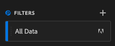

# 4.4 Preparação de dados em Customer Journey Analytics

## Objetivos

- Entenda a UO do Analysis Workspace no CJA
- Entenda os conceitos de preparação de dados no Analysis Workspace
- Aprenda a fazer cálculos de dados

## 4.4.1 UI do Analysis Workspace no CJA

O Analysis Workspace remove todas limitações típicas de um único relatório do Analytics. Ele fornece uma tela robusta e flexível para criar projetos de analytics personalizados. Arraste e solte qualquer número de tabelas de dados, visualizações e componentes (dimensões, métricas, segmentos e granularidades de tempo) para um projeto. Criação instantânea de avarias e segmentos, criação de cortes para análise, criação de alertas, comparação de segmentos, análise de fluxo e de falhas e relatórios de curadoria e agendamento para compartilhar com qualquer pessoa em seu negócio.

O Customer Journey Analytics traz essa Solution Além dos dados da plataforma. É altamente recomendável assistir a este vídeo de visão geral de quatro minutos:

>[!VIDEO](https://video.tv.adobe.com/v/35109?quality=12&learn=on)

Se você nunca usou o Analysis Workspace antes, recomendamos este vídeo:

>[!VIDEO](https://video.tv.adobe.com/v/26266?quality=12&learn=on)

### Crie Seu Projeto

Agora é hora de criar seu primeiro project do CJA. Vá para a aba de projetos dentro do CJA. De klikem **leidt tot nieuw**.

Em seguida, você verá a tela abaixo. Selecione **Leeg project** então klique em **creeert**.

Você verá um projeto vazio.

Primeiro, certificate-se de selecionar a Visualização de dados correta no canto superior direito da tela. Neste exemplo, a Visualização de dados a ser selecionada é `vangeluwe - Omnichannel Data View` .

Em seguida, você irá salvar seu projeto e dar um nome a ele. Você pode usar o seguinte comando para salvar:

| OS | Korte snede |
| ----------------- |-------------| 
| Windows | Control + S |
| Mac | Command + S |

Pop-up Você verá este:

Este modelo de nomenclatura gebruiken:

| Naam | Beschrijving |
| ----------------- |-------------| 
| `yourLastName - Omnichannel Analysis` | `yourLastName - Omnichannel Analysis` |

Em seguida, kliek em **sparen**.

## 4.4.2 Berekeningen van Métricas

Embora tenhamos organizado todos os componentes na Visualização de dados, você ainda deve adaptar algun deles para que os usuários de negócios estejam prontos para iniciar suas análises. Além disso, durante qualquer processo de analytics, você pode criar métricas calculadas para aprofundar a descoberta de insights.

Como exemplo, criaremos uma Taxa de conversão calculada usando a métrica/evento Compras que definimos na Visualização de dados.

## Taxa de conversão

Vamos começar a abrir o construtor de métricas calculadas. Clique em **+** para criar sua primeira Métrica calculada no Analysis Workspace.

O **Berekende Metrische Bouwer** irá aparecer:

Encontre **Aankopen** na lista de métricas geen menu doet lado esquerdo. Em **Metriek** klikem **toont allen**

Agora arraste e solte a métrica **Aankopen** na definição da métrica calculada.

Normaal, taxa de conversão significant **Conversies/Sessies**. Então, vamos fazer o mesmo cálculo na tela de definição de métrica calculada. Contacteer a métrica **Sessions** e arraste e solte-a geen criador de definição, geen zelfs aan **Aankopen**.

Waarnemingspost que o operador de divisão é selecionado automcamente.

A taxa de conversão é comumente representada em porcentagem. Então, vamos mudar o formato para porcentagem e selecionar 2 casas decimais.

Ten slotte wijzigt u de naam en beschrijving van de berekende metrische waarde:

| Titel | Beschrijving |
| ----------------- |-------------| 
| Conversiesnelheid | Conversiesnelheid |

Por fim, altere o nome e a describe ção da métrica calculada:

Não se esqueça de **Salvar** a Métrica calculada.

## 4.4.3 Dimensões calculadas: Filtros (segmentação) e intervalos de datas

### Filtros: Dimensões calculadas

Os cálculos não devem ser apenas para métricas. Antes de iniciar qualquer análise, também é interessante criar algumas **Berekende Dimensionen**. Is significant, essencialmente, **segmenten** geen Adobe Analytics. Geen Customer Journey Analytics, Verwerkt segmentos são chamados de **Filters**.

A criação de filtros ajudará os usuários de negócios a iniciar o analytics com algumas dimensões calculadas valiosas. Isso irá automzar algumas tarefas, além de ajudar na parte de adoção. Abaixo estão alweren:

1. Mídia Própria, Mídia Paga,
2. Visitas novas x recorrentes
3. Clientes com carrinho stoponado

Esses filtros podem ser criados antes ou durante a parte de análise (o que você fará no próximo uitoefício).

### Intervalos de datas: Dimensões de tempo calculadas

Als dimensões de tempo são outro tipo de dimensões calculadas. Algun já foram criados, mas você também pode criar suas próprias Dimensões de tempo personalizadas na fase de preparação de dados.

Essas Dimensões de tempo calculado ajudarão analistas e usuários de negócios a lembrar datas importantes e usá-las para filtrar e Alternar o tempo de relatório. Perguntas e dúvidas típicas quando fazemos análises:

- Quando foi a Black Vrijdag do ano passado? Wilt u de dias 21 e 29 invoeren?
- Quando veiculamos aquela campanha de TV em dezembro?
- De quando a quando fizemos as vendas de verão de 2018? Quero comparar com 2019. A propósito, você sabe os dias exatos em 2019?

Agora você concluiu o uitoefício de preparação de dados usando o Analysis Workspace do CJA.

Próxima etapa: [ 4.5 Visualização usando Customer Journey Analytics ](./ex5.md)

[Retornar para Fluxo de Usuário 4](./uc4.md)

[Retornar para Todos os Módulos](./../../overview.md)
