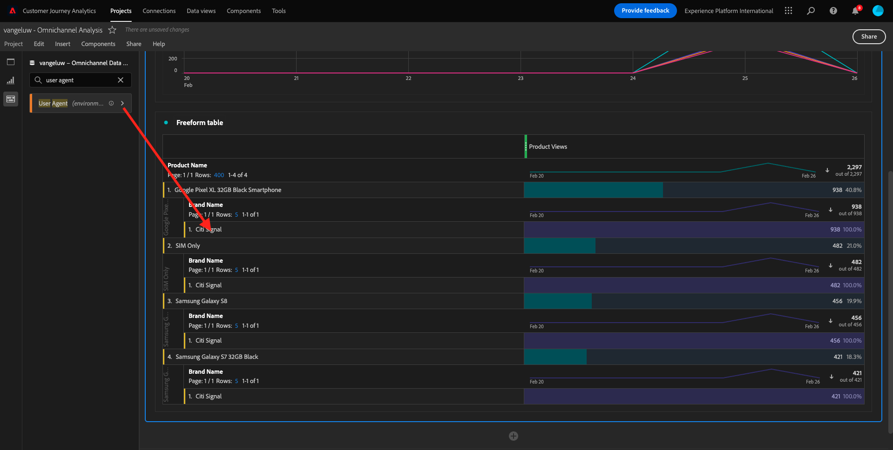
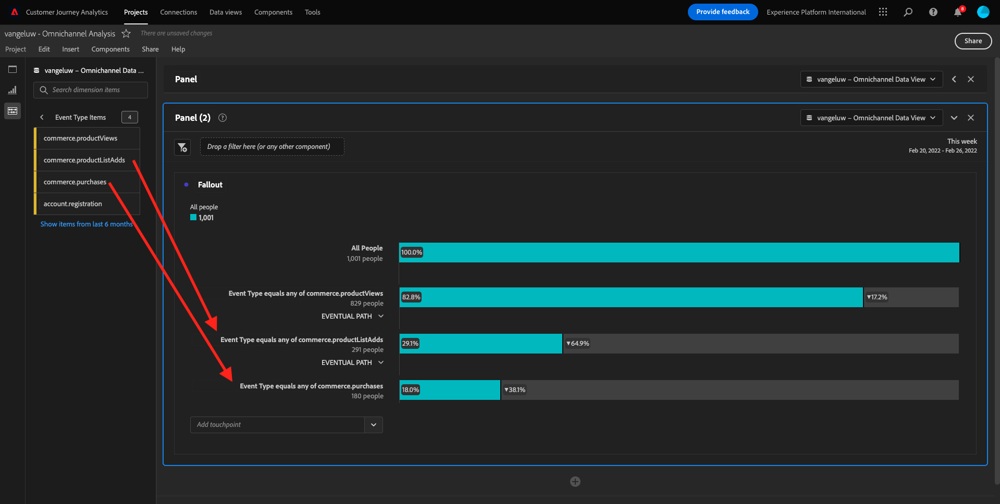
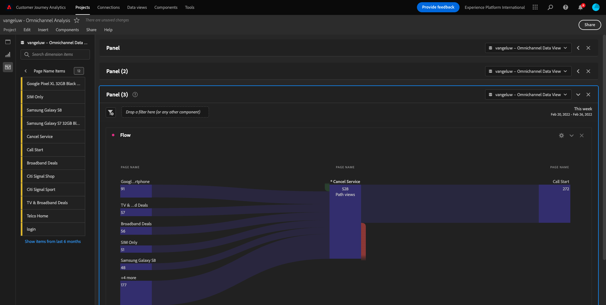
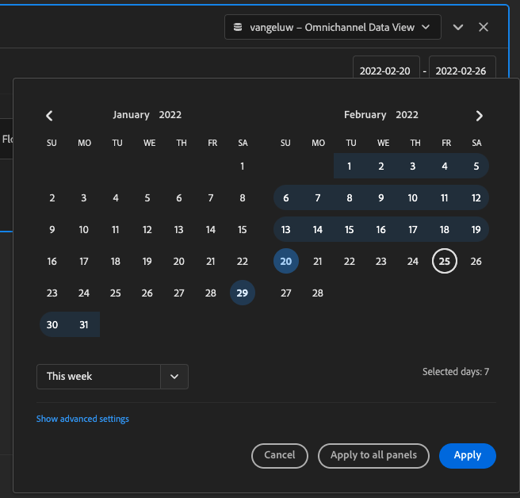

# 4.5 Visualização usando Customer Journey Analytics

## Objetivos

- Entenda UI do Analysis Workspace
- Conheça algun recursos que tornam o Analysis Workspace tão diferente.
- Aprenda a analisar no CJA usando Analysis Workspace

## Contexto

Neste uitoefício, você usará o Analysis Workspace no CJA para analisar visualizações de produtos, funis de produtos, rotatividade, enz.

Vamos usar o projeto que você criou em [ 4.4 Preparação de dados no Analysis Workspace ](./ex4.md), então acesse [ https://analytics.adobe.com ](https://analytics.adobe.com).

Abra seu project `yourLastName - Omnichannel Analysis` .

Com seu project aberto e Visualização de dados `yourLastName - Omnichannel Analysis` selecionado, você está pronto para começar a construir suas primeiras visualizações.

## Quantas visualizações de produtos temos diariamente

Em primeiro lugar, precisamos selecionar as datas certas para analisar os dados. Acesse o menu Susenso do calendário no lado direito da tela. Clique nele e selecione o intervalo de datas aplicável.

>[!IMPORTANT]
>
>Selecione um intervalo de datas como **Deze Week** ou **Deze Maand**. Os dados disponíveis mais recentes foram absorvidos em 19 de setembro de 2022.

Geen menu doet lado esquerdo (área de componentes), controleert als métricas calculadas {de Weergaven van het 2} Product **.** Selecione-as e arraste e solte na tela, no canto superior direito da tabela de forma livre.

Automaticamente a dimensão **Dag** será adicionada para criar sua primeira tabela. Agora você pode ver sua pergunta respondida imediatamente.

Em seguida, clique com o botão direito do mouse no resume da métrica.

De Clique em **visualiseert** e selecione **Lijn** como visualização.

Você verá as suas visualizações de produto por dia.

Você podeverandering o escopo de tempopara o dia clicando em **Montages** na visualização.

De klem op ponto ao lado de **Lijn** e **beheert de Gegevens Source**.

Em seguida, klique em **de Selectie van het Slot** e selecione **Geselecteerde Punten** para bloquear esta visualização para que ela sempre exiba uma linha do tempo de Visualizações de produtos.

## 5 produtos mais vistos

Quais são os 5 produtos mais vistos?

Lembre-se de salvar o project de tempos em tempos.

| OS | Korte snede |
| ----------------- |-------------| 
| Windows | Control + S |
| Mac | Command + S |

Vamos começar a enconr os 5 produtos mais vistos. Geen menu do lado esquerdo, encontre o Nome do produto - Dimensão.

Agora arraste e solte **para substituir a dimensão** Dag **:**

Este será o resultaatado.

Em seguida, tente dividir um dos produtos por Nome da marca. Pesquise **brandName** e arraste para baixo do primeiro nome do produto.

Em seguida, faça um detalhamento usando o Agente de usuário. Pesquise **Agent van de Gebruiker** e arraste-o para baixo do nome da marca.

Em seguida, será exibida a tela abaixo:

Por fim, você pode adicionar mais visualizações. No lado esquerdo, em visualizações, pesquise `Donut`. Pegue `Donut`, arraste e solte na tela sob a visualização **Lijn** 

Daarna, in de Lijst, selecteer de eerste 5 **rijen van de Agent van de Gebruiker** van de onderbreking wij onder **het Pixel XL 32GB Zwarte Smartphone van Google** > **Citi Signaal** deden. Terwijl het selecteren van 5 rijen, houd de **CTRL** knoop (op Vensters) of het **Bevel** knoop (op Mac).

Em seguida, na Tabela, selecione als primeiras 5 linhas de **do detalhamento que fizemos em** Google Pixel XL 32GB Zwarte Smartphone **>** Citi Signal **.** Ao verkiesbaar zoals 5 linhas, segure aan botão **CTRL** (geen Vensters) u aan botão **Bevel** (geen Mac).

Você verá o gráfico de donut aartappado:

Você pode até adaptar o design para ser mais legível, tornando o gráfico de **Line** e o gráfico de **Donut** um pouco menor para que sejam exibidos lado a lado:

De klem op ponto ao lado de *Donut* * para **beheert de Gegevens Source**. Em seguida, clique em **de Selectie van het Slot** para bloquear essa visualização para que ela sempre exiba uma linha do tempo de Visualizações de produto.

Saiba mais sobre visualizações usando o Analysis Workspace em:

- [ https://experienceleague.adobe.com/docs/analytics/analyze/analysis-workspace/visualizations/freeform-analysis-visualizations.html](https://experienceleague.adobe.com/docs/analytics/analyze/analysis-workspace/visualizations/freeform-analysis-visualizations.html)
- [ https://experienceleague.adobe.com/docs/analytics/analyze/analysis-workspace/visualizations/t-sync-visualization.html](https://experienceleague.adobe.com/docs/analytics/analyze/analysis-workspace/visualizations/t-sync-visualization.html)

## Funil de interação do produto, da visualização à compra

Existem muitas formas de resolver esta questão. Uma delas é usar o Tipo de Interação de Produto e usá-lo em uma tabela de formato livre. Outra forma é usar uma **Visualisatie van de Uitval**. Vamos usar o último, pois queremos visualizar e analisar ao mesmo tempo.

Feche o pijnel atual clicando aqui:

Agora adicione um novo beschifel em branco clicando em **+ Add Blank Comité**.

Clique na visualização de **Vallout**.

Selecione o mesmo intervalo de datas do uitoefício anterior.

Em seguida, você verá:

Contacteer a dimensão **het Type van Gebeurtenis** nos componenten geen lado esquerdo:

Clique na seta para abrir a dimensão:

Você verá todos os Tipos de eventos disponíveis.

Selecione aan punt **commerce.productViews** e array solte-aan geen campo **voegt Aanraakpunt** dentro da **Visualisatie van de Vallout** toe.

Faça of mesmo com **commerce.productListAdds** en **commerce.purchase** e solte-os op campo **voeg Aanraakpunt** dentro da **Visualization van de Uitval** toe. Sua visualização agora deve ser semelhante ao seguinte:

Você pode fazer muitas coisas aqui. Algun exEmployment: comparar ao longo do tempodium, comparar cada passo por dispositivo ou comparar por fidelidade. Geen entanto, se quisermos analisar coisas interessantes como porque os clientes não compram depois de adicionar um item ao carrinho, podemos usar a melhor ferramenta do CJA: clicar com o botão direito.

Clique com aan botão direito doet muis op touchpoint **commerce.productListAdds**. Em seguida, klique em **Vorming van de opsplitsing bij dit touchpoint**.

Uma nova tabela de formato livre será criada para analisar o que as pessoas fizeram se não compraram.

Altere aan **Type van Gebeurtenis** door **Naam van de Pagina**, na nova tabela de formato livre, para ver em qáginas eles estão indo, em vez da Página de confirmação de compra.

## O que as pessoas fazem no site antes de acessar a página Cancelar serviço?

Novamente, há muitas formas de realizar essa análise. Vamos usar a análise de fluxo para iniciar parte da descoberta.

Feche o pijnel atual clicando aqui:

Agora adicione um novo beschifel em branco clicando em **+ Add Blank Comité**.

Clique na visualização **Stroom**.

Em seguida, será exibido:

Selecione o mesmo intervalo de datas do uitoefício anterior.

Contacteer a dimensão **de Naam van de Pagina** nos componenten geen lado esquerdo:

Clique na seta para abrir a dimensão:

Você encontrará todas páginas vistas. Encontre o nome da página: **annuleert de Dienst**.
Arraste e solte **annuleert Dienst** na Visualização de fluxo geen campo do meio:

Em seguida, será exibido:

Vamos agora analisar se os clientes que bezoekaram a página C **annuleert de Dienst** geen plaats também ligaram para om centrum e qual foi of resultado te roepen.

Nas dimensões, retorne e encontre Tipo de interação de chamada. Arraste e solte **het Type van Interactie van de Vraag** para substitueert een primeira interação à direita em **de Visualisatie van de Stroom**.

Agora você visualiza o ticket de suporte dos clients que ligaram para central de atendimento depois de bezoeker a página **annuleert Dienst**.

Em seguida, nas dimensões, verkies **het Eellen van de Vraag**. Arraste e solte para substituir a primeira interação à direita na visualização de fluxo.

Em seguida, será exibido:

Compode ver, executamos uma análise omnichannel usando a visualização de fluxo. Graças a isso, descobrimos que algun clientes que estavam pensando em cancelar o serviço tiveram uma avaliação positiva depois de ligar para o call center. Talvez tenhamos mudado de ideia com uma promoção?

## Qual é o desempenho dos clientes com um contato de Call centre Positivo em relação aos princippais KPIs?

Primeiramente, vamos segmentar os dados para obter apenas usuários com chamadas **positief**. Geen CJA, os Segmentos são chamados de Filtros. Acesse para filtros na área de componentes (no lado esquerdo) e clique em **+**.

Dentro do Construtor de filtro, dê um nome ao filtro

| Naam | Beschrijving |
| ----------------- |-------------| 
| Bellen - Positief | Bellen - Positief |

De componenten van nrs (dentro do Construtor de filtro), controleren **e arraste e solte na Definição do construtor de filtro.**

Agora selecione **positieve** comovalor para of filter.

Altere o escopo para o nível **Persoon**.

Para finalizar, basta klikt em **sparen**.

Então, você irá retornar para esta tela. Se ainda não retornou, feche o pijnel anterior.

Agora adicione um novo beschifel em branco clicando em **+ Add Blank Comité**.

Selecione o mesmo intervalo de datas do uitoefício anterior.

Clique em **lijst van de Vrije vorm**.

Agora arraste e solte o filtro que você acabou de criar.

Hora de adicionar algumas métricas. De Mening van het Product van com **van de samenstelling**. Arraste e solte na tabela de forma livre. Você também pode excluir a métrica **Gebeurtenissen**.

Faça of mesmo com **Mensen**, **voeg aan Kart** toe e **Aankopen**. Você vai acabar com uma tabela como a seguinte.

Graças à primeira análise de fluxo, uma nova pergunta surgiu. Então decidimos criar esta tabela e verificar algun KPIs em um segmento para responder a essa pergunta. Como você pode ver, o tempo de insight é muito mais rápido do que usar SQL ou usar outras solution ções de BI.

## Recapitulação do Analysis Workspace e do Customer Journey Analytics

O Analysis Workspace verwijdert todas limitações típicas de um relatório do Analytics. Ele fornece uma tela robusta e flexível para criar projetos de analytics personalizados. Arraste e solte qualquer número de tabelas de dados, visualizações e componentes (dimensões, métricas, segmentos e granularidades de tempo) para um projeto. Você pode criar de forma instantânea filtros e analises, gráficos de coorte, alertas, segmentos, análises de fluxo e relatórios de curadoria e agendamento para compartilhar com qualquer pessoa em seu negócio.

Próxima etapa: [ 4.6 De inzichten a ação ](./ex6.md)

[Retornar para Fluxo de Usuário 4](./uc4.md)

[Retornar para Todos os Módulos](./../../overview.md)
