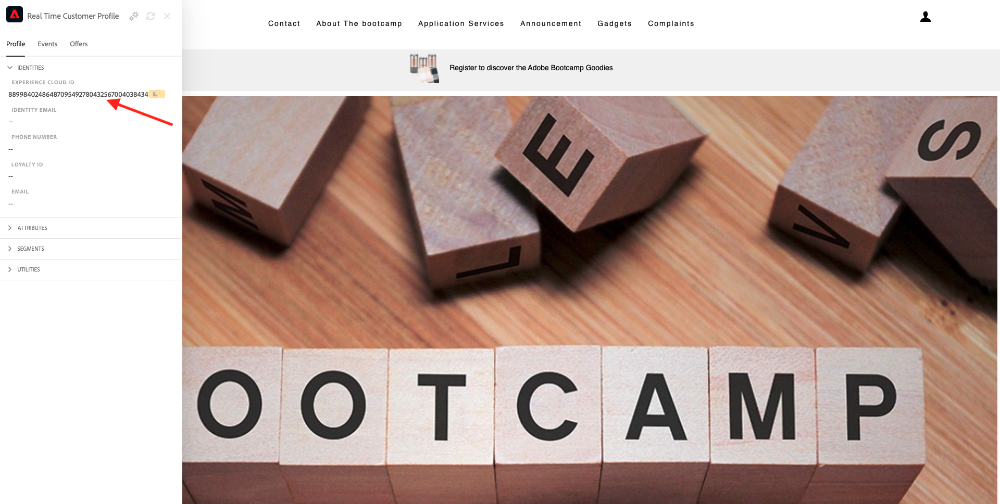

# 1.1 Van onbekend naar bekend op de website

## Context

De reis van onbekend naar bekend is tegenwoordig een van de belangrijkste onderwerpen onder merken, evenals de reis van de klant van aankoop naar bewaring.

Adobe Experience Platform speelt een enorme rol in deze reis. Het platform is de hersenen voor mededeling, het **ervaringssysteem van verslag**.

Platform is een omgeving waarin het woord klant breder is dan alleen de bekende klanten. Een onbekende bezoeker op de website is ook een klant vanuit het perspectief van Platform en als zodanig wordt al het gedrag als onbekende bezoeker ook verzonden naar Platform. Dankzij deze aanpak, wanneer deze bezoeker uiteindelijk een bekende klant wordt, kan een merk ook visualiseren wat er voor dat moment gebeurde. Dit helpt vanuit een attributie- en ervaringsperspectief.

## Vervoersstroom voor klanten

Ga naar [ https://bootcamp.aepdemo.net ](https://publish9122.adobedemo.com/content/aep-bootcamp-experience/language-masters/en.html). Klik **allen** toestaan.

Klik op het Adobe-logopictogram in de linkerbovenhoek van het scherm om de Profile Viewer te openen.

Heb een blik bij het paneel van de Kijker van het Profiel en het Profiel van de Klant in real time met **identiteitskaart van het Experience Cloud** als primaire herkenningsteken voor deze momenteel onbekende klant.

U kunt ook alle Experience Events zien die zijn verzameld op basis van het gedrag van de klant. De lijst is momenteel leeg, maar dat zal binnenkort veranderen.

Ga naar de **menuoptie van de Diensten van de Toepassing 0} {en klik op het product** Real-Time CDP **.**

Vervolgens ziet u de pagina met productdetails. Een Gebeurtenis van de Ervaring van type **Mening van het Product** is nu verzonden naar Adobe Experience Platform gebruikend de implementatie van SDK van het Web die u in Module 1 herzien. Open het paneel van de Kijker van het Profiel en heb een blik bij uw **Gebeurtenissen van de Ervaring**.

Ga naar de **menuoptie van de Diensten van de Toepassing 0} {en klik op het product** Adobe Journey Optimizer **.** Er is een andere Experience Event verzonden naar Adobe Experience Platform.

Open het deelvenster Profielviewer. U zult nu 2 Gebeurtenissen van de Ervaring van type **Mening van het Product** zien. Terwijl het gedrag anoniem is, wordt elke klik gevolgd en in Adobe Experience Platform opgeslagen. Zodra de anonieme klant wordt gekend, zullen wij al anoniem gedrag automatisch aan het knowhowprofiel kunnen samenvoegen.

Analyseer nu uw klantenprofiel en gebruik dan uw gedrag om uw klantenervaring op de website te personaliseren.

Volgende Stap: [ 1.2 visualiseer uw eigen real-time klantenprofiel - UI ](./ex2.md)

[Ga terug naar gebruikersstroom 1](./uc1.md)

[Terug naar alle modules](../../overview.md)
