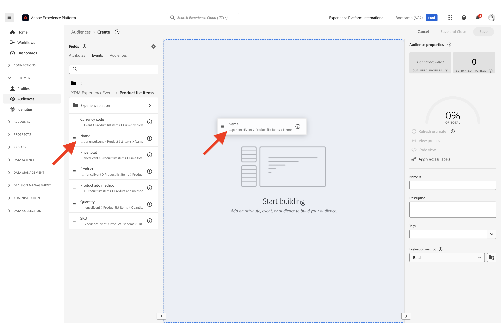
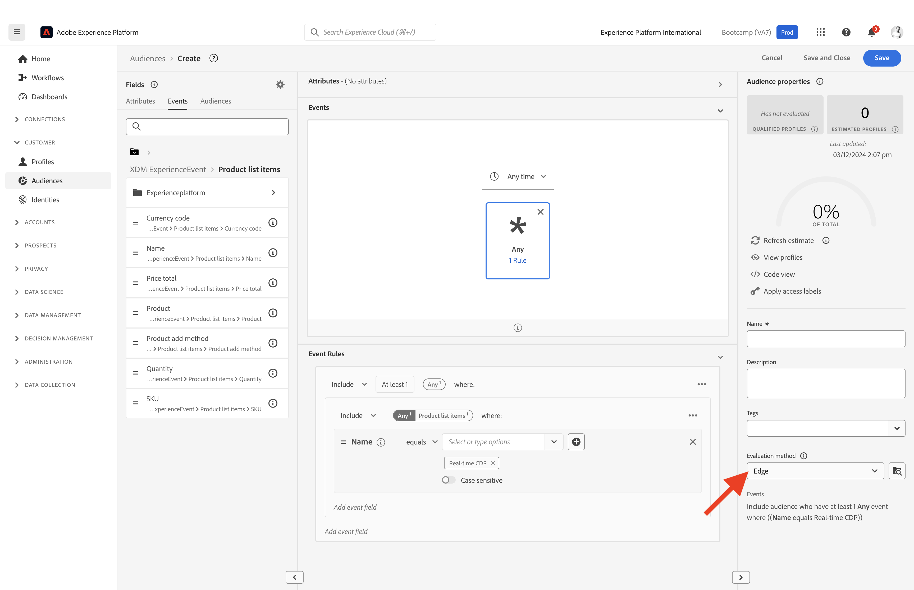

# 1.3 Een publiek maken - UI

In deze oefening, zult u een publiek creëren door gebruik van de Bouwer van het Publiek van Adobe Experience Platform te maken.

## Artikel

Ga naar [Adobe Experience Platform](https://experience.adobe.com/platform). Na het aanmelden landt je op de homepage van Adobe Experience Platform.

Voordat u verdergaat, moet u een **sandbox**. De sandbox die moet worden geselecteerd, krijgt een naam ``Bootcamp``. U kunt dit doen door op de tekst te klikken **[!UICONTROL Production Prod]** in de blauwe lijn boven op het scherm. Nadat u de juiste [!UICONTROL sandbox], ziet u de schermwijziging en nu bent u in uw eigen omgeving [!UICONTROL sandbox].

Ga in het menu aan de linkerkant naar **Soorten publiek**. Op deze pagina ziet u dashboards met essentiële informatie over **Publiek** prestaties.

Klikken op **Bladeren** een overzicht van alle bestaande doelgroepen te zien. Klik op de knop **+ Personeel maken** om een nieuw publiek te maken.

Er wordt een pop-uppictogram weergegeven met de vraag of u **&#39;Doelgroep samenstellen&#39;** of **&#39;Build rule&#39;**. Kies **&#39;Build rule&#39;** om door te gaan en te klikken **maken**.

![Segmentering][def]

Zodra u in de publieksbouwer bent, merkt u onmiddellijk **Attributen** en de **Afzonderlijk XDM-profiel** referentie.

Aangezien XDM de taal is die de ervaringszaken macht, is XDM ook de stichting voor de publieksbouwer. Alle gegevens die in Platform worden opgenomen, moeten tegen XDM worden toegewezen en als zodanig, worden alle gegevens deel van het zelfde gegevensmodel ongeacht waar die gegevens uit komen. Dit geeft u een groot voordeel wanneer het bouwen van publiek, zoals van deze één kijkbouwer UI, kunt u gegevens van om het even welke oorsprong in het zelfde werkschema combineren. Soorten publiek dat is gemaakt in de Audience Builder kunnen worden verzonden naar oplossingen zoals Adobe Target, Adobe Campaign of een ander activeringskanaal.

U moet nu een publiek maken van alle klanten die het product hebben bekeken **Real-Time CDP**.

U moet een Experience Event toevoegen om dit publiek op te bouwen. U kunt alle Experience Events vinden door op **Gebeurtenissen** in het deelvenster **Velden** menubalk.

Vervolgens ziet u het hoogste niveau, **XDM ExperienceEvents** knooppunt. Klikken op **XDM ExperienceEvent**.

Ga naar **Objecten in de productlijst**.

Selecteren **Naam** en sleep de **Naam** object van het linkermenu naar het canvas van de publieksbuilder **Gebeurtenissen** sectie. U zult dan dit zien:

De vergelijkingsparameter moet **equals** en in het invoerveld typt u **Real-time CDP**.

Telkens wanneer u een element aan de publieksbouwer toevoegt, kunt u klikken **Offerte vernieuwen** om een nieuwe schatting van de bevolking in uw publiek te krijgen.

Als **Evaluatiemethode**, selecteert u **Rand**.

Tot slot geven wij uw publiek een naam en bewaren het.

Gebruik als naamgevingsconventie:

- `yourLastName - Interest in Real-Time CDP`

Klik vervolgens op de knop **Opslaan en sluiten** om uw publiek op te slaan.

U gaat nu terug naar de overzichtspagina van het publiek, waar u een voorbeeldvoorproef van klantenprofielen zult zien die voor uw publiek kwalificeren.

U kunt nu doorgaan met de volgende oefening en uw publiek gebruiken met Adobe Target.

Volgende stap: [1.4 Actie nemen: stuur je publiek naar Adobe Target](./ex4.md)

[Ga terug naar gebruikersstroom 1](./uc1.md)

[Terug naar alle modules](../../overview.md)

[def]: ./images/segmentationpopup.png
