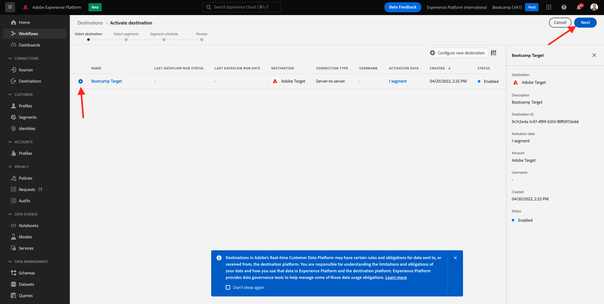

# 1.4 Actie nemen: stuur je publiek naar Adobe Target

Ga naar [ Adobe Experience Platform ](https://experience.adobe.com/platform). Na het aanmelden landt je op de homepage van Adobe Experience Platform.

Alvorens u verdergaat, moet u a **zandbak** selecteren. De te selecteren sandbox krijgt de naam ``Bootcamp`` . U kunt dit doen door op de tekst **[!UICONTROL Production Prod]** in de blauwe lijn boven op het scherm te klikken. Nadat u de juiste [!UICONTROL sandbox] hebt geselecteerd, ziet u de schermwijziging en nu bevindt u zich in uw toegewezen [!UICONTROL sandbox] .

## 1.4.1 Activeer je publiek naar de Adobe Target-bestemming

Adobe Target is beschikbaar als een bestemming vanuit Real-Time CDP. Om uw integratie van Adobe Target te plaatsen, ga **Doelen**, aan **Catalogus**.

Klik **Personalization** in het **menu van Categorieën**. U zult dan de **Adobe Target** bestemmingskaart zien. Klik **activeren publiek**.

Selecteer de bestemming ``Bootcamp Target`` en klik **daarna**.

In de lijst van beschikbaar publiek, selecteer het publiek u in [ 1.3 creeerde een publiek ](./ex3.md), dat `yourLastName - Interest in Real-Time CDP` wordt genoemd. Dan, klik **daarna**.

Voor de volgende pagina, klik **daarna**.

Klik **Afwerking**.

Uw publiek wordt nu geactiveerd voor Adobe Target.

>[!IMPORTANT]
>
>Als je net je Adobe Target-bestemming hebt gemaakt in Real-Time CDP, kan het tot een uur duren voordat de bestemming live is. Dit is eenmalig wachttijd, wegens de opstelling van de backendconfiguratie. Zodra de aanvankelijke 1 uur wachttijd en de backendconfiguratie wordt gedaan, zal het onlangs toegevoegde randpubliek dat naar de bestemming van Adobe Target wordt verzonden voor richten in real time beschikbaar zijn.

## 1.4.2 Configureer uw Adobe Target-formuliergebaseerde activiteit

Nu uw Real-Time CDP-publiek is geconfigureerd om naar Adobe Target te worden verzonden, kunt u uw Experience Targeting-activiteit in Adobe Target configureren. In deze oefening zult u een Visuele op Composer-Gebaseerde activiteit van de Ervaring vormen.

Ga naar de homepage van Adobe Experience Cloud door [ https://experiencecloud.adobe.com/ ](https://experiencecloud.adobe.com/) te gaan. Klik **Doel** om het te openen.

Op **Adobe Target** homepage, zult u alle bestaande Activiteiten zien.
Klik op **+ Activiteit maken** om een nieuwe activiteit te maken.

Selecteer **Ervaring richtend**.

Selecteer **Visuele** en plaats de **Activiteit URL** aan `https://bootcamp.aepdemo.net/content/aep-bootcamp-experience/language-masters/en/exercises/particpantXX.html`, maar alvorens u dat doet, vervang XX door een aantal tussen 01 en 30.

>[!IMPORTANT]
>
>Elke deelnemer aan het activering moet een aparte webpagina gebruiken om botsing met verschillende Adobe Target-ervaringen te voorkomen. U kunt een Web-pagina plukken en URL vinden door hier te gaan: [ https://bootcamp.aepdemo.net/content/aep-bootcamp-experience/language-masters/en/exercises.html ](https://bootcamp.aepdemo.net/content/aep-bootcamp-experience/language-masters/en/exercises.html).
>
>Pagina&#39;s delen allemaal dezelfde basis-URL en eindigen op het nummer van de deelnemer.
>
>Als voorbeeld zou deelnemer 1 URL `https://bootcamp.aepdemo.net/content/aep-bootcamp-experience/language-masters/en/exercises/particpant01.html` moeten gebruiken, zou deelnemer 30 URL `https://bootcamp.aepdemo.net/content/aep-bootcamp-experience/language-masters/en/exercises/particpant30.html` moeten gebruiken.

Selecteer de werkruimte **BIJ Bootkamp**.

Klik **daarna**.

U bent nu in de Composer van de Visuele Ervaring. Het kan 20-30 seconden duren totdat de website volledig is geladen.

Het standaardpubliek is momenteel **Alle Bezoekers**. Klik op **3 dots** naast **Alle Bezoekers** en klik **Publiek van de Verandering**.

U ziet nu de lijst met beschikbare soorten publiek. Het Adobe Experience Platform-publiek dat u eerder hebt gemaakt en naar Adobe Target hebt verzonden, maakt nu deel uit van deze lijst. Selecteer het publiek dat u eerder in Adobe Experience Platform hebt gemaakt. Klik **toewijzen Publiek**.

Uw Adobe Experience Platform-publiek maakt nu deel uit van deze Experience Targeting Activity.

Alvorens u het heldenbeeld kunt veranderen, zult u **moeten klikken toestaat allen** op de koekjesbanner.

Om dit te doen, ga **doorbladeren**

Daarna, klik **allen** toestaan.

Daarna, ga terug **samenstellen**.

Laten we nu de hoofdafbeelding veranderen op de homepage van de website. Klik het standaard heldenbeeld op de website, klik **vervangen Inhoud** en selecteer dan **Beeld**.

Onderzoek naar het beelddossier **rtcdp.png**. Selecteer het en klik dan **sparen**.

U zult dan de nieuwe ervaring met het nieuwe beeld, voor uw geselecteerd Publiek zien.

Klik op de titel van uw activiteit in de linkerbovenhoek om de naam ervan te wijzigen.

Gebruik voor de naam:

- `yourLastName - RTCDP - XT (VEC)`

Klik **daarna**.

Klik **daarna**.

Op de **Doelstellingen &amp; Montages** - pagina, ga naar **Goal Metrics**.

Plaats het Primaire Doel aan **Betrokkenheid** - **Tijd op Plaats**. Klik **sparen &amp; Sluiten**.

U bent nu op de **pagina van het Overzicht van de Activiteit**. U moet uw activiteit nog activeren.

Klik op het gebied **Inactief** en selecteer **activeren**.

Je krijgt dan een visuele bevestiging dat je activiteit nu actief is.

Uw activiteiten zijn nu live en kunnen worden getest op de website van het bootkamp.

Als u nu terug naar uw demowebsite gaat en de productpagina voor **Real-Time CDP** bezoekt, zult u onmiddellijk voor het publiek kwalificeren dat u creeerde, en u zult de activiteit van Adobe Target op de homepage in real time zien worden getoond.

>[!IMPORTANT]
>
>Elke deelnemer aan het activering moet een aparte webpagina gebruiken om botsing met verschillende Adobe Target-ervaringen te voorkomen. U kunt een Web-pagina plukken en URL vinden door hier te gaan: [ https://bootcamp.aepdemo.net/content/aep-bootcamp-experience/language-masters/en/exercises.html ](https://bootcamp.aepdemo.net/content/aep-bootcamp-experience/language-masters/en/exercises.html).
>
>Pagina&#39;s delen allemaal dezelfde basis-URL en eindigen op het nummer van de deelnemer.
>
>Als voorbeeld zou deelnemer 1 URL `https://bootcamp.aepdemo.net/content/aep-bootcamp-experience/language-masters/en/exercises/particpant01.html` moeten gebruiken, zou deelnemer 30 URL `https://bootcamp.aepdemo.net/content/aep-bootcamp-experience/language-masters/en/exercises/particpant30.html` moeten gebruiken.

Volgende Stap: [ 1.5 Actie nemen: verzend uw publiek naar Facebook ](./ex5.md)

[Ga terug naar gebruikersstroom 1](./uc1.md)

[Terug naar alle modules](../../overview.md)
