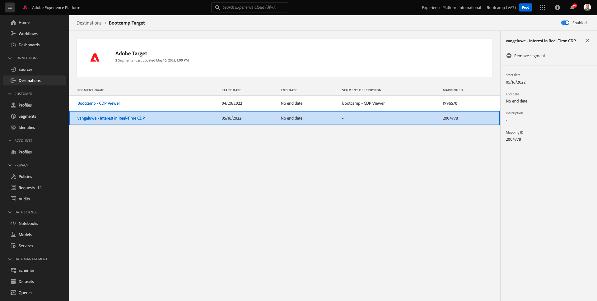
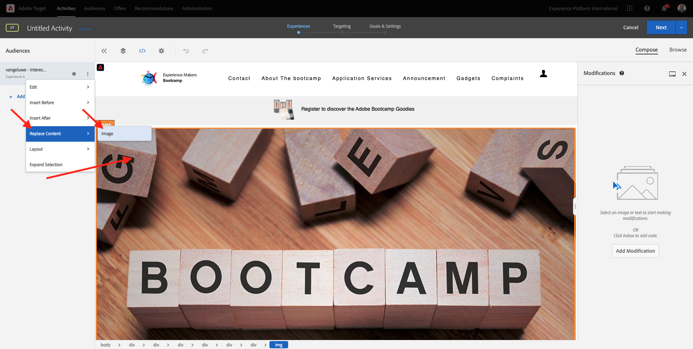

# 1.4 Actie ondernemen: Uw segment verzenden naar Adobe Target

Ga naar [Adobe Experience Platform](https://experience.adobe.com/platform). Na het aanmelden landt je op de homepage van Adobe Experience Platform.

Voordat u verdergaat, moet u een **sandbox**. De sandbox die moet worden geselecteerd, krijgt een naam ``Bootcamp``. U kunt dit doen door op de tekst te klikken **[!UICONTROL Productieproduct]** in de blauwe lijn boven op het scherm. Nadat u de juiste [!UICONTROL sandbox], ziet u de schermwijziging en nu bent u in uw eigen omgeving [!UICONTROL sandbox].

## 1.4.1 Activeer uw segment naar uw Adobe Target-bestemming

Adobe Target is beschikbaar als een bestemming vanuit Real-Time CDP. Ga naar **Doelen**, naar **Catalogus**.

Klikken **Personalisatie** in de **Categorieën** -menu. Dan zie je de **Adobe Target** doelkaart. Klikken **Segmenten activeren**.

Het doel selecteren ``Bootcamp Target`` en klik op **Volgende**.

Selecteer in de lijst met beschikbare segmenten het segment waarin u hebt gemaakt [1.3 Een segment maken](./ex3.md), die `yourLastName - Interest in Real-Time CDP`. Klik vervolgens op **Volgende**.

Klik op de volgende pagina op **Volgende**.

Klikken **Voltooien**.

Uw segment wordt nu geactiveerd naar Adobe Target.

>[!IMPORTANT]
>
>Als je net je Adobe Target-bestemming hebt gemaakt in Real-Time CDP, kan het tot een uur duren voordat de bestemming live is. Dit is eenmalig wachttijd, wegens de opstelling van de backendconfiguratie. Zodra de aanvankelijke 1 uur wachttijd en achtergrondconfiguratie wordt gedaan, zullen de onlangs toegevoegde randsegmenten die naar de bestemming van Adobe Target worden verzonden voor het richten in real time beschikbaar zijn.

## 1.4.2 Configureer uw Adobe Target-formuliergebaseerde activiteit

Nu uw Real-Time CDP-segment is geconfigureerd voor verzending naar Adobe Target, kunt u uw Experience Targeting-activiteit configureren in Adobe Target. In deze oefening zult u een Visuele op Composer-Gebaseerde activiteit van de Ervaring vormen.

Ga naar de Adobe Experience Cloud-homepage door naar [https://experiencecloud.adobe.com/](https://experiencecloud.adobe.com/). Klikken **Doel** om het te openen.

Op de **Adobe Target** homepage, zult u alle bestaande Activiteiten zien.
Klikken **+ Activiteit maken** om een nieuwe Activiteit te creëren.

Selecteren **Gericht op ervaring**.

Selecteren **Zichtbaar** en stelt de **URL van activiteit** tot `https://bootcamp.aepdemo.net/content/aep-bootcamp-experience/language-masters/en/exercises/particpantXX.html`Maar voordat u dat doet, vervangt u XX door een getal tussen 01 en 30.

>[!IMPORTANT]
>
>Elke deelnemer aan het activering moet een aparte webpagina gebruiken om botsing met verschillende Adobe Target-ervaringen te voorkomen. U kunt hier een webpagina kiezen en de URL vinden: [https://bootcamp.aepdemo.net/content/aep-bootcamp-experience/language-masters/en/exercises.html](https://bootcamp.aepdemo.net/content/aep-bootcamp-experience/language-masters/en/exercises.html).
>
>Pagina&#39;s delen allemaal dezelfde basis-URL en eindigen op het nummer van de deelnemer.
>
>Als voorbeeld zou deelnemer 1 URL moeten gebruiken `https://bootcamp.aepdemo.net/content/aep-bootcamp-experience/language-masters/en/exercises/particpant01.html`, deelnemer 30 moet URL gebruiken `https://bootcamp.aepdemo.net/content/aep-bootcamp-experience/language-masters/en/exercises/particpant30.html`.

De werkruimte selecteren **AT Bootkamp**.

Klik op **Next**.

U bevindt zich nu in de composer voor visuele ervaring. Het kan 20-30 seconden duren totdat de website volledig is geladen.

Het standaardpubliek is momenteel **Alle bezoekers**. Klik op de knop **3 punten** naast **Alle bezoekers** en klik op **Publiek wijzigen**.

U ziet nu de lijst met beschikbare soorten publiek. Het Adobe Experience Platform-segment dat u eerder hebt gemaakt en naar Adobe Target hebt verzonden, maakt nu deel uit van deze lijst. Selecteer het segment dat u eerder in Adobe Experience Platform hebt gemaakt. Klikken **Publiek toewijzen**.

Uw Adobe Experience Platform-segment maakt nu deel uit van deze Experience Targeting Activity.

Voordat u de hoofdafbeelding kunt wijzigen, moet u eerst op **Alles toestaan** op de cookiebanner.

Ga hiertoe naar **Bladeren**

Klik op Volgende **Alles toestaan**.

Ga vervolgens terug naar **Samenstellen**.

Laten we nu de hoofdafbeelding veranderen op de homepage van de website. Klik op de standaardhoofdafbeelding op de website en klik op **Inhoud vervangen** en selecteer vervolgens **Afbeelding**.

Zoeken naar het afbeeldingsbestand **rtcdp.png**. Selecteer het en klik vervolgens op **Opslaan**.

U zult dan de nieuwe ervaring met het nieuwe beeld, voor uw geselecteerd Publiek zien.

Klik op de titel van uw activiteit in de linkerbovenhoek om de naam ervan te wijzigen.

Gebruik voor de naam:

- `yourLastName - RTCDP - XT (VEC)`

Klik op **Next**.

Klik op **Next**.

Op de **Doelstellingen en instellingen** - pagina, ga naar **Goederenstatistieken**.

Het primaire doel instellen op **Betrokkenheid** - **Tijd op de site**. Klikken **Opslaan en sluiten**.

Je bent nu op de **Overzicht van activiteiten** pagina. U moet uw activiteit nog activeren.

Klik in het veld **Inactief** en selecteert u **Activeren**.

Je krijgt dan een visuele bevestiging dat je activiteit nu actief is.

Uw activiteiten zijn nu live en kunnen worden getest op de website van het bootkamp.

Als u nu teruggaat naar uw demo-website en de productpagina bezoekt voor **Real-Time CDP** U komt dan meteen in aanmerking voor het segment dat u hebt gemaakt en u ziet dat de Adobe Target-activiteit in real-time wordt weergegeven op de homepage.

>[!IMPORTANT]
>
>Elke deelnemer aan het activering moet een aparte webpagina gebruiken om botsing met verschillende Adobe Target-ervaringen te voorkomen. U kunt hier een webpagina kiezen en de URL vinden: [https://bootcamp.aepdemo.net/content/aep-bootcamp-experience/language-masters/en/exercises.html](https://bootcamp.aepdemo.net/content/aep-bootcamp-experience/language-masters/en/exercises.html).
>
>Pagina&#39;s delen allemaal dezelfde basis-URL en eindigen op het nummer van de deelnemer.
>
>Als voorbeeld zou deelnemer 1 URL moeten gebruiken `https://bootcamp.aepdemo.net/content/aep-bootcamp-experience/language-masters/en/exercises/particpant01.html`, deelnemer 30 moet URL gebruiken `https://bootcamp.aepdemo.net/content/aep-bootcamp-experience/language-masters/en/exercises/particpant30.html`.

Volgende stap: [1.5 Actie nemen: Uw segment verzenden naar Facebook](./ex5.md)

[Ga terug naar gebruikersstroom 1](./uc1.md)

[Terug naar alle modules](../../overview.md)
