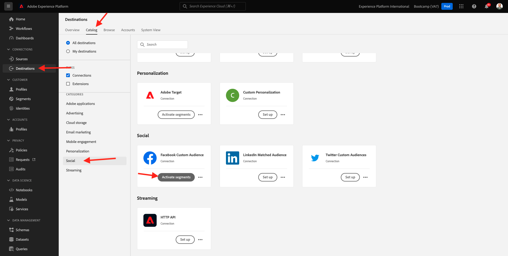

# 1.5 Actie nemen: stuur je publiek naar Facebook

Ga naar [&#x200B; Adobe Experience Platform &#x200B;](https://experience.adobe.com/platform). Na het aanmelden landt je op de homepage van Adobe Experience Platform.

Alvorens u verdergaat, moet u a **zandbak** selecteren. De te selecteren sandbox krijgt de naam ``Bootcamp`` . U kunt dit doen door op de tekst **[!UICONTROL Production Prod]** in de blauwe lijn boven op het scherm te klikken. Nadat u de juiste [!UICONTROL sandbox] hebt geselecteerd, ziet u de schermwijziging en nu bevindt u zich in uw toegewezen [!UICONTROL sandbox] .

In het linkermenu, ga naar **Doelen**, dan gaan naar **Catalogus**. U zult dan de **Catalogus van Doelen** zien. In **Doelen**, klik **activeren publiek** op de **kaart van het publiek van de Douane van Facebook**.

Selecteer de bestemming **bootkamp-facebook** en klik **daarna**.

Selecteer in de lijst met beschikbare doelgroepen het publiek dat u in de vorige oefening hebt gemaakt. Klik **daarna**.

Op de **Afbeelding** pagina, zorg ervoor dat **checkbox van de Transformatie** toepast wordt toegelaten. Klik **daarna**.

Op de **pagina van het Programma van de Auditie**, selecteer de **Oorsprong van uw publiek** en plaats het aan **direct van klanten**. Klik **daarna**.

Tot slot op de **pagina van het Overzicht**, klik **Afwerking**.

Uw publiek is nu gekoppeld aan het aangepaste publiek van Facebook. Telkens wanneer een klant voor dit publiek in aanmerking komt, wordt een signaal verzonden naar de Facebook-server om die klant op te nemen in het aangepaste publiek aan Facebook-zijde.

In Facebook vindt u uw publiek in Adobe Experience Platform onder Aangepast publiek:

Je kunt nu een aangepast publiek weergeven in Facebook:

[Ga terug naar gebruikersstroom 1](./uc1.md)

[Terug naar alle modules](../../overview.md)
