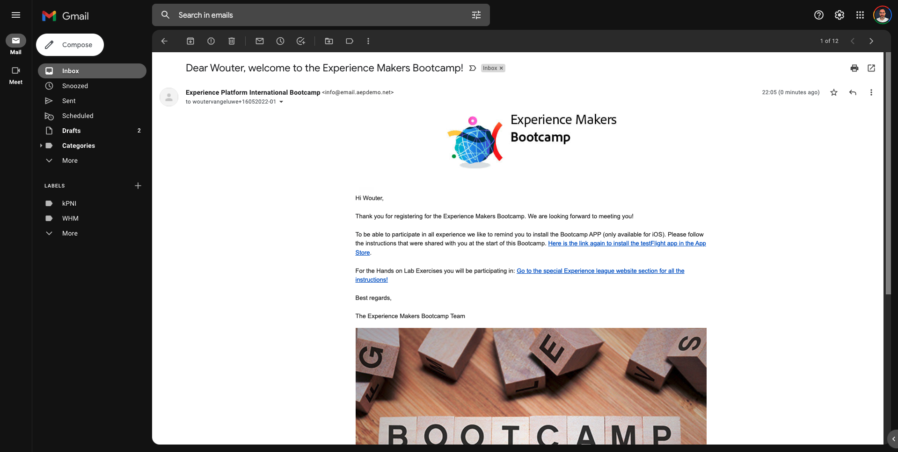

# 2.1 Bezoek de website en maak uw account

## Context

De reis van onbekend naar bekend is tegenwoordig een van de belangrijkste onderwerpen onder merken, evenals de reis van de klant van aankoop naar bewaring.

Adobe Experience Platform speelt een enorme rol in deze reis. Platform is de hersenen voor communicatie, de **ervaringssysteem**.

Platform is een omgeving waarin het woord klant breder is dan alleen de bekende klanten. Een onbekende bezoeker op de website is ook een klant vanuit het perspectief van Platform en als zodanig wordt al het gedrag als onbekende bezoeker ook naar het Platform verzonden. Dankzij deze aanpak, wanneer deze bezoeker uiteindelijk een bekende klant wordt, kan een merk ook visualiseren wat er voor dat moment gebeurde. Dit helpt vanuit een attributie- en ervaringsperspectief.

## Vervoersstroom voor klanten

Ga naar [https://bootcamp.aepdemo.net](https://bootcamp.aepdemo.net). Klikken **Alles toestaan**. Gebaseerd op uw het doorbladeren gedrag in de vorige gebruikersstroom, zult u personalisering zien gebeuren op de homepage van de website.

Klik op het Adobe-logopictogram in de linkerbovenhoek van het scherm om de Profile Viewer te openen. Bekijk het deelvenster Profielviewer en het realtime klantprofiel met de **Experience Cloud-id** als primaire id voor deze momenteel onbekende klant.

U kunt ook alle Experience Events zien die zijn verzameld op basis van het gedrag van de klant.

Klik op de knop **Profiel** in de rechterbovenhoek van het scherm.

Klikken **Een account maken**.

Vul alle velden van het formulier in. Gebruik een echte waarde voor e-mailadres en telefoonnummer, aangezien deze worden gebruikt bij latere oefeningen voor het verzenden van e-mail en SMS.

Omlaag schuiven en klikken **Registreren**.

Dan zie je dit.

U ontvangt ook deze e-mail:

Een paar minuten later ontvang je ook deze e-mail:

Laten we zien hoe deze onboarding reis daarna is geconfigureerd.

Volgende stap: [2.2 Uw gebeurtenis maken](./ex2.md)

[Ga terug naar Gebruikersstroom 2](./uc2.md)

[Terug naar alle modules](../../overview.md)
