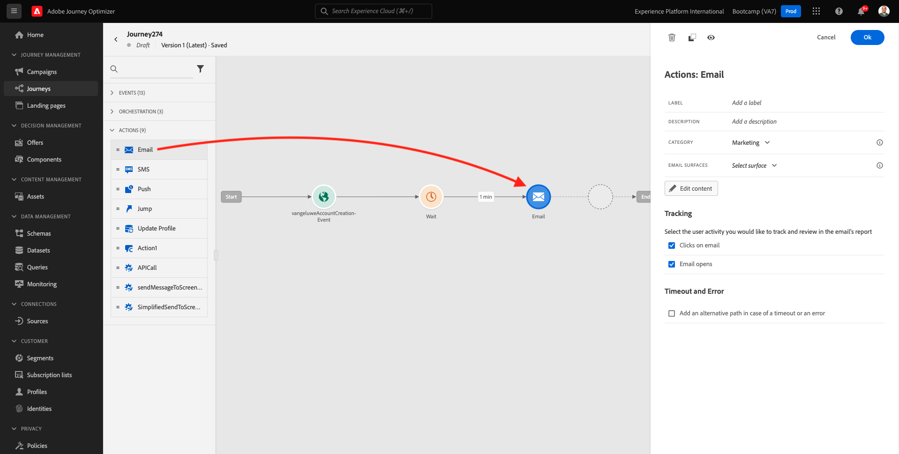

# 2.3 Maak uw reis en e-mailbericht

In deze oefening, zult u de reis vormen die moet worden teweeggebracht wanneer iemand een rekening op de demowebsite creeert.

Aanmelden bij Adobe Journey Optimizer door naar [Adobe Experience Cloud](https://experience.adobe.com). Klikken **Journey Optimizer**.

U wordt omgeleid naar de **Home**  in Journey Optimizer. Eerst, zorg ervoor u de correcte zandbak gebruikt. De sandbox die moet worden gebruikt, wordt `Bootcamp`. Als u van de ene naar de andere sandbox wilt gaan, klikt u op **Prod** en selecteert u de sandbox in de lijst. In dit voorbeeld krijgt de sandbox een naam **Bootkamp**. Dan ben je in de **Home** weergave van de sandbox `Bootcamp`.

## 2.3.1 Uw reis maken

Klik in het linkermenu op **Reizen**. Klik op Volgende **Reis maken** om een nieuwe reis te maken.

Dan zie je een leeg reisscherm.

In de vorige oefening creeerde u een nieuw **Gebeurtenis**. U noemde het zo `yourLastNameAccountCreationEvent` en vervangen `yourLastName` met uw achternaam. Dit was het resultaat van het maken van de gebeurtenis:

U moet deze gebeurtenis nu als begin van deze reis nemen. U kunt dit doen door naar de linkerkant van het scherm te gaan en naar uw gebeurtenis in de lijst met gebeurtenissen te zoeken.

Selecteer de gebeurtenis, sleep deze naar het canvas Reis. Uw reis ziet er nu als volgt uit:

Als tweede stap in de reis, moet u een korte toevoegen **Wachten** stap. Naar de linkerkant van het scherm **Orchestratie** voor meer informatie. U zult profielattributen gebruiken en moet ervoor zorgen zij in het Profiel van de Klant in real time worden bevolkt.

Je reis ziet er nu zo uit. Aan de rechterkant van het scherm moet u de wachttijd configureren. Stel dit in op 1 minuut. Dit geeft voldoende tijd om de profielkenmerken beschikbaar te maken nadat de gebeurtenis is gestart.

Klikken **OK** om uw wijzigingen op te slaan.

Als derde stap in de reis, moet u toevoegen **E-mail** handeling. Naar de linkerkant van het scherm gaan **Handelingen**, selecteert u de **E-mail** actie, dan belemmering en laat vallen het op de tweede knoop in uw reis. U ziet dit nu.

Stel de **Categorie** tot **Marketing** en selecteer een e-mailoppervlak waarmee u e-mail kunt verzenden. In dit geval is het te selecteren e-mailoppervlak **E-mail**. Zorg ervoor dat de selectievakjes **Klik op e-mail** en **e-mail wordt geopend** zijn beide ingeschakeld.

De volgende stap is uw bericht te creëren. Om dat te doen, klikt u op **Inhoud bewerken**.

## 2.3.2 Uw bericht maken

Klik op **Inhoud bewerken**.

U ziet dit nu.

Klik op de knop **Onderwerpregel** tekstveld.

Begin met schrijven in het tekstgebied **Hallo**

De onderwerpregel is nog niet gereed. Vervolgens moet u het personalisatietoken voor het veld introduceren **Voornaam** dat is opgeslagen onder `profile.person.name.firstName`. Blader in het linkermenu omlaag om de **Persoon** en klik op de pijl om een niveau dieper te gaan.

Zoek nu de **Volledige naam** en klik op de pijl om een niveau dieper te gaan.

Tot slot, vind **Voornaam** en klik op de knop **+** onderteken ernaast. Vervolgens ziet u het personalisatietoken in het tekstveld.

Voeg vervolgens de tekst toe **, dank u dat u zich hebt aangemeld!**. Klikken **Opslaan**.

Dan ben je hier weer. Klikken **E-mailontwerper** om de inhoud van de e-mail te maken.

In het volgende scherm krijgt u drie verschillende methoden om de inhoud van de e-mail te verschaffen:

- **Ontwerpen vanaf nul**: Begin met een leeg canvas en gebruik de WYSIWYG-redacteur om structuur en inhoudscomponenten te slepen en te laten vallen om de inhoud van e-mail visueel op te bouwen.
- **Uw eigen code schrijven**: Uw eigen e-mailsjabloon maken door deze te coderen met HTML
- **HTML importeren**: Importeer een bestaande HTML-sjabloon, die u kunt bewerken.

Klikken **HTML importeren**.

Het bestand slepen en neerzetten **mailtemplatebootkamp.html**, die u kunt downloaden [hier](../../assets/html/mailtemplatebootcamp.html.zip). Klik op Importeren.

Deze standaard e-mailsjabloon wordt dan weergegeven:

Laten we de e-mail personaliseren. Klik naast de tekst **Hallo** en klik vervolgens op de knop **Persoonlijkheid toevoegen** pictogram.

Nu moet u de **Voornaam** personalisatietoken dat onder wordt opgeslagen `profile.person.name.firstName`. Zoek in het menu de **Persoon** element, naar beneden boren naar de **Volledige naam** en klik vervolgens op de knop **+** pictogram om het veld Voornaam toe te voegen aan de expressieeditor.

Klikken **Opslaan**.

U zult nu zien hoe het verpersoonlijkingsgebied aan uw tekst is toegevoegd.

Klikken **Opslaan** om uw bericht op te slaan.

Ga terug naar het berichtdashboard door op het **pijl** naast de tekst van de onderwerpregel in de linkerbovenhoek.

Je hebt je registratiebericht nu gemaakt. Klik op de pijl in de linkerbovenhoek om terug te gaan naar uw reis.

Klikken **OK**.

## 2.3.3 Uw reis publiceren

Je moet je reis nog steeds een naam geven. U kunt dat doen door op de knop **Eigenschappen** in de rechterbovenhoek van het scherm.

Je kunt hier de naam van de reis invoeren. Gebruik `yourLastName - Account Creation Journey`. Klikken **OK** om uw wijzigingen op te slaan.

U kunt uw reis nu publiceren door te klikken **Publiceren**.

Klikken **Publiceren** opnieuw.

Vervolgens ziet u een groene bevestigingsbalk met de mededeling dat uw reis nu is gepubliceerd.

Je hebt deze oefening nu afgerond.

Volgende stap: [2.4 Test uw reis](./ex4.md)

[Ga terug naar Gebruikersstroom 2](./uc2.md)

[Terug naar alle modules](../../overview.md)