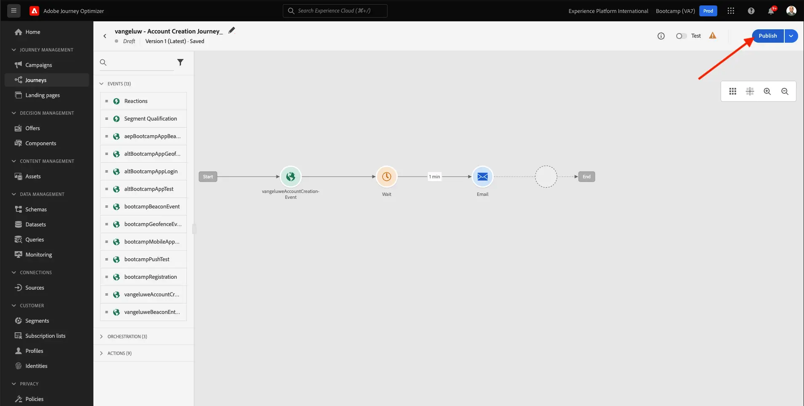
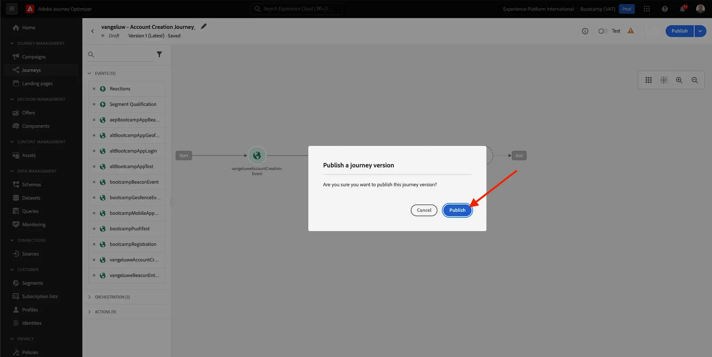

# 2.3 Uw reis- en e-mailbericht maken

In deze oefening, zult u de reis vormen die moet worden teweeggebracht wanneer iemand een rekening op de demowebsite creeert.

Login aan Adobe Journey Optimizer door naar [ Adobe Experience Cloud ](https://experience.adobe.com) te gaan. Klik **Journey Optimizer**.

U zult aan de **1} mening van het Huis {in Journey Optimizer worden opnieuw gericht.** Eerst, zorg ervoor u de correcte zandbak gebruikt. De sandbox die moet worden gebruikt, wordt `Bootcamp` genoemd. Om van één zandbak in een andere te veranderen, klik op **Prod** en selecteer de zandbak van de lijst. In dit voorbeeld, wordt de zandbak genoemd **Bootkamp**. U zult dan in de **1} mening van het Huis {van uw zandbak `Bootcamp` zijn.**

## 2.3.1 Uw reis maken

In het linkermenu, klik **Reizen**. Daarna, klik **creeer Reis** om een nieuwe reis tot stand te brengen.

Dan zie je een leeg reisscherm.

In de vorige oefening, creeerde u een nieuwe **Gebeurtenis**. U hebt de naam op deze manier `yourLastNameAccountCreationEvent` gegeven en `yourLastName` vervangen door uw achternaam. Dit was het resultaat van het maken van de gebeurtenis:

U moet deze gebeurtenis nu als begin van deze reis nemen. U kunt dit doen door naar de linkerkant van het scherm te gaan en naar uw gebeurtenis in de lijst met gebeurtenissen te zoeken.

Selecteer de gebeurtenis, sleep deze naar het canvas Reis. Uw reis ziet er nu als volgt uit:

Als tweede stap in de reis, moet u een korte **toevoegen wacht** stap. Ga naar de linkerkant van uw scherm aan de **sectie van het Orchestration** om dit te vinden. U zult profielattributen gebruiken en moet ervoor zorgen zij in het Profiel van de Klant in real time worden bevolkt.

Je reis ziet er nu zo uit. Aan de rechterkant van het scherm moet u de wachttijd configureren. Stel dit in op 1 minuut. Dit geeft voldoende tijd om de profielkenmerken beschikbaar te maken nadat de gebeurtenis is gestart.

Klik **O.K.** om uw veranderingen te bewaren.

Als derde stap in de reis, moet u een **E-mail** actie toevoegen. Ga naar de linkerkant van uw scherm aan **Acties**, selecteer de **E-mail** actie, dan belemmering en laat vallen het op de tweede knoop in uw reis. U ziet dit nu.

Plaats de **Categorie** aan **Marketing** en selecteer een e-mailoppervlakte die u toelaat om e-mail te verzenden. In dit geval, is de e-mailoppervlakte om te selecteren **E-mail**. Zorg ervoor dat checkboxes voor **klikt op e-mail** en **e-mail opent** allebei worden toegelaten.

De volgende stap is uw bericht te creëren. Om dat te doen, klik **geef inhoud** uit.

## 2.3.2 Uw bericht maken

Om uw bericht tot stand te brengen, klik **geef inhoud** uit.

U ziet dit nu.

Klik het **Onderwerplijn** tekstgebied.

In het tekstgebied begin **te schrijven Hoog**

De onderwerpregel is nog niet gereed. Daarna moet u het verpersoonlijkingstoken voor het gebied **Eerste naam** brengen die onder `profile.person.name.firstName` wordt opgeslagen. In het linkermenu, scrol neer om het **element van de Persoon** te vinden en op de pijl te klikken om een niveau diepers te gaan.

Nu vind het **Volledige naam** element en klik op de pijl om een niveau dieper te gaan.

Tot slot vind het **Voornaam** gebied en klik op **+** teken naast het. Vervolgens ziet u het personalisatietoken in het tekstveld.

Voeg vervolgens de tekst **toe. Hartelijk dank voor uw aanmelding.**. Klik **sparen**.

Dan ben je hier weer. Klik **E-mail Designer** om de inhoud van e-mail tot stand te brengen.

In het volgende scherm krijgt u drie verschillende methoden om de inhoud van de e-mail te verschaffen:

- **Ontwerp van kras**: Begin met een leeg canvas en gebruik WYSIWYG-redacteur om structuur en inhoudscomponenten te slepen en te laten vallen om de inhoud van e-mail visueel op te bouwen.
- **Code uw eigen**: Creeer uw eigen e-mailmalplaatje door het te coderen gebruikend HTML
- **de HTML van de Invoer**: De invoer een bestaand malplaatje van HTML, dat u zult kunnen uitgeven.

Klik **de HTML van de Invoer**. Alternatief, kunt u **Bewaarde Malplaatjes** klikken en het malplaatje **selecteren Bootkamp - E-mailMalplaatje**.

Als u **HTML van de Invoer** selecteerde, kunt u het dossier **nu slepen en laten vallen mailtemplatebootamp.html**, die u [ hier ](../../assets/html/mailtemplatebootcamp.html.zip) kunt downloaden. Klik op Import.

Deze standaard e-mailsjabloon wordt dan weergegeven:

Laten we de email personaliseren. Klik naast de tekst **Hi** en klik dan **toevoegen Personalization** pictogram.

Daarna, moet u het **Voornaam** verpersoonlijkingstoken brengen dat onder `profile.person.name.firstName` wordt opgeslagen. In het menu, vind het **element van de Persoon**, boor neer aan het **Volledige element van de Naam**, en klik dan het **+** pictogram om het Eerste gebied van de Naam op uitdrukkingsredacteur toe te voegen.

Klik **sparen**.

U zult nu zien hoe het verpersoonlijkingsgebied aan uw tekst is toegevoegd.

Klik **sparen** om uw bericht te bewaren.

Ga terug naar het berichtdashboard door de **pijl** naast de onderwerplijntekst in de top-left hoek te klikken.

Je hebt je registratiebericht nu gemaakt. Klik op de pijl in de linkerbovenhoek om terug te gaan naar uw reis.

Klik **OK**.

## 2.3.3 Publish uw reis

Je moet je reis nog steeds een naam geven. U kunt dat doen door het **pictogram van het Potlood** in de hoogste linkerkant van uw scherm te klikken.

Je kunt hier de naam van de reis invoeren. Gebruik `yourLastName - Account Creation Journey` . Klik **O.K.** om uw veranderingen te bewaren.

U kunt uw reis nu publiceren door **Publish** te klikken.

Klik **opnieuw Publish**.

Vervolgens ziet u een groene bevestigingsbalk met de mededeling dat uw reis nu is gepubliceerd.

Je hebt deze oefening nu afgerond.

Volgende Stap: [ 2.4 Test uw reis ](./ex4.md)

[Ga terug naar Gebruikersstroom 2](./uc2.md)

[Terug naar alle modules](../../overview.md)