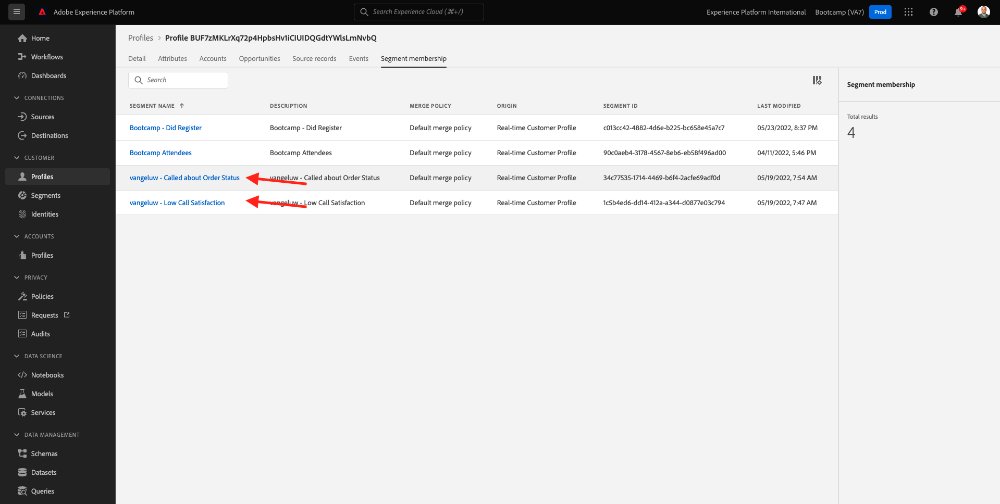

# 2.6 Personalization in het callcenter

Zoals die veelvoudige tijden tijdens bootkamp reeds wordt besproken, is het personaliseren van de klantenervaring iets dat op een omnichannel manier zou moeten gebeuren. Een callcenter is vaak vrij losgekoppeld van de rest van de klantenreis en dat leidt vaak tot frustrerende klantenervaringen, maar het hoeft niet te zijn. Laten wij u een voorbeeld tonen van hoe het callcenter gemakkelijk met Adobe Experience Platform, in real time kan worden verbonden.

## Klantreis

In de vorige oefening, gebruikend de mobiele toepassing, kocht u een product door **te klikken Koop** knoop.

Laten we aannemen dat u een vraag hebt over de status van uw bestelling, wat zou u doen? Typisch zou u het vraagcentrum roepen.

Alvorens het vraagcentrum te roepen, moet u uw **identiteitskaart van de Loyaliteit** kennen. U vindt uw Loyalty-id in de profielviewer van de website.

In dit geval, is **identiteitskaart van de Loyalty** **5863105**. Als deel van onze douaneimplementatie van de eigenschap van het vraagcentrum in het demomilieu, moet u een prefix aan uw **identiteitskaart van de Loyaliteit** toevoegen. Het voorvoegsel is **11373**, zodat identiteitskaart van de Loyaliteit in dit voorbeeld te gebruiken is **11373 5863105**.

Laten we dat nu doen. Gebruik uw telefoon en roep het aantal **+1 (323) 745-1670**.

U wordt gevraagd uw Loyalty-id in te voeren, gevolgd door **#** . Voer je Loyalty-id in.

U zult dan **Hello, eerste naam** horen. Deze voornaam is afkomstig uit het Real-Time Klantprofiel in Adobe Experience Platform. Dan heb je 3 keuzen. Het aantal van de pers **1**, **Status van de Orde**.

Na het horen van uw ordestatus, zult u een keus worden gegeven om **1** te drukken om naar het belangrijkste menu terug te gaan of anders, druk 2. Pers **2**.

U zult dan worden gevraagd om uw ervaring van het vraagcentrum te schatten, door een aantal tussen 1 en 5 te selecteren, met 1 laag en 5 die hoog zijn. Maak uw keuze.

Uw vraag aan het vraagcentrum zal nu beëindigen.

Ga naar [&#x200B; Adobe Experience Platform &#x200B;](https://experience.adobe.com/platform). Na het aanmelden landt je op de homepage van Adobe Experience Platform.

Alvorens u verdergaat, moet u a **zandbak** selecteren. De te selecteren sandbox krijgt de naam ``Bootcamp`` . U kunt dit doen door op de tekst **[!UICONTROL Production Prod]** in de blauwe lijn boven op het scherm te klikken. Nadat u de juiste [!UICONTROL sandbox] hebt geselecteerd, ziet u de schermwijziging en nu bevindt u zich in uw toegewezen [!UICONTROL sandbox] .

In het linkermenu, ga naar **Profielen** en **doorbladeren**.

Selecteer **Identiteit namespace** **E-mail** en ga het e-mailadres van uw klantenprofiel in. Klik **Mening**. Klik om uw profiel te openen.

Je ziet het profiel van je klant opnieuw. Ga naar **Gebeurtenissen**.

Onder gebeurtenissen, zult u 2 gebeurtenissen met een eventType van **callCenter** zien. De eerste gebeurtenis is een resultaat van uw antwoord op de vraag **tarief uw vraagtevredenheid**.

De rol neer een beetje, en u zult de gebeurtenis zien die werd geregistreerd toen u de optie selecteerde om uw **Status van de Orde** te controleren.

Ga naar **lidmaatschap van het Segment**. U zult nu zien dat 2 segmenten op uw profiel, in real time kwalificeren, die op de interactie wordt gebaseerd u door het vraagcentrum had. Deze segmentlidmaatschappen kunnen en zouden dan moeten worden gebruikt om te beïnvloeden welke mededeling en verpersoonlijking over een ander kanaal gebeurt.

Je hebt deze oefening nu afgerond.

[Ga terug naar Gebruikersstroom 2](./uc2.md)

[Terug naar alle modules](../../overview.md)
