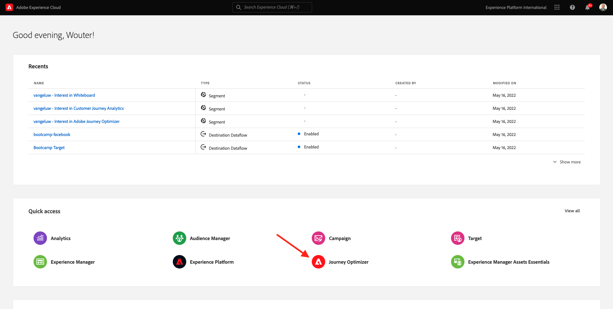
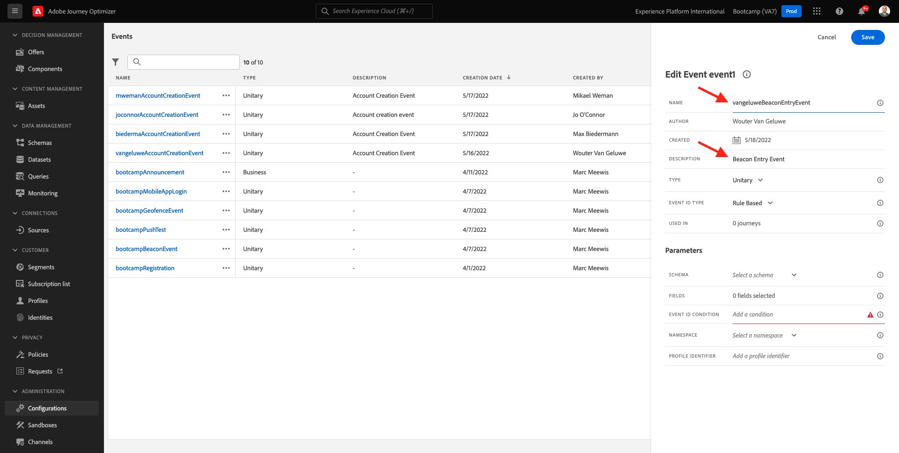

# 3.2 Uw gebeurtenis maken

Aanmelden bij Adobe Journey Optimizer door naar [Adobe Experience Cloud](https://experience.adobe.com). Klikken **Journey Optimizer**.

U wordt omgeleid naar de **Home**  in Journey Optimizer. Eerst, zorg ervoor u de correcte zandbak gebruikt. De sandbox die moet worden gebruikt, wordt `Bootcamp`. Als u van de ene naar de andere sandbox wilt gaan, klikt u op **Prod** en selecteert u de sandbox in de lijst. In dit voorbeeld krijgt de sandbox een naam **Bootamp2**. Dan ben je in de **Home** weergave van de sandbox `Bootcamp`.

Blader in het linkermenu omlaag en klik op **Configuraties**. Klik op de knop **Beheren** knop onder **Gebeurtenissen**.

Vervolgens ziet u een overzicht van alle beschikbare gebeurtenissen. Klikken **Gebeurtenis maken** om uw eigen gebeurtenis te maken.

Er verschijnt dan een nieuw, leeg gebeurtenisvenster.

Geef uw gebeurtenis als volgt een naam: `yourLastNameBeaconEntryEvent` en voeg een dergelijke beschrijving toe `Beacon Entry Event`.

Controleer vervolgens of de **Type** is ingesteld op **Unitair** en voor de **Type gebeurtenis-id** selectie, selecteren **Door systeem gegenereerd**.

Nu de selectie van het schema. Hiervoor is een schema opgesteld. Gebruik het schema `Demo System - Event Schema for Mobile App (Global v1.1) v.1`.

Nadat u het schema hebt geselecteerd, ziet u een aantal velden die worden geselecteerd in het dialoogvenster **Velden** sectie. U moet nu de muisaanwijzer op de knop **Velden** en u ziet 3 pictogrammen verschijnen. Klik op de knop **Bewerken** pictogram.

Je ziet een **Velden** venster popup, waarin u enkele gebieden moet selecteren die wij de reis moeten personaliseren.  We kiezen later andere profielkenmerken met de gegevens die al in Adobe Experience Platform staan.

Omlaag schuiven totdat u het object ziet `Place context` en schakel het selectievakje in. Met dit, zal alle context van de plaats van de klant aan de reis ter beschikking worden gesteld. Klikken **OK** om uw wijzigingen op te slaan.

Dan moet je dit zien. Klikken **Opslaan** nogmaals om uw wijzigingen op te slaan.

Uw gebeurtenis is nu geconfigureerd en opgeslagen.

Klik nogmaals op uw gebeurtenis om het dialoogvenster **Gebeurtenis bewerken** opnieuw. Overslaan **Velden** om de 3 pictogrammen weer te zien. Klik op de knop **Weergave** pictogram.

U zult nu een voorbeeld van de verwachte nuttige lading zien.
Uw gebeurtenis heeft een unieke orchestration eventID, die u kunt vinden door neer in die lading te scrollen tot u ziet `_experience.campaign.orchestration.eventID`.

De gebeurtenis-id is wat naar Adobe Experience Platform moet worden verzonden om de reis te activeren die u in een van de volgende oefeningen gaat maken. Onthoud deze eventID, aangezien u deze later nodig kunt hebben.
`"eventID": "e76c0bf0c77c3517e5b6f4c457a0754ebaf5f1f6b9357d74e0d8e13ae517c3d5"`

Klikken **OK**, gevolgd door klikken **Annuleren**.

Je hebt deze oefening nu afgerond.

Volgende stap: [3.3 Maak uw reis en pushmelding](./ex3.md)

[Ga terug naar gebruikersstroom 3](./uc3.md)

[Terug naar alle modules](../../overview.md)
