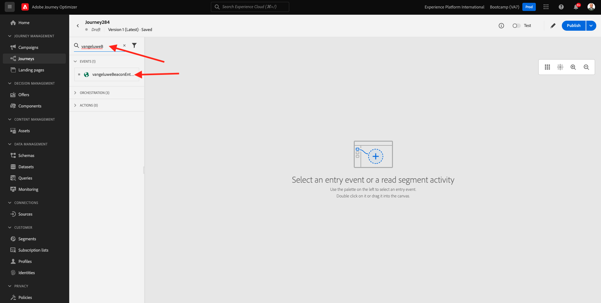
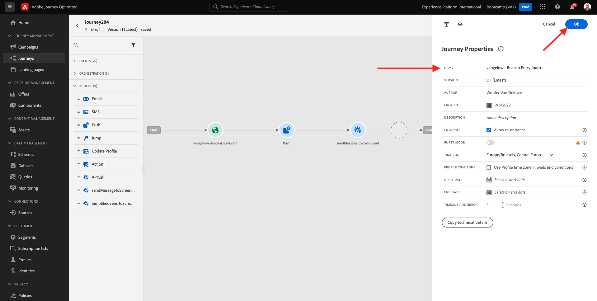

# 3.3 Maak uw reis en pushmelding

In deze oefening, zult u de reis en het bericht vormen die moeten worden teweeggebracht wanneer iemand een baken gebruikend mobiele app ingaat.

Login aan Adobe Journey Optimizer door naar [&#x200B; Adobe Experience Cloud &#x200B;](https://experience.adobe.com) te gaan. Klik **Journey Optimizer**.

U zult aan de **1&rbrace; mening van het Huis {in Journey Optimizer worden opnieuw gericht.** Eerst, zorg ervoor u de correcte zandbak gebruikt. De sandbox die moet worden gebruikt, wordt `Bootcamp` genoemd. Om van één zandbak in een andere te veranderen, klik op **Prod** en selecteer de zandbak van de lijst. In dit voorbeeld, wordt de zandbak genoemd **Bootkamp**. U zult dan in de **1} mening van het Huis &lbrace;van uw zandbak `Bootcamp` zijn.**

## 3.3.1 Uw reis maken

In het linkermenu, klik **Reizen**. Daarna, klik **creeer Reis** om een nieuwe reis tot stand te brengen.

Dan zie je een leeg reisscherm.

In de vorige oefening, creeerde u een nieuwe **Gebeurtenis**. U hebt de naam op deze manier `yourLastNameBeaconEntryEvent` gegeven en `yourLastName` vervangen door uw achternaam. Dit was het resultaat van het maken van de gebeurtenis:

U moet deze gebeurtenis nu als begin van deze reis nemen. U kunt dit doen door naar de linkerkant van het scherm te gaan en naar uw gebeurtenis in de lijst met gebeurtenissen te zoeken.

Selecteer de gebeurtenis, sleep deze naar het canvas van de reis. Je reis ziet er nu zo uit. Klik **O.K.** om uw veranderingen te bewaren.

Als tweede stap in de reis, moet u a **&#x200B;**&#x200B;actie toevoegen Duw. Ga naar de linkerkant van uw scherm aan **Acties**, selecteer de **Duw** actie, dan belemmering en laat vallen het op de tweede knoop in uw reis.

Rechts in het scherm moet u nu een pushmelding maken.

Plaats de **Categorie** aan **Marketing** en selecteer een drukkend oppervlak dat u toelaat om pushberichten te verzenden. In dit geval, is de drukkende oppervlakte om te selecteren **memewis-app-mobile-bootkamp**.

## 3.3.2 Uw bericht maken

Klik **uitgeven Inhoud**.

U zult dan dit zien:

Laten we de inhoud van de pushmelding definiëren.

Klik het **de tekstgebied van de Titel**.

In het begin van het tekstgebied **te schrijven Hi**. Klik op het pictogram voor aanpassen.

U moet nu het verpersoonlijkingstoken voor het gebied **Eerste naam** brengen die onder `profile.person.name.firstName` wordt opgeslagen. In het linkermenu, uitgezochte **Attributen van het Profiel**, scrol neer/navigeer om het **Persoon** element te vinden en op de pijl te klikken om een niveau dieper te gaan tot u het gebied `profile.person.name.firstName` bereikt. Klik op het pictogram **+** om het veld aan het canvas toe te voegen. Klik **sparen**.

Dan ben je hier weer. Klik het verpersoonlijkingspictogram naast het gebied **Lichaam**.

Schrijf in het tekstgebied `Welcome at the ` .

Daarna, klik **Contextafhankelijke Attributen** en dan **Journey Orchestration**.

Klik **Gebeurtenissen**.

Klik de naam van uw gebeurtenis, die als dit zou moeten kijken: **yourLastNameBeaconEntryEvent**.

Klik **context van de Plaats**.

Klik **POI Interactie**.

Klik **POI Detail**.

Klik **+** pictogram op **Naam van POI**.
Dan zie je dit. Klik **sparen**.

Uw bericht is nu klaar. Klik op de pijl in de linkerbovenhoek om terug te gaan naar uw reis.

Klik **OK**.

## 3.3.2 Een bericht naar het scherm verzenden

Als derde stap in de reis, moet u a **sendMessageToScreen** actie toevoegen. Ga naar de linkerkant van uw scherm aan **Acties**, selecteer **sendMessageToScreen** actie, dan belemmering en laat vallen het op de derde knoop in uw reis. Dan zie je dit.

De **sendMessageToScreen** actie is een douaneactie die een bericht aan het eindpunt zal publiceren dat door de in-opslagvertoning wordt gebruikt. De **sendMessageToScreen** actie verwacht een aantal te bepalen variabelen. U kunt die variabelen zien door neer te scrollen tot u **Parameters van de Actie** ziet.

U moet nu de waarden voor elke handelingsparameter instellen. Volg deze tabel om te begrijpen welke waarden vereist zijn.

| Parameter | value |
|:-------------:| :---------------:|
| LEVERING | `'image'` |
| ECID | `@{yourLastNameBeaconEntryEvent._experienceplatform.identification.core.ecid}` |
| EERSTE NAAM | `#{ExperiencePlatform.ProfileFieldGroup.profile.person.name.firstName}` |
| EVENTSUBJECT | `#{ExperiencePlatform.ProductListItems.experienceevent.first(currentDataPackField.eventType == "commerce.productViews").productListItems.first().name}` |
| EVENTSUBJECTURL | `#{ExperiencePlatform.ProductListItems.experienceevent.first(currentDataPackField.eventType == "commerce.productViews").productListItems.first()._experienceplatform.core.imageURL}` |
| SANDBOX | `'bootcamp'` |
| CONTAINERID | `''` |
| ACTIVITYID | `''` |
| PLACEMENTID | `''` |

{style="table-layout:auto"}

Om die waarden te plaatsen, klik **uitgeven** pictogram.

Daarna, uitgezochte **Geavanceerde Wijze**.

Plak vervolgens de waarde op basis van de bovenstaande tabel. Klik **OK**.

Herhaal dit proces om waarden toe te voegen voor elk veld.

>[!IMPORTANT]
>
>Voor het veld ECID is er een verwijzing naar de gebeurtenis `yourLastNameBeaconEntryEvent` . Vervang `yourLastName` door uw achternaam.

Het eindresultaat moet er als volgt uitzien:

De rol omhoog en klikt **O.K.**.

Je moet je reis nog steeds een naam geven. U kunt dat doen door het **pictogram van het Potlood** in de hoogste linkerkant van uw scherm te klikken.

Je kunt hier de naam van de reis invoeren. Gebruik `yourLastName - Beacon Entry Journey` . Klik **O.K.** om uw veranderingen te bewaren.

U kunt uw reis nu publiceren door **Publish** te klikken.

Klik **opnieuw Publish**.

Vervolgens ziet u een groene bevestigingsbalk met de mededeling dat uw reis nu is gepubliceerd.

Je reis is nu live en kan worden geïnitieerd.

Je hebt deze oefening nu afgerond.

Volgende Stap: [&#x200B; 3.4 Test uw reis &#x200B;](./ex4.md)

[Ga terug naar gebruikersstroom 3](./uc3.md)

[Terug naar alle modules](../../overview.md)
