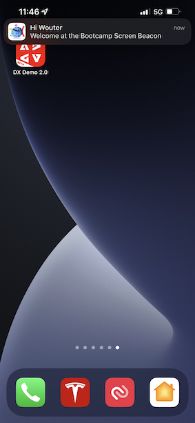

# 3.4 Test uw reis

Om uw reis te testen, zult u gebeurtenisidentiteitskaart van de gebeurtenis moeten gebruiken u in oefening 3.2 creeerde, die als dit kijkt.

De evenement-id is wat naar Adobe Experience Platform moet worden verzonden om de reis te starten. In dit voorbeeld is de eventID:
`e76c0bf0c77c3517e5b6f4c457a0754ebaf5f1f6b9357d74e0d8e13ae517c3d5`.

Open de mobiele app en ga naar de startpagina. Klik op de knop **Instellingen** pictogram.

De eventID in het veld plakken **Beacon EventID** en klik op **Opslaan**.

Open deze webpagina op uw computer voordat u doorgaat: [https://bootcamp.aepdemo.net/content/aep-bootcamp-experience/language-masters/en/screen.html](https://bootcamp.aepdemo.net/content/aep-bootcamp-experience/language-masters/en/screen.html)

U zult dan dit zien:

Ga vervolgens terug naar de startpagina. Klik op de knop **baken** pictogram.

Dan zie je dit. Eerst selecteert u **Bootamp Screen Beacon** en klik vervolgens op de knop **ingang** knop. Hierdoor kunt u een baken-item simuleren.

Kijk nu eens naar het scherm in de winkel. Het laatste product dat u hebt bekeken, wordt hier binnen 5 seconden weergegeven.

Je hebt ook je pushmelding ontvangen.

Je hebt deze oefening nu afgerond.

[Ga terug naar gebruikersstroom 3](./uc3.md)

[Terug naar alle modules](../../overview.md)
