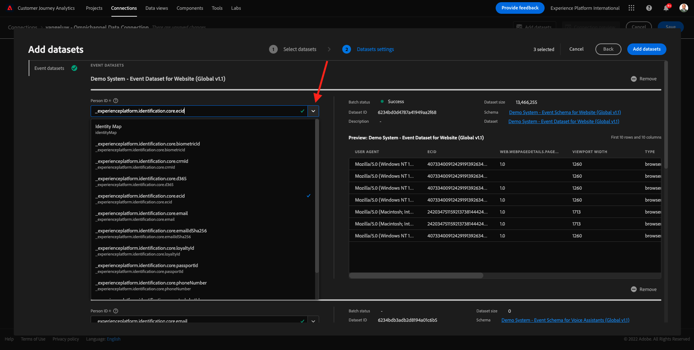

# 4.2 Connect Adobe Experience Platform-gegevenssets in Customer Journey Analytics

## Doelstellingen

- De interface voor gegevensverbinding begrijpen
- Adobe Experience Platform-gegevens in CJA plaatsen
- Persoon-id en gegevensstitching begrijpen
- Leer het concept gegevensstreaming in Customer Journey Analytics

## 4.2.1 Verbinding

Ga naar [ analytics.adobe.com ](https://analytics.adobe.com) om tot Customer Journey Analytics toegang te hebben.

Op Customer Journey Analytics-homepage, ga naar **Verbindingen**.

Hier kunt u alle verschillende verbindingen zien die tussen CJA en Platform worden gemaakt. Deze verbindingen hebben hetzelfde doel als rapportsuites in Adobe Analytics. De gegevensverzameling is echter totaal anders. Alle gegevens komen uit de datasets van Adobe Experience Platform.

Laten we uw eerste verbinding maken. Klik **creëren nieuwe verbinding**.

U zult dan **&#x200B;**&#x200B;UI zien creëren Verbinding.

U kunt nu een naam aan uw verbinding geven.

Gebruik deze naamgevingsconventie: `yourLastName – Omnichannel Data Connection` .

Voorbeeld: `vangeluw - Omnichannel Data Connection`

U moet ook de juiste sandbox selecteren om te gebruiken. Selecteer de sandbox in het menu van de sandbox, die `Bootcamp` moet zijn. In dit voorbeeld, is de zandbak aan gebruik **Bootkamp**. En u moet ook het **Gemiddelde aantal dagelijkse gebeurtenissen** aan **minder dan 1 miljoen** plaatsen.

Nadat u de sandbox hebt geselecteerd, kunt u beginnen met het toevoegen van gegevenssets aan deze verbinding. Klik **toevoegen datasets**.

## 4.2.2 Adobe Experience Platform-gegevenssets selecteren

Zoek naar de dataset `Demo System - Event Dataset for Website (Global v1.1)`. Klik **+** om de dataset aan deze verbinding toe te voegen.

Zoek en controleer nu de selectievakjes voor `Demo System - Profile Dataset for Loyalty (Global v1.1)` en `Demo System - Event Dataset for Call Center (Global v1.1)` .

Dan heb je dit. Klik **daarna**.

## 4.2.3 Persoon-id en gegevensopname

### Persoon-id

Het doel is nu om zich bij deze datasets aan te sluiten. Voor elke dataset u selecteerde, zult u een gebied genoemd **identiteitskaart van de Persoon** zien. Elke gegevensset heeft een eigen veld Person-id.

Zoals u kunt zien, hebben de meeste van hen automatisch geselecteerde identiteitskaart van de Persoon. Dit komt omdat in elk schema in Adobe Experience Platform een primaire id is geselecteerd. Hier ziet u bijvoorbeeld het schema voor `Demo System - Event Schema for Call Center (Global v1.1)` , waarin u kunt zien dat de primaire id is ingesteld op `phoneNumber` .

Nochtans, kunt u nog beïnvloeden welk herkenningsteken zal worden gebruikt om datasets voor uw verbinding samen te binden. U kunt om het even welke herkenningsteken gebruiken die in het schema verbonden aan uw dataset wordt gevormd. Klik op dropdown om IDs te onderzoeken beschikbaar op elke dataset.

Zoals vermeld, kunt u verschillende Persoon IDs voor elke dataset plaatsen. Dit staat u toe om verschillende datasets van veelvoudige oorsprong in CJA samen te brengen. Stel je voor dat we NPS-gegevens of enquêtegegevens invoeren die erg interessant en nuttig zouden zijn om de context te begrijpen en waarom er iets is gebeurd.

De naam van het veld Person-id is niet belangrijk, zolang de waarde in de velden Person-id overeenkomt. Als de persoon-id bijvoorbeeld `email` is in een gegevensset en `emailAddress` in een andere gegevensset en `dnb-bootcamp@adobe.com` dezelfde waarde is voor het veld Persoon-id in beide gegevenssets, kan CJA de gegevens naasten.

Op dit moment zijn er nog enkele andere beperkingen, zoals het aanstichten van het anonieme gedrag aan gekend. Gelieve te herzien FAQs hier: [ Veelgestelde vragen ](https://experienceleague.adobe.com/docs/analytics-platform/using/cja-overview/cja-faq.html?lang=nl-NL).

### De gegevens tikken met de persoon-id

Nu u het concept het stitching datasets gebruikend identiteitskaart van de Persoon begrijpt, kiezen `email` als uw Persoon identiteitskaart voor elke dataset.

Ga naar elke dataset om de Persoon identiteitskaart bij te werken.

Vul nu het veld Persoon-id met de `email` in de vervolgkeuzelijst.

Zodra u de drie datasets hebt vastgezet, zijn wij bereid om verder te gaan.

| gegevensset | Persoon-id |
| ----------------- |-------------| 
| Demosysteem - Dataset voor gebeurtenissen voor website (Global v1.1) | email |
| Demosysteem - profielgegevensset voor logo (Global v1.1) | email |
| Het Systeem van de manifestatie - de Dataset van de Gebeurtenis voor het Centrum van de Vraag (Globale v1.1) | email |

U moet ook ervoor zorgen dat voor elke dataset, deze opties worden toegelaten:

- Alle nieuwe gegevens importeren
- Back-up maken van alle bestaande gegevens

Klik **toevoegen datasets**.

Klik **sparen** en ga naar de volgende oefening.
Na het creëren van uw **Verbinding** kan het een paar uren nemen alvorens uw gegevens in CJA beschikbaar zijn.

Volgende Stap: [ 4.3 leidt tot een Mening van Gegevens ](./ex3.md)

[Ga terug naar Gebruikersstroom 4](./uc4.md)

[Terug naar alle modules](./../../overview.md)
