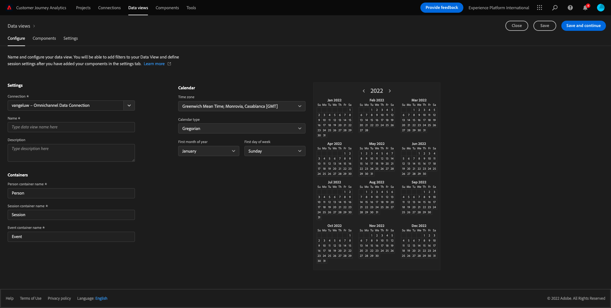
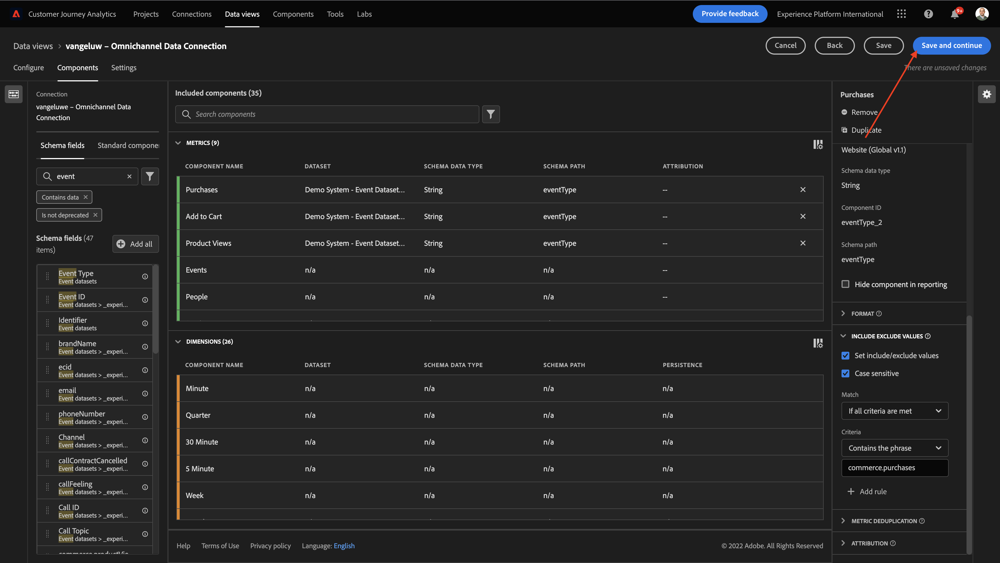
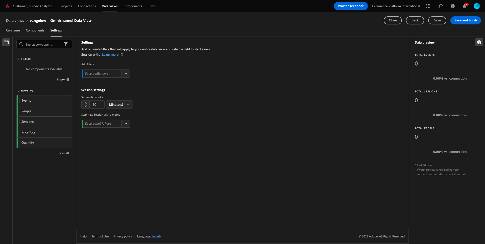
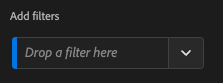

# 4.3 Een gegevensweergave maken

## Doelstellingen

- De interface voor gegevensweergave begrijpen
- De basisinstellingen van de definitie van een bezoek begrijpen
- Kenmerk en doorzettingsvermogen in een gegevensweergave begrijpen

## 4.3.1 Gegevensweergave

Als de verbinding tot stand is gebracht, kunt u nu de visualisatie beïnvloeden. Een verschil tussen Adobe Analytics en CJA is dat CJA een gegevensweergave nodig heeft om de gegevens vóór visualisatie te kunnen opschonen en voorbereiden.

Een mening van Gegevens is gelijkaardig aan het concept Virtuele Reeksen van het Rapport in Adobe Analytics, waar u context-bewuste bezoekendefinities bepaalt, filtrerend en ook, hoe de componenten worden geroepen.

U hebt minimaal één gegevensweergave per verbinding nodig. Nochtans, voor sommige gebruik-gevallen, is het groot om veelvoudige Mening van Gegevens voor de zelfde verbinding te hebben, met het doel om verschillende inzichten aan verschillende teams te geven.
Als u uw bedrijf gegevensgedreven wilt worden, zou u moeten aanpassen hoe de gegevens in elk team worden bekeken. Enkele voorbeelden:

- UX-meetgegevens alleen voor het UX-ontwerpteam
- Gebruik dezelfde namen voor KPI&#39;s en Metriek voor Google Analytics als voor Customer Journey Analytics, zodat het digitale analyseteam slechts één taal kan spreken.
- Gegevensweergave gefilterd om bijvoorbeeld gegevens weer te geven voor één markt, of voor één merk, of alleen voor mobiele apparaten.

Op de **Verbindingen** , schakelt u het selectievakje in vóór de verbinding die u net hebt gemaakt. Klikken **Gegevensweergave maken**.

U wordt omgeleid naar de **Gegevensweergave maken** workflow.

## 4.3.2 Gegevensweergavedefinitie

U kunt de basisdefinities voor uw Mening van Gegevens nu vormen.

De **Verbinding** die u in de vorige oefening hebt gemaakt, is al geselecteerd. De naam van uw verbinding is `yourLastName – Omnichannel Data Connection`.

Geef vervolgens in de gegevensweergave een naam die volgt op de naamgevingsconventie: `yourLastName – Omnichannel Data View`.

Voer dezelfde waarde in voor de beschrijving: `yourLastName – Omnichannel Data View`.

| Naam | Beschrijving |
| ----------------- |-------------| 
| `yourLastName – Omnichannel Data View` | `yourLastName – Omnichannel Data View` |

Voor de **Tijdzone** selecteert u de tijdzone **Berlijn, Stockholm, Rome, Bern, Brussel, Wenen, Amsterdam GMT+01:00**. Dit is een heel interessante situatie, aangezien sommige bedrijven in verschillende landen en geografische gebieden actief zijn. Door de juiste tijdzone voor elk land toe te wijzen, worden typische fouten in de gegevens vermeden, zoals bijvoorbeeld het vermoeden dat in Peru de meerderheid van de mensen om 16.00 uur T-shirts koopt.

U kunt ook de namen van de belangrijkste metriek wijzigen (Person, Sessie en Gebeurtenis). Dit is niet verplicht, maar sommige klanten gebruiken graag Personen, Bezoekingen en Verzoeken in plaats van Personen, Sessie en Gebeurtenissen (standaardnaamgevingsconventie van Customer Journey Analytics).

De volgende instellingen moeten nu zijn geconfigureerd:

Klikken **Opslaan en doorgaan**.

## 4.3.3 Componenten voor gegevensweergave

In deze oefening, zult u de componenten vormen u de gegevens moet analyseren en het visualiseren gebruikend Analysis Workspace. In deze interface zijn er drie hoofdgebieden:

- Linkerkant: Beschikbare componenten van de geselecteerde datasets
- Midden: Componenten toegevoegd aan de gegevensweergave
- Rechterkant: Componentinstellingen

>[!IMPORTANT]
>
>Als u geen specifieke metrisch of afmeting kunt vinden, gelieve te controleren of het gebied `Contains data` wordt verwijderd uit uw gegevensweergave. Zo niet, verwijder dat veld.
>
>

U moet nu de componenten die u nodig hebt voor de analyse naar de **Toegevoegde componenten**. U doet dit door de componenten in het linkermenu te selecteren en ze naar het canvas in het midden te slepen.

Laten we beginnen met de eerste component: **Naam (web.webPageDetails.name)**. Zoek naar deze component, dan belemmering en laat vallen het op het canvas.

Deze component is de paginanaam, aangezien u uit het lezen van het schemagebied kunt voortkomen `(web.webPageDetails.name)`.

Bij **Naam** aangezien de naam niet de beste noemende overeenkomst voor een bedrijfsgebruiker is om deze dimensie snel te begrijpen.

Laten we de naam wijzigen om **Paginanaam**. Klik op de component en wijzig de naam ervan in het dialoogvenster **Componentinstellingen** gebied.

Wat echt belangrijk is, is de **Persistinstellingen**. Het concept gebeurtenissen en prop bestaat niet in CJA maar de montages van de Persistentie maken een gelijkaardig gedrag mogelijk.

Als u deze montages niet verandert, zal CJA de dimensie als a interpreteren **Prop** (raakniveau). Ook kunnen we de persistentie wijzigen om van de dimensie een **eVar** (zet de waarde over de reis voort).

Als u niet vertrouwd bent met eVars en Props, kunt u [meer informatie staat in de documentatie](https://experienceleague.adobe.com/docs/analytics/landing/an-key-concepts.html).

Laten we de paginanaam als een pop-up opgeven. Als dusdanig, te hoeven u om het even welk niet te veranderen **Persistinstellingen**.

| Componentnaam die u wilt zoeken | Nieuwe naam | Persistinstellingen |
| ----------------- |-------------| --------------------| 
| Naam (web.webPageDetails.name) | Paginanaam |  |

Kies vervolgens de dimensie **phoneNumber** en zet het neer op het canvas. De nieuwe naam moet **Telefoonnummer**.

Tot slot veranderen de montages van de Persistentie, aangezien het Mobiele Aantal op gebruikersniveau zou moeten voortbestaan.

Als u de persistentie wilt wijzigen, schuift u omlaag in het rechtermenu en opent u het dialoogvenster **Persistentie** tab:

Schakel het selectievakje in om de instellingen voor persistentie te wijzigen. Selecteren **Recentste** en de **Persoon (venster Rapportage)** bereik, aangezien we alleen om het laatste mobiele nummer van die persoon geven. Als de klant de mobiele telefoon niet invult bij toekomstige bezoeken, ziet u deze waarde nog steeds gevuld.

| Componentnaam die u wilt zoeken | Nieuwe naam | Persistinstellingen |
| ----------------- |-------------| --------------------| 
| phoneNumber | Telefoonnummer | Recentste versie, Persoon (rapportagevenster) |

De volgende component is `web.webPageDetails.pageViews.value`.

Zoek in het linkermenu naar `web.webPageDetails.pageViews.value`. Sleep deze metrische waarde naar het canvas.

De naam wijzigen om **Paginaweergaven** onder de **Componentinstellingen**.

| Componentnaam die u wilt zoeken | Nieuwe naam | Attributie-instellingen |
| ----------------- |-------------| --------------------| 
| web.webPageDetails.pageViews.value | Paginaweergaven |  |

Voor de toewijzingsinstellingen laten we deze leeg.

Opmerking: Persistentie-instellingen voor metriek kunnen ook worden gewijzigd in Analysis Workspace. In sommige gevallen kunt u het hier instellen om te voorkomen dat zakelijke gebruikers hoeven te bedenken wat het beste persistentiemodel is.

Daarna, zult u veel Dimension en Metriek moeten vormen, zoals die in de hieronder lijst wordt vermeld.

### Dimension

| Componentnaam die u wilt zoeken | Nieuwe naam | Persistinstellingen |
| ----------------- |-------------| --------------------| 
| brandName | Merknaam | Recentste versie, sessie |
| aanfluiting | Aanroepfunctie |  |
| call-id | Type oproepinteractie |  |
| callTopic | Het Onderwerp van de vraag | Recentste versie, sessie |
| ecid | ECID | Recentste versie, Persoon (rapportagevenster) |
| email | E-mailid | Recentste versie, Persoon (rapportagevenster) |
| Betalingstype | Betalingstype |  |
| Product toevoegen, methode | Product toevoegen, methode | Recentste versie, sessie |
| Type gebeurtenis | Type gebeurtenis |  |
| Naam (productListItems.name) | Productnaam |  |
| SKU | SKU (sessie) | Recentste versie, sessie |
| Transactie-id | Transactie-id |  |
| URL (web.webPageDetails.URL) | URL |  |
| User Agent | User Agent | Recentste versie, sessie |
| niveau | Loyaliteitsniveau |  |
| punten | Levensduur van klant |  |

### METRISCHE

| Componentnaam die u wilt zoeken | Nieuwe naam | Attributie-instellingen |
| ----------------- |-------------| --------------------| 
| Aantal | Aantal |  |
| commerce.order.priceTotal | Omzet |  |

Uw configuratie zou dan als dit moeten kijken:

Vergeet niet om **Opslaan** uw gegevensweergave. Klik op **Opslaan** nu.

## 4.3.4 Berekende cijfers

Hoewel wij alle componenten in de Mening van Gegevens hebben georganiseerd, moet u nog enkele hen aanpassen, zodat de bedrijfsgebruikers bereid zijn om hun analyse te beginnen.

Als je je herinnert, hebben we Metriek zoals &#39;Add to Cart&#39;, &#39;Product View&#39; of &#39;Purchases&#39; niet specifiek meegenomen in de Data View.
We hebben echter wel een dimensie met de naam: **Type gebeurtenis**. Dus, laten we deze interactietypen afleiden door 3 berekende Metriek te creëren.

Laten we beginnen met eerste metrisch: **Productweergaven**.

Zoek links in het scherm **Type gebeurtenis** en selecteert u de dimensie. Sleep het vervolgens naar de **Opgenomen onderdelen** canvas.

Klik om de nieuwe metrische waarde te selecteren **Type gebeurtenis**.

Wijzig nu de naam en beschrijving van de component in de volgende waarden:

| Componentnaam | Componentbeschrijving |
| ----------------- |-------------| 
| Productweergaven | Productweergaven |

Nu mag alleen tellen **Productweergaven** gebeurtenissen. Schuif omlaag naar de **Componentinstellingen** tot u ziet **Waarden uitsluiten opnemen**. Zorg ervoor dat de optie is ingeschakeld **Waarden voor opnemen/uitsluiten instellen**.

Aangezien wij slechts willen tellen **Productweergaven**, gelieve **commerce.productViews** volgens de criteria.

Uw berekende metrisch is nu klaar!

Herhaal vervolgens hetzelfde proces voor **Toevoegen aan winkelwagentje** en **Aanschaffen** gebeurtenissen.

### Toevoegen aan winkelwagentje

Dezelfde dimensie eerst slepen en neerzetten **Type gebeurtenis**.

Er verschijnt een pop-upwaarschuwing voor een gedupliceerd veld terwijl we dezelfde variabele gebruiken. Klik op **Toch toevoegen**:

Volg nu hetzelfde proces als voor de metrische productweergaven:
- Wijzig eerst de naam en beschrijving.
- Tot slot toevoegen **commerce.productListAdds** als criteria om alleen Toevoegen aan winkelwagentje te tellen

| Naam | Beschrijving | Criteria |
| ----------------- |-------------| -------------|
| Toevoegen aan winkelwagentje | Toevoegen aan winkelwagentje | commerce.productListAdds |

### Aankopen

Dezelfde dimensie eerst slepen en neerzetten **Type gebeurtenis** zoals wij voor beide vorige metriek deden.

Er verschijnt een pop-upwaarschuwing voor een gedupliceerd veld terwijl we dezelfde variabele gebruiken. Klik op **Toch toevoegen**:

Volg nu hetzelfde proces als voor de metrieke productweergaven en Toevoegen aan winkelwagentje:
- Wijzig eerst de naam en beschrijving.
- Tot slot toevoegen **commerce.purchase** als criteria om alleen aankopen te tellen

| Naam | Beschrijving | Criteria |
| ----------------- |-------------| -------------|
| Aankopen | Aankopen | commerce.purchases |

Uw definitieve configuratie zou dan gelijkaardig aan dit moeten kijken. Klikken **Opslaan en doorgaan**.

## 4.3.5 Gegevensweergave-instellingen

U moet naar dit scherm worden omgeleid:

Op dit tabblad kunt u enkele belangrijke instellingen wijzigen om de manier te wijzigen waarop gegevens worden verwerkt. Laten we beginnen met het instellen van de **Time-out sessie** tot 30 min. Dankzij de tijdstempel van elke ervaringsgebeurtenis kunt u het concept van een sessie op alle kanalen uitbreiden. Bijvoorbeeld, wat gebeurt als een klant het vraag-centrum na het bezoeken van de website roept? Wanneer u aangepaste sessietime-outs gebruikt, hebt u veel flexibiliteit om te bepalen wat een sessie is en hoe die sessie gegevens samenvoegt.

Op dit lusje kunt u andere dingen wijzigen zoals het filtreren van de gegevens door een segment/filter te gebruiken. Dat hoef je in deze oefening niet te doen.

Als u klaar bent, klikt u op **Opslaan en voltooien**.

>[!NOTE]
>
>U kunt later terugkeren naar deze gegevensweergave en op elk gewenst moment instellingen en componenten wijzigen. Wijzigingen zijn van invloed op de manier waarop historische gegevens worden weergegeven.

U kunt nu doorgaan met het gedeelte visualisatie en analyse!

Volgende stap: [4.4 Voorbereiding van gegevens in Customer Journey Analytics](./ex4.md)

[Ga terug naar Gebruikersstroom 4](./uc4.md)

[Terug naar alle modules](./../../overview.md)
