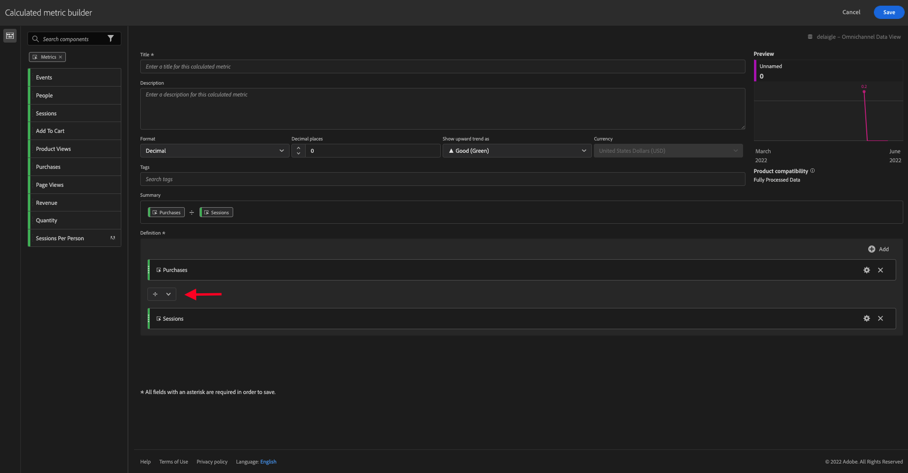

# 4.4 Gegevensvoorbereiding in Analysis Workspace

## Doelstellingen

- De gebruikersinterface van Analysis Workspace in CJA begrijpen
- Begrijp de concepten van gegevensvoorbereiding in Analysis Workspace
- Leer hoe u gegevensberekeningen uitvoert

## 4.4.1 Analysis Workspace-gebruikersinterface in CJA

Analysis Workspace verwijdert alle typische beperkingen die van toepassing zijn op een enkel Analytics-rapport. Analysis Workspace biedt een robuust en flexibel canvas om analyseprojecten op maat te maken. Sleep een willekeurig aantal gegevenstabellen, visualisaties en componenten (afmetingen, Metriek, segmenten en tijdgranulariteit) naar een project. Maak direct uitsplitsingen en segmenten, maak meldingen en cohorten aan voor analyse, vergelijk segmenten, werk aan uitval- en flowanalyse, en verzorg en plan voor rapporten die u kunt delen met de relevante personen in uw bedrijf.

Customer Journey Analytics brengt deze oplossing bovenop de gegevens van het Platform. We raden u aan deze overzichtsvideo van vier minuten te bekijken:

>[!VIDEO](https://video.tv.adobe.com/v/35109?quality=12&learn=on)

Als u Analysis Workspace nog niet eerder hebt gebruikt, raden we u aan deze video te bekijken:

>[!VIDEO](https://video.tv.adobe.com/v/26266?quality=12&learn=on)

### Uw project maken

Nu is het tijd om uw eerste CJA-project te maken. Ga naar het projectlusje binnen van CJA.
Klikken **Nieuw maken**.

Dan zie je dit. Selecteren **Leeg project** en klik vervolgens op **Maken**.

Dan zie je een leeg project.

Selecteer eerst de juiste gegevensweergave in de rechterbovenhoek van het scherm. In dit voorbeeld moet de gegevensweergave worden geselecteerd: `CJA Bootcamp - Omnichannel Data View`.

Vervolgens slaat u uw project op en geeft u het een naam. U kunt de volgende opdracht gebruiken om op te slaan:

| OS | Korte snede |
| ----------------- |-------------| 
| Windows | Control + S |
| Mac | Command + S |

U ziet deze pop-up:

Gebruik deze naamgevingsconventie:

| Naam | Beschrijving |
| ----------------- |-------------| 
| `yourLastName - Omnichannel Analysis` | `yourLastName - Omnichannel Analysis` |

Klik op Volgende **Opslaan**.

## 4.4.2 Berekende cijfers

Hoewel wij alle componenten in de Mening van Gegevens hebben georganiseerd, moet u nog enkele hen aanpassen, zodat de bedrijfsgebruikers bereid zijn om hun analyse te beginnen. Ook, tijdens om het even welke analyse kunt u berekende metrisch tot stand brengen om dieper op de inzichten het vinden te gaan.

Als voorbeeld maken we een berekende **Omzetsnelheid** met de **Aankopen** Metrisch/gebeurtenis wij op de Mening van Gegevens bepaalde.

### Omzetsnelheid

Laten we beginnen met het openen van de berekende metrische builder. Klik op de knop **+** om je eerste Berekende metrische waarde te maken in Analysis Workspace.

De **Berekende metrische bouwer** verschijnt:

Zoek de **Aankopen** in de lijst Metriek in het linkerzijmenu. Onder **Metrisch** klikken **Alles tonen**

Sleep nu en zet de **Aankopen** metrisch binnen aan de berekende metrische definitie.

Doorgaans betekent de omrekeningskoers: **Conversies/sessies**. Laten we dezelfde berekening uitvoeren in het berekende metrische definitiekanvas. Zoek de **Sessies** metrisch en belemmering en laat vallen het in de definitiebouwer, onder **Aankopen** gebeurtenis.

De operator voor delen wordt automatisch geselecteerd.

De omrekeningskoers wordt gewoonlijk uitgedrukt in een percentage. Dus, veranderen wij het formaat om percentage te worden en ook 2 decimalen selecteren.

Ten slotte wijzigt u de naam en beschrijving van de berekende metrische waarde:

| Titel | Beschrijving |
| ----------------- |-------------| 
| yourLastName - Conversion Rate | yourLastName - Conversion Rate |

U zult iets als dit op uw scherm hebben:

Vergeet niet om **Opslaan** de berekende metrisch.

## 4.4.3 Berekende Dimension: Filters (segmentatie) en datumbereiken

### Filters: Berekende Dimension

Berekeningen zijn niet alleen bedoeld voor Metriek. Voordat u een analyse start, is het ook interessant om een **Berekende Dimension**. Dit betekende eigenlijk **segmenten** terug in Adobe Analytics. In Customer Journey Analytics worden deze segmenten aangeroepen **Filters**.

Het creëren van filters zal bedrijfs gebruikers helpen om de analyse met sommige waardevolle berekende afmetingen te beginnen. Dit zal sommige taken automatiseren evenals aan het adoptiedeel helpen. Hier volgen enkele voorbeelden:

1. Eigen media, betaalde media,
2. Nieuwe of terugkerende bezoeken
3. Klanten met Verlaten winkelwagen

Deze filters kunnen voor of tijdens het analysegedeelte worden gemaakt (dat u in de volgende oefening zult doen).

### Datumbereik: Dimension berekende tijd

De Dimension van de tijd zijn een ander type berekende afmetingen. Sommige zijn reeds creeerd, maar u hebt ook de capaciteit om uw eigen Dimension van de Douane te creëren bij de fase van de gegevensvoorbereiding.

Deze berekende Dimension van de Tijd zullen wij analisten en bedrijfsgebruikers helpen om belangrijke data te herinneren en hen te gebruiken om de rapporttijd te filtreren en te veranderen. Typische vragen en twijfels die ons bij analyses opkomen:

- Wanneer was Zwarte Vrijdag vorig jaar? 21e-29e?
- Wanneer hebben we die tv-campagne in december gevoerd?
- Van wanneer tot wanneer deden we de zomerverkoop van 2018? Ik wil het vergelijken met 2019. Weet je trouwens de exacte dagen in 2019?

U hebt nu de gegevensvoorbereidingsoefening met CJA Analysis Workspace voltooid.

Volgende stap: [4.5 Visualisatie met Customer Journey Analytics](./ex5.md)

[Ga terug naar Gebruikersstroom 4](./uc4.md)

[Terug naar alle modules](./../../overview.md)
