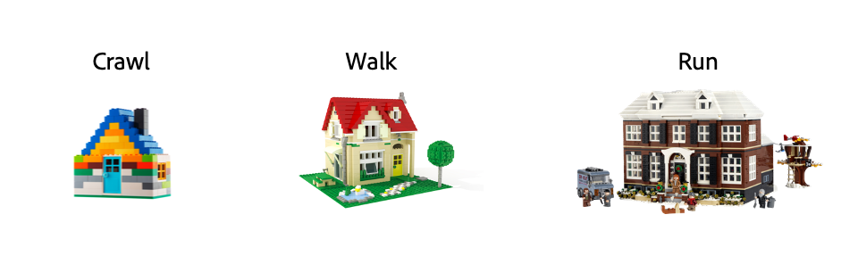

# Conclusie

Zoals je tijdens dit bootkamp hebt opgemerkt, gaat de toeleveringsketen van inhoud niet over producten, maar over de synergie tussen producten. Deze synergie levert veel voordelen op, bijvoorbeeld:

- **Rationalisatie van uitgaven**
   - Breng de productie van inhoud intern wanneer het voor minder kan worden gedaan
   - Consolideer en wijs efficiënter uitgaven over agentschappartners toe
- **Hergebruik van bedrijfsmiddelen**
   - Elimineer afval in het opnieuw creëren van bestaande activa door verenigde toegang
   - Het gebruik en de snelheid aan markt verhogen via Al-Verbeterd globaal onderzoek
- **Aanmaakcyclustijden reduceren**
   - Verminder de administratieve lasten via werkorkest en samenwerking
   - Versnel de cycli met geïntegreerde functies voor veilige revisie en goedkeuring
- **Automatisering optimaliseren**
   - Automatisch elementvariaties genereren voor meerdere kanalen en apparaten
   - Automatisch gelokaliseerde versies van elementen genereren voor meerdere markten/geos
- **Prestaties effectief meten**
   - Workflows optimaliseren via budgetinformatie en informatie over projectprestaties
   - Prioriteit geven aan hoger waardewerk via geavanceerde inzicht in de prestaties van bedrijfsmiddelen

Nochtans, is het even belangrijk om opnieuw te benadrukken dat de Keten van de Levering van de Inhoud geen magische oplossing voor al uw problemen is. Het is een manier van werken die u toestaat om efficiënter te zijn en alle ervaringen te beheren u aan uw klanten wilt brengen. Je moet kruipen voordat je kunt lopen en uiteindelijk rennen.

[Terug naar fase 4 - Inzichten voor een marketingmanager](./phases/insights/marketing-manager.md)

[Terug naar alle modules](./overview.md)
