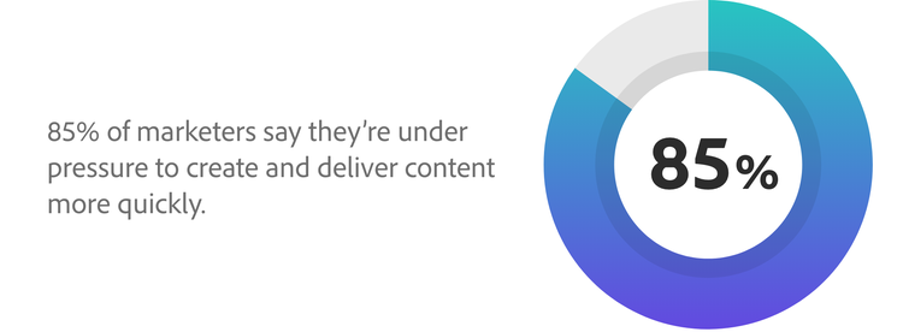

# De Keten van de Levering van de inhoud in 4 fasen

De wereld is nu eerst digitaal. Het is een realiteit waar bedrijven gedwongen zijn om mee om te gaan, en het gaat niet snel weg. Als deel van deze digitale wereld, zien wij [&#x200B; een enorme toename van inhoud &#x200B;](https://www.prnewswire.com/news-releases/content-marketing-market-size-to-grow-by-usd-487-24-billion--by-objective-platform-end-user-and-geography---forecast-and-analysis-2022-2026--301562808.html) gestuwd door meer mensen doorbladerend sociale media, die tijd in digitale ruimten doorbrengen, en ver werken.

Dit betekent voor u dat er meer kanalen, markten en indelingen zijn om inhoud te leveren — en er is een grotere behoefte aan dynamische en geoptimaliseerde inhoud.

_Source:_ [_Deloitte Digitale_ &#x200B;](https://www2.deloitte.com/content/dam/Deloitte/uk/Documents/consultancy/deloitte-uk-future-of-experience-time-to-market.pdf)

Het goede nieuws is, hoe uitdagend het ook kan zijn om de vraag naar inhoud bij te houden, er is een manier om, inhoud sneller en gemakkelijker te plannen, te produceren en te leveren. Het wordt genoemd de ketting van de a **inhoudslevering**. En als u met vlotte processen, sterke strategie, en stevige praktijken in werking kunt stellen, kunt u de volledige levenscyclus van inhoud stroomlijnen.

## Collaboration is de sleutel tot een vloeiende toeleveringsketen voor inhoud

Een toeleveringsketen voor inhoud is het proces waarin mensen, gereedschappen en werkstromen worden samengebracht om inhoud effectief te plannen, te maken, te beheren en te leveren. Met klanten die meer en betere ervaringen in een steeds sneller tempo eisen, zult u uw inhoud op dit ogenblik moeten krijgen eerder dan later. Dit zal druk van al uw teams door silo&#39;s te breken en werkschema&#39;s te verenigen tegenhouden. En u krijgt ook meer waarde van uw technologieinvestering, die u efficiency en waarde helpt verhogen.

Theoretisch is het een proces dat bedrijven overal moet helpen hun inhoud sneller uit de deur te krijgen. Maar in de praktijk zijn de meeste toeleveringsketens gebroken vanwege de manier waarop de levenscycli van interfunctionele inhoud natuurlijk zijn. Jammer genoeg, wanneer deze ketens breken, kunnen zij interne wanverhouding tot stand brengen, begrotingen in werking stellen, werknemers verminderen, en de snelheid vertragen van het leveren van zeer belangrijke berichten in de markt.

### Wat is het verbreken van de toeleveringsketen voor inhoud?

- [**70%** &#x200B;](https://business.adobe.com/resources/reports/future-creative-experiences.html) van tijd wordt besteed aan niet-kernwerk, het beheren van handtaken in ongelijke systemen over rollen.
- [**21%** &#x200B;](https://business.adobe.com/resources/reports/future-creative-experiences.html) van creatieven identificeerde knelpunten door het inhoudsproces als uitdaging aan het creëren van efficiënte ervaringen.
- [**31%** &#x200B;](https://www.fotoware.com/blog/dam-industry-trends-by-fotoware) van creatieve personen en marketers zeggen hun hoogste uitdaging de onmogelijkheid is om activa met veelvoudige belanghebbenden te delen.

Om een nog betere blik bij gemeenschappelijke schuldigen achter gebroken ketens van de inhoudslevering te krijgen, helpt het om elk van de drie high-level fasen te bekijken:

1. In de **plannings** fase, leidt een gebrek aan een uniform projectproces of een centrale manier om middelen te volgen tot veelvoudige revisies, bovenmatige kosten, prijsvertragingen, en onvermogen om het werk in evenwicht te brengen. Bovendien leidt het verbreken van de verbinding tussen teamleden tot verspilde cycli en langzame prioriteitswijzigingen.
2. Tijdens **productie**, de gesiloade systemen en de losgemaakte werkschema&#39;s beperken levende samenwerking, activa findability, vertragingen, en opruiming. En omdat creatieve personen taken en middelen handmatig moeten bijhouden en herhalende taken handmatig moeten uitvoeren, zijn er hogere kosten en meer fouten.
3. Wanneer het tijd voor **levering** is, niet hebbend een centraal systeem van het activabeheer — evenals beperkte automatisering aan schaal inhoud — vermindert de capaciteit van teams om samenhangende, gepersonaliseerde ervaringen over kanalen te lanceren. Bovendien beperken gefragmenteerde leveringsgereedschappen en gegevens een nauwkeurige meting van de prestaties van de bedrijfsmiddelen.

## Het is tijd om de toeleveringsketen van uw inhoud te verdraaien

Net als bij alles wat te lijden heeft onder verkeerde stappen en verkeerde communicatie, is er altijd een manier om het proces te verbeteren. Wanneer u deze drie fasen gebruikt, duikt u in wat een grote toeleveringsketen voor inhoud er voor uw bedrijf zou kunnen uitzien.

### Bewerkingen optimaliseren via gestroomlijnde planning

Idealiter gebruikt uw marketingteam een oplossing voor werkbeheer die interfunctionele samenwerking toestaat en projecten verbindt met geplande, gegevensgestuurde resultaten. Het zou het marketing team ook moeten machtigen om werk strategisch prioriteit te geven en die prioriteiten aan uw creatief team mee te delen. Vanaf dat punt moeten de creatieve samenvatting, inhoudsversies, en terugkoppelen in elk project worden samengevoegd zodat uw team niet door oude e-mails hoeft te zoeken om te vinden wat zij zoeken.

Uw creatief team zou opstelling met [&#x200B; een groot digitaal activabeheer &#x200B;](https://business.adobe.com/nl/products/experience-manager/assets/digital-asset-management.html) moeten zijn [&#x200B; (DAM) &#x200B;](https://business.adobe.com/nl/products/experience-manager/assets/digital-asset-management.html) [&#x200B; systeem &#x200B;](https://business.adobe.com/nl/products/experience-manager/assets/digital-asset-management.html) dat met uw creatieve en werkbeheerhulpmiddelen geïntegreerd is. Op die manier is het voor hen gemakkelijk om relevante middelen te vinden, te gebruiken, bij te werken of opnieuw te gebruiken. Door dit alles te doen, kunt u uw go-aan-marktsnelheid verbeteren en interne verrichtingen en processen vereenvoudigen.

### Verhoog de efficiëntie in productie met naadloze workflows

Met uw planning op zijn plaats, richt een grote productiefase rond een verenigde oplossing van het activabeheer die, samen met uw werkbeheertoepassing, meta-gegevens over al uw systemen synchroniseert. Hierdoor kunt u herhalende opmaaktaken automatiseren, zodat u de uitvoer kunt versnellen zonder de kwaliteit te verminderen. En wanneer uw werkbeheeroplossing met creatieve gereedschappen wordt geïntegreerd, kunnen uw creatieve teams niet alleen aanvragen, workflows en revisies beheren, maar kunnen ze zelfs inhoud goedkeuren en voltooien binnen de gereedschappen waarin ze al werken.

Als u vervolgens kunstmatige intelligentie (AI) toevoegt aan uw inhoudswerkstromen, kunt u gepersonaliseerde inhoud tot stand brengen die op klantenbelangen, allen automatisch bij schaal wordt gericht. Dit betekent dat uw teams allemaal kunnen doen wat ze het beste doen — uw creatieven kunnen aantrekkelijke inhoud bouwen en uw marketeers kunnen inzichten gebruiken om die inhoud aan te passen. Alles, zodat je geweldige ervaringen kunt opdoen.

### Elementen leveren en de efficiëntie van inhoud meten

Wanneer het tijd is om uw inhoud te leveren, is het belangrijk dat alle kritieke gebruikers of teams in kwestie toegang tot de inhoud hebben zij nodig hebben. Zorg ervoor dat uw DAM is ontworpen om aan uw behoeften te voldoen en dat uw teams elementen kunnen catalogiseren, bijhouden en zoeken op type of andere tags die u kiest. Klanten gaan snel en uw teams moeten zich nog sneller verplaatsen en zoeken naar video&#39;s, informatie, foto&#39;s, berichten en nog veel meer in een flits.

Bovendien maakt een werkelijk grote toeleveringsketen van inhoud gebruik van een DAM die automatisch afbeeldingen kan vergroten of verkleinen, versiebeheer kan beheren en dubbel werk in verschillende geografische omgevingen kan voorkomen. Het zou ook over uw volledige technologiestapel, met inbegrip van uw creatieve hulpmiddelen, werkbeheeroplossing, en inhoudsbeheersysteem moeten integreren zodat uw teams snel en gemakkelijk nieuwe inhoud kunnen creëren en het aan om het even welk kanaal leveren. En met AI kunt u automatisch relevante inhoud genereren die zich aanpast aan de locaties, interesses en acties van klanten.

## Bij de Adobe bouwen we een best-in-class leveringsketen voor inhoud

Onze zeer eigen [&#x200B; zaken van Adobe Experience Cloud &#x200B;](https://business.adobe.com/nl/) wordt geconcentreerd op het volgen van de eerder geschetste stappen om onze campagnes tot leven te brengen en veelvoudige segmenten te steunen. Onze visie was om wereldwijd aantrekkelijke inhoud te leveren die aansluit bij ons campagnerekader en onze boodschap.

Sleutel tot ons proces van de inhoudsverwezenlijking van begin tot eind is het verpakken van [&#x200B; Adobe Workfront &#x200B;](https://business.adobe.com/nl/products/workfront/main.html) en [&#x200B; Adobe Experience Manager Assets &#x200B;](https://business.adobe.com/nl/products/experience-manager/assets/aem-assets.html). Laten we eens kijken hoe we ons proces benaderen met dezelfde drie fasen op hoog niveau.

Wij beginnen met **planning**, waar wij honderden inhoudsverzoeken van over de zaken innemen en dan aan hen tegen onze driemaandelijkse prioriteiten voorrang geven. Vervolgens gebruiken we een inhoudvoorstel-dashboard in Workfront om transparantie te bieden, zodat we ons kunnen aansluiten bij onze belanghebbenden en snel een aftekening kunnen maken door onze marketing-, creatieve, web- en verkoopteams. Door dit te doen, maken we een verslag van wat we voor het kwart vastleggen, en geven we onze creatieve en webteams ook zichtbaarheid in het totale aanvraagvolume zodat ze kunnen plannen om middelen te besteden. Bovendien kunnen managers de werklasten voor hun teams gemakkelijk controleren.

Aangezien wij in **productie** bewegen, veranderen de goedgekeurde verzoeken in projecten die meer detail aan ons creatieve team verstrekken — dingen zoals creatieve briefjes, Web landende plaatsen, promotievereisten, en meer. Onze inhoudstrategen werken vervolgens samen met belanghebbenden en creatieven in Workfront om de inhoud te beoordelen en de termijnen te halen. Omdat we dit allemaal doen in Workfront, hebben we dubbele stappen, overbodige e-mails en meerdere invullingen geëlimineerd, en we beginnen zelfs productiecycli te volgen op basis van het type middel. Dit laat ons personeel in evenwicht brengen en herprioriteren wanneer nodig, allen door een diepgaande blik op projectgegevens te krijgen.

En wanneer onze inhoud klaar voor **levering** is, publiceren wij [&#x200B; onze aanbiedingen, activa, en promotionele inhoud &#x200B;](https://business.adobe.com/customer-success-stories/adobe-content-hub-case-study.html) aan Experience Manager Assets. Specifiek, gaat het allen in onze interne Hub van de Marketing, waar iedereen in het bedrijf het nauwkeurige stuk van inhoud snel kan vinden zij, juist wanneer zij het nodig hebben.

We hebben belangrijke voordelen gezien van het bouwen van een werkende toeleveringsketen voor inhoud. Specifiek, hebben wij onze dubbele gegevensingang in de helft gekrompen door aan één enkel werkbeheersysteem te migreren. En hoewel er altijd ruimte voor verbetering is, weten we dat we op de weg zijn naar een proces dat ons zal helpen één stap voor de verwachtingen van de klant te blijven.

>[!NOTE]
>
> Dit artikel werd oorspronkelijk gepubliceerd op de [_blog van Adobe Experience Cloud_ &#x200B;](https://business.adobe.com/blog/how-to/create-a-content-supply-chain-that-will-stand-the-test-of-time).

## De vierde fase: Inzichten

De keten van de Levering van de inhoud is geen magische oplossing voor al uw problemen. Het is een manier van werken die u toestaat om efficiënter te zijn en alle ervaringen te beheren u aan uw klanten wilt brengen. Je moet kruipen voordat je kunt lopen en uiteindelijk rennen.

En als je eindelijk aan de slag bent, is er nog iets dat je uit je end-to-end Content Supply Chain kan krijgen: inzichten. Na enige tijd kunt u gaan onderzoeken hoe bepaalde acties invloed hebben op tijd, begroting, ... We zullen dit ook aan het einde van het bootkamp behandelen.

Volgende Stap: [&#x200B; Creative Brief &#x200B;](./creative-brief.md)

[Terug naar alle modules](./overview.md)
