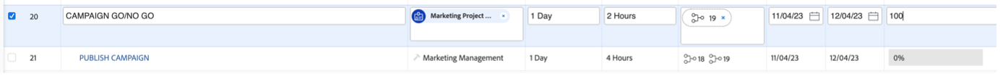

# Campagne GO/NO-GO

## De campagne in Adobe Workfront goedkeuren

Aangezien we alle taken nu hebben voltooid, en als gevolg daarvan alle taken aan 100% plaatsen, hebben we alleen de &#39;Campagne go/no go&#39; nodig - een taak van beoordeling en goedkeuring - om de campagne te kunnen publiceren.

We keuren natuurlijk onze campagne goed, dus stel taak 20 &#39;CAMPAIGN GO/NO GO&#39; in op 100% voltooid. Hierdoor wordt automatisch een beoordelings- en goedkeuringsproces gestart:

Laten we kijken naar het proces dat we hebben. Klik op de naam van taak 20 &#39;CAMPAIGN GO/NO GO&#39;:

 bij

Laten we nu kijken naar de sectie goedkeuringen:

We kunnen zien dat het een proces in twee stappen is waarbij ofwel ik, Petra, of iemand van u die dit go/nee-proces moet beoordelen en/of goedkeuren, als eerste stap gaat, en dan kan Olivia (onze Director of Marketing Operations) haar definitief toestemming geven.

Rechtsboven verscheen dus mijn goedkeuringsknoppen en ik kan deze &#39;Go No/Go&#39; nu goedkeuren voor de eerste stap. Klik op de groene markering om goed te keuren:

 goed

Al onze projecten moeten nu worden goedgekeurd door Olivia. Zodra ze haar goedkeuring heeft gehecht - wat ze natuurlijk zal doen - kan onze campagne worden gepubliceerd.

## De campagne voor sociale media starten

Nu we hebben geverifieerd dat onze campagne klaar is om te starten, en we zijn klaar om onze fietsen te gaan verkopen, is het tijd om een bozz te maken. En hoe kan je dat beter doen, dan met een bericht in de sociale media?

Aangezien we al een bericht voor sociale media hebben gemaakt en goedgekeurd, kunnen we het nu op onze Instagram-demo-account plaatsen.

>[!WARNING]
> Enkele huishoudelijke voorschriften
> 
> Dit is een account die alleen gemaakt is om het verhaal van ons bootkamp te voltooien. Het is **niet bedoeld om worden gedeeld, worden gevolgd of openbaar worden gemaakt**. Gelieve te houden uw post **respectvol en professioneel**. **deelt niet de geloofsbrieven** met iedereen buiten bootkamp, en gelieve nota te nemen **alle apparaten** na deze oefening zullen worden geregistreerd.

- U krijgt het wachtwoord van een Instagram-account met de naam &quot;csc_bootkamp_emea&quot;.
- Maak een nieuwe post, waarin u als laatste onderdeel van het bijschrift de locatie toevoegt waar u zich bij wilt voegen, plus de datum en het teamnummer.
- Voel vrij om naar alle verschillende posten te scrollen, om te zien hoe andere teams enige artistieke vrijheid met hetzelfde materiaal hebben ingenomen.

## Gefeliciteerd, uw campagne is gepubliceerd!

Volgende Stap: [ Fase 4 - Inzichten: Overzicht ](../insights/overview.md)

[Ga terug naar fase 3 - levering: pagina maken in AEM](./app.md)

[Terug naar alle modules](../../overview.md)
