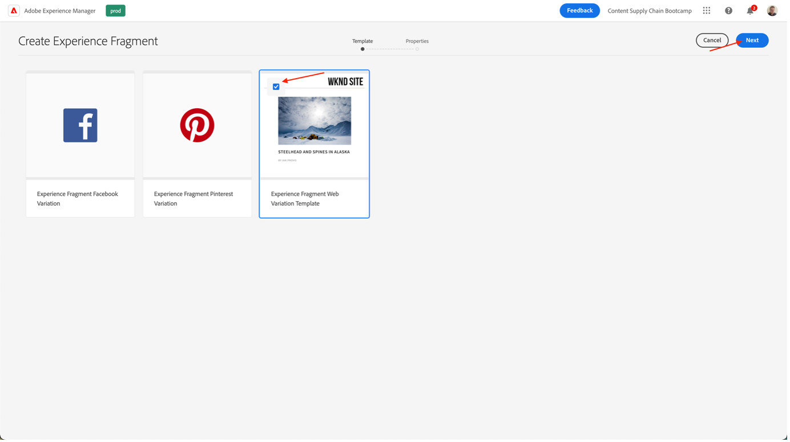
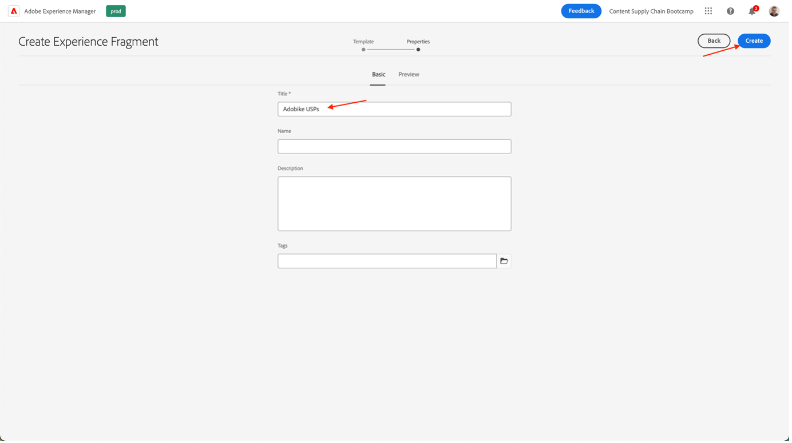
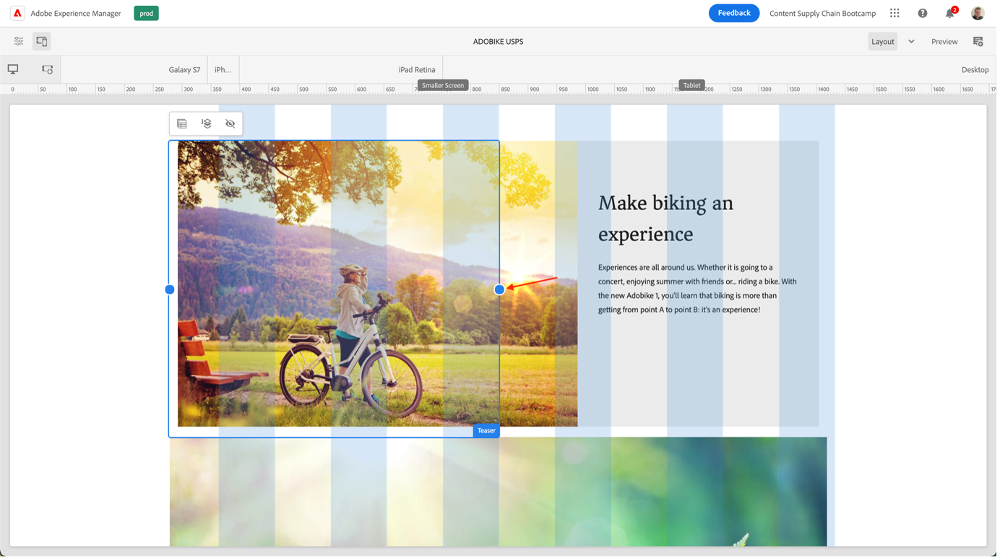
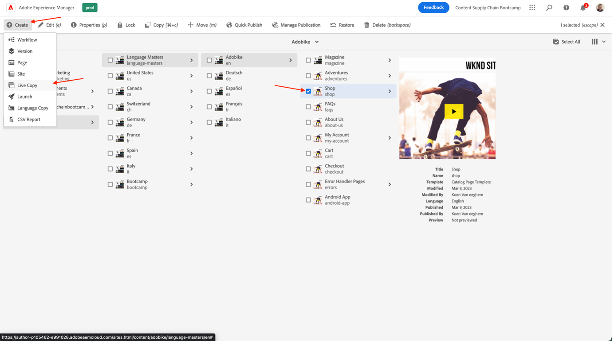
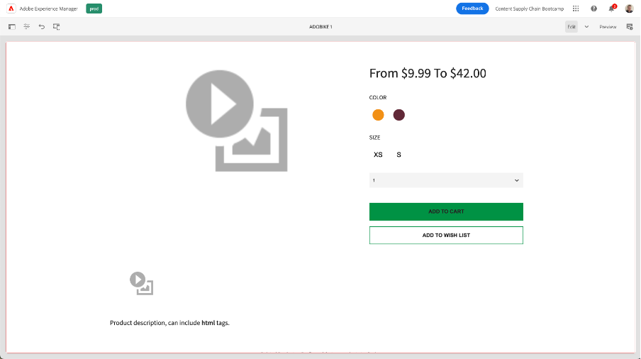

# Pagina maken in AEM

AEM biedt u twee omgevingen: de Auteur-omgeving en de Publish-omgeving. Deze interacties maken het mogelijk om inhoud beschikbaar te maken op uw website - zodat uw bezoekers deze kunnen ervaren.

De auteursomgeving verstrekt de mechanismen om deze inhoud tot stand te brengen, bij te werken en te herzien alvorens het daadwerkelijk te publiceren:

- Een auteur maakt en beoordeelt de inhoud (dit kan van verschillende typen zijn, bijvoorbeeld pagina&#39;s, middelen, publicaties, enz.)
- die op een gegeven moment op uw website worden gepubliceerd.

Als auteur moet u uw website binnen AEM organiseren. Dit betekent dat u inhoudspagina&#39;s maakt en een naam geeft, zodat:

- U kunt deze gemakkelijk vinden in de ontwerpomgeving
- Bezoekers naar uw site kunnen deze gemakkelijk in de publicatieomgeving bekijken

De structuur van een website kan worden beschouwd als een boomstructuur die uw inhoudspagina&#39;s bevat. De namen van deze inhoudspagina&#39;s worden gebruikt om URLs te vormen, terwijl de titel wordt getoond wanneer de paginainhoud wordt bekeken. In het onderstaande voorbeeld is de toegankelijke URL voor de pagina /content/adobike/language-masters/en.html

Laten we bekijken hoe u enkele nieuwe pagina&#39;s aan een bestaande website kunt toevoegen en hoe u bepaalde inhoud opnieuw kunt gebruiken.

## De startpagina maken

Zoals uitgelegd in de vorige sectie, werkt AEM paginahiërarchie als boomstructuur. Dit betekent dat we beginnen met de pagina op het hoogste niveau: de homepage.

- Ga naar de AEM auteur op [ https://author-p71057-e991028.adobeaemcloud.com/ ](https://author-p71057-e991028.adobeaemcloud.com/) en login met de geloofsbrieven die wij verstrekten.

- Selecteer Navigatie \> Sites in het menu AEM Start

- Eerst, navigeren de bestaande boomstructuur aan de plaats waar wij onze homepage willen tot stand brengen. Navigeer in de boomstructuur door &quot;AdobeEngine&quot; te selecteren in de eerste kolom en vervolgens &quot;Bootkamp&quot; in de tweede kolom. Als u vervolgens een pagina onder deze pagina wilt maken, klikt u op de knop &quot;Maken&quot; en selecteert u &quot;Pagina&quot; in het menu dat verschijnt.

- Hiermee wordt een nieuw scherm geopend waarin de nieuwe pagina wordt geconfigureerd. Eerst wordt een paginasjabloon geselecteerd. Met paginasjablonen in AEM kunt u de structuur van een pagina definiëren en definiëren welke inhoud op deze pagina kan worden gebruikt. Aangezien wij de homepage, die een landende pagina is, zullen wij het het Bestaan van de Malplaatje van de Pagina selecteren, dan de &quot;Volgende&quot;knoop klikken om verder te gaan.

- In het volgende scherm kunt u de pagina vullen met een aantal initiële gegevens. De belangrijkste informatie is de titel (een verplichte eigenschap, aangeduid met een \* ), die u moet gebruiken om de pagina een betekenisvolle naam te geven. Als u niet de &quot;Naam&quot;invult, zal AEM automatisch URL produceren waarop uw pagina, volgens SEO beste praktijken beschikbaar zal zijn. In dit geval kunt u dit veld leeg laten. Sommige andere eigenschappen kunnen ook worden ingevuld, kunt u de andere lusjes onderzoeken, maar voor dit bootkamp vullen geen andere eigenschappen enkel nog uit. Als u klaar bent om uw pagina te maken, klikt u gewoon op de knop Maken.

 in

- AEM maakt nu uw pagina. Zodra het wordt gedaan, zult u een pop-up krijgen, die u toestaat om de pas gecreëerde pagina te openen door de &quot;Open&quot;knoop te klikken.

- U komt nu aan in de AEM Editor. Dit is een redacteur &quot;wat u ziet is wat u krijgt&quot; (of WYSIWYG), waarin u componenten aan een pagina kunt slepen en laten vallen om uw pagina te bouwen. Laten we eens kijken naar de navigatie:
  
   - Aan de linkerkant hebt u het zijpaneel met de elementen die u op uw pagina&#39;s kunt gebruiken, de componenten (of bouwstenen) die u op deze pagina kunt gebruiken, en een handige boomstructuurweergave die u toont hoe uw pagina is gestructureerd. Klik op een van deze pictogrammen om de weergave te openen.
   - Aan de rechterkant ziet u de &quot;lay-outcontainer&quot;. Dit is een gebied waarin u de gewenste componenten kunt laten vallen.
   - Laten we onze pagina vullen met wat inhoud. Voel u vrij om de homepage te vullen zoals u het past. In het onderstaande voorbeeld hebben we een afbeeldingscomponent gebruikt die aan de productpagina is gekoppeld, en twee lasercomponenten.

## Ervaringen hergebruiken door ervaringsfragmenten te benutten

We hebben nu de homepage geschreven, die klaar is voor onze Adobe-startpagina. Een deel van de inhoud, bijvoorbeeld de unieke verkooppunten van onze fiets, kan echter op meerdere pagina&#39;s worden hergebruikt.

In het ideale geval willen we deze unieke verkooppuntervaring slechts één keer maken, zodat we deze centraal kunnen beheren en een persoonlijke, maar consistente ervaring kunnen garanderen. In AEM kunnen we dit doen met &#39;Experience Fragments&#39;. Een ervaringsfragment is een groep van een of meer componenten, inclusief inhoud en lay-out, waarnaar op pagina&#39;s kan worden verwezen. Ze kunnen elke gewenste component bevatten.

Laten we dit meteen gebruiken:

- Ga naar de AEM auteur op [ https://author-p71057-e991028.adobeaemcloud.com/ ](https://author-p71057-e991028.adobeaemcloud.com/) en login met de geloofsbrieven die wij verstrekten.

- Selecteer Navigatie \> Fragmenten AEM in het menu Start

- In het volgende scherm, maken een omslag die uw team kan gebruiken om hun herbruikbare ervaringen op te slaan. Navigeer in de kolomweergave naar Adobe-fiets \> Bootkamp en klik vervolgens op de knop Map maken \>.

- Geef uw map de naam van uw team in de modale pop-up. U kunt het naamveld leeg laten, AEM genereert dit automatisch voor u. Nadat u de map een naam hebt gegeven, klikt u op de knop Maken om de map te maken.

- De map moet nu worden weergegeven. Klik erop en klik vervolgens op de knop Maken \> Experience Fragment.

- Eerst, selecteren wij een Malplaatje van het Fragment van de Ervaring. Enkel zoals pagina&#39;s, kunnen de Fragmenten van de Ervaring op veelvoudige malplaatjes worden gebaseerd, elk die een vooraf bepaalde ervaring voorzien. In ons geval, aangezien wij onze inhoud in onze website willen hergebruiken, kies een &quot;Sjabloon van de Variatie van het Web van het Fragment van de Ervaring&quot;door checkbox op de linkerbovenkant te selecteren, dan de &quot;Volgende&quot;knoop te klikken.

- Geef uw ervaringsfragment een betekenisvolle titel, bijv. &quot;Adobe USPs&quot;, en klik dan de Create knoop.

- Als uw ervaringsfragment is gemaakt, klikt u op de knop Openen in het modaal, zodat we inhoud kunnen toevoegen aan het ervaringsfragment.

- Net als bij het bewerken van een pagina kunt u een lay-outcontainer zien waarin u inhoud kunt toevoegen.

- We kopiëren de onderdelen van de startpagina. Navigeer op een nieuw tabblad naar de startpagina zoals uitgelegd in het vorige hoofdstuk, selecteer de component waarover u wilt kopiëren en klik op het kopieerpictogram.

- Klik vervolgens weer in het ervaringsfragment op de lay-outcontainer en klik op de knop Plakken.

>[!NOTE]
>
> Tip: AEM kunt u de &quot;lay-outmodus&quot; gebruiken in elk pagina- of ervaringsfragment. Op deze manier kunt u het formaat van de componenten aanpassen en de ervaringen voor elk apparaat optimaliseren.

- Open in het bovenste menu het vervolgkeuzemenu en selecteer Lay-out om de lay-outmodus te activeren.

- Vervolgens kunt u elke component selecteren en de grootte ervan wijzigen door de handgrepen aan beide zijden van de component te slepen en vast te zetten op de kolommen die zichtbaar zijn op het scherm.

 houdt

- Standaard bewerkt u alle onderbrekingspunten. Als u echter een bepaald onderbrekingspunt wilt bewerken, kunt u een overeenkomstig apparaat selecteren in de werkbalk boven aan de pagina. Het breekpunt waarvoor u dan creeert zal dan worden benadrukt.

- Zoals u ziet, ziet een lay-out met twee kolommen er niet goed uit op mobiele apparaten. Laten we een lay-out met één kolom maken voor mobiele apparaten. Zoals u op desktop ziet, blijft onze ervaring hetzelfde, maar op mobiele apparaten hebben we nu een betere ervaring met slechts één kolom inhoud.

- Tot slot kunnen we deze ervaring nu opnieuw gebruiken op de homepage. Sleep een component &quot;Experience Fragment&quot; naar de pagina op de locatie waar u de inhoud wilt weergeven. U kunt de inhoud verwijderen die we opnieuw hebben gekopieerd, omdat we deze uit het ervaringsfragment gebruiken.

- Open het configuratiedialoogvenster voor de ervaringsfragmentcomponent en gebruik de padkiezer om de locatie te selecteren waar u het ervaringsfragment hebt gemaakt.

- Tot slot hebben we nu onze herbruikbare ervaring op onze pagina.

## De productpagina maken

Wanneer u Adobe Commerce gebruikt dat is geïntegreerd met AEM, kunt u een algemene pagina met productdetails hebben die wordt gebruikt wanneer u door de site navigeert vanuit de gegenereerde overzichten. Soms willen we echter ook een inspirerende pagina zien waarin productspecifieke inhoud wordt gecombineerd met inspirerende inhoud. Laten we de winkel kopiëren zoals ze door ons is gemaakt, en dan een inspirerende productpagina maken.

- Ga naar de AEM auteur op [ https://author-p71057-e991028.adobeaemcloud.com/ ](https://author-p71057-e991028.adobeaemcloud.com/) en login met de geloofsbrieven die wij verstrekten.

- Selecteer Navigatie \> Sites in het menu AEM Start

- Navigeer in het kolomoverzicht naar de winkel van de kant-en-klare website: Adobe fiets \> Taalstramienen \> Adobe-fiets \> Winkelen. Selecteer vervolgens de pagina Winkelen met het selectievakje en klik op Maken \> Live kopie. Zonder al te veel details in te voeren, maakt u hiermee een kopie van de pagina die u op uw site kunt gebruiken, zodat u de bestaande pagina&#39;s en inhoud opnieuw kunt gebruiken met AEM op Multi-Site Manager.

- Selecteer in het scherm dat verschijnt de site van uw teams als bestemming door het selectievakje naast de naam in te schakelen. Klik vervolgens op de knop Volgende.

- Aangezien wij niet diep in de Manager van de MultiPlaats gaan, kunt u enkel deze configuratie overnemen.\
  Titel: Winkelen\
  Naam: winkel\
  Rollout Configs: standaard rollout config\
  Zodra u het levende exemplaar hebt gevormd, klik de Create knoop.

>[!NOTE]
>
> Vreemd voor meer informatie over live kopieën? Check out [ &quot;Creating and Synchronizing Live Copies&quot;.](https://experienceleague.adobe.com/docs/experience-manager-cloud-service/content/sites/administering/reusing-content/msm/creating-live-copies.html?lang=en)

- Als u klaar bent, ziet u nu de winkel die op uw website beschikbaar is. Selecteer het en klik vervolgens op Maken \> Pagina om onze inspirerende productpagina te maken.

- Aangezien wij productinformatie op de pagina willen tonen, laten wij nu een pagina tot stand brengen gebruikend het malplaatje van de productpagina. Selecteer het, dan klik de Volgende knoop.

- Vul de metagegevens van de pagina in en klik op de knop Maken, net als bij de startpagina. Nadat u de pagina hebt gemaakt, kunt u deze openen door op de knop Openen te klikken. Zoals u kunt zien, is het reeds bevolkt met een component van productdetails.

- Eerst voegen we ons ervaringsfragment toe dat we eerder hebben gemaakt. Vervolgens kunnen we extra inhoud toevoegen die we nog steeds op de pagina willen. Tot slot zullen wij de component van productdetails vormen om ons product van Adobe te tonen door de productzoeker in de configuratiedialoog te selecteren dan onze categorie van Adobe te selecteren en de doos naast het product te controleren. Klik vervolgens op Toevoegen.

- We hebben nu onze volledige inspiratiepagina, inclusief centraal beheerde inhoud en productinformatie uit Adobe Commerce.

Volgende Stap: [ Fase 3 - Levering: Campagne GO/NO-GO ](./go-nogo.md)

[Ga terug naar fase 3 - Levering: mobiele app verifiëren](./app.md)

[Terug naar alle modules](../../overview.md)
