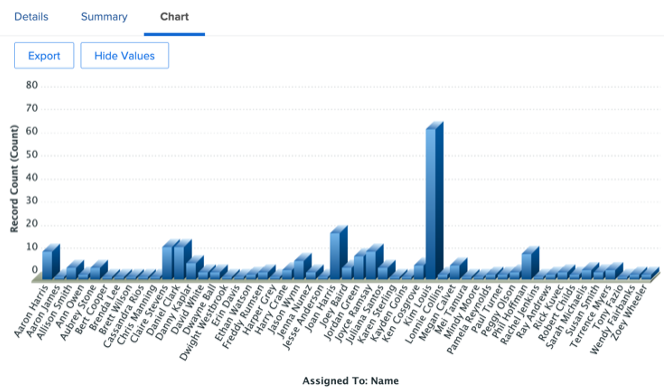
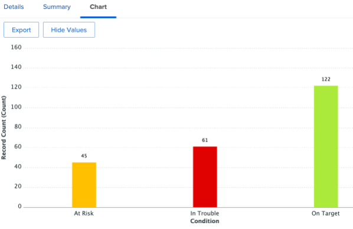
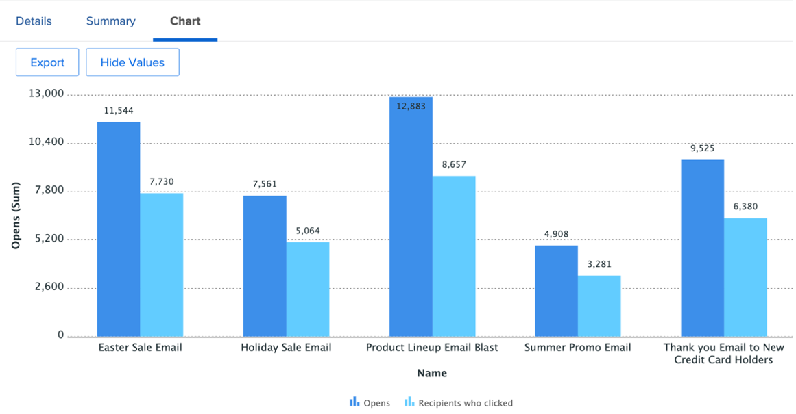

# Inzichten voor een marketingmanager

## Wekelijkse weergave van projectleider

Klik in de linkerkolom op de wekelijkse weergave van de projectleider:

Dit behandelt een rijke serie rapporten, altijd klikbaar/actionable voor verdere details:

- De **taken wegens deze week door Project**

- De **komende Mijlpalen van het Beheer van het Project**:

- De **Open Kwesties door Prioriteit**

- De **Late Taken door Afdeling**

- De **Late Taken door Individueel**

## SCRUM-gerelateerde inzichten

Klik in de linkerkolom op Interferatiestatus

Als uw Teams met de Methodologie SCRUM werken, is dit een interessante reeks rapporten van het Beheer:

- **Winst door Herhaling**

- **Gemiddelde Snelheid door Team**

- **Huidige herhalingen voltooide de totalen van het Uur door Assignee**

- **Herhalingen door Team**

## Efficiëntierapportage

Nog steeds in de linkerkolom, klik op &#39;Efficiëntie&#39;

- **Geplande/niet-Geplande Verhouding** (van het uitgevoerde werk)

- **voltooide Verzoeken door Week**

## Inzichten van projecten tijdens de vlucht

Nog steeds in de linkerkolom klikt u op &#39;Marketing - Projecten tijdens de vlucht&#39;

- **Status van de Projecten van de Vlucht**

- **projecten door voorwaarde door maand**

- Lijst, vooruitgang en financiële details van de **In-Vluchtprojecten**

## Afhankelijkheden visualiseren (cross-project)

Klik terug naar de lijn van de &quot;SPELD&quot;op de Mening van de Gant van het Portfolio:

Hier hebt u de mening van de Grafiek van de Gant van een groep projecten **met mogelijke gebiedsdelen (predecessors) tussen projecten**

## Integratie-inzichten van derden

>[!NOTE]
>
> Dit is een voorbeeld van integratie met software van derden. Dit is een integratie met Adobe Campaign als voorbeeld. De resultaten van de voltooide campagnes in Adobe Campaigns worden geïmporteerd.

Klik op de regel &#39;PIN&#39; op &#39;Campagneoverzicht&#39;:

- **Samenvatting van Adobe Campaign**

- **Adobe Campaign die naar Opens wordt verzonden**

- **Adobe Campaign opent aan Klikken**

 te klikken

Volgende Stap: [ Conclusie ](../../conclusion.md)

[Terug naar fase 4 - Inzichten voor een projectmanager](./project-manager.md)

[Terug naar alle modules](../../overview.md)
