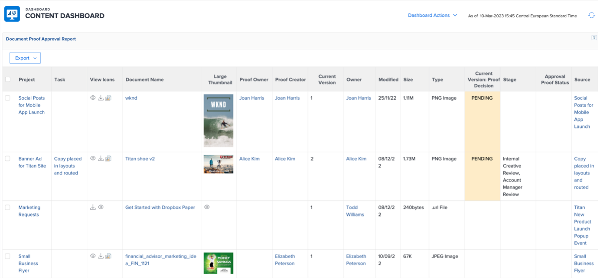

# Inzichten voor een projectmanager

## Voortgangsrapporten interactief project

Klik op de regel &#39;PIN&#39; op &#39;Mobile App Awareness&#39; en klik vervolgens op &#39;Metrics&#39;:

Hier ziet u een grafische weergave van de status van één project/campagne.

>[!NOTE]
>
> Op elk gebied kan worden geklikt voor meer details, dit geldt voor de meeste inzichten in Workfront. Geef het een keer!

## Campagnespecifieke verslagen

Klik op Projecten op de regel &#39;PIN&#39;:

Klik in de linkerkolom op Campagnestatus:

Het hoogste deel geeft u inzichten op één enkele campagne over 1/Campagne **gepland vs. daadwerkelijke** bestede uren en 2/de **Voorwaarde van de Campagne** voor elk kanaal:

Het bodemdeel geeft u inzichten over de **Campagne levert** status op:

## Inzichten gebaseerd op meerdere projecten

Nog op de linkerkolom, klik op &quot;Controle&quot;

Het hoogste deel geeft u inzichten over het statuut van een groep projecten, zowel van het **status van Taken** punt van mening en van het **3} punt van de projectomstandigheden {:**

Het bodemdeel toont alle **bij risicogoedkeuringen** en zal het jagen vereisen:

## Het inhouddashboard

Klik nog steeds in de linkerkolom op &#39;DASHBOARD INHOUD&#39;:

Het hoogste deel geeft goed inzicht over al uw **status van de proefgoedkeuring van 0} document (is het goedgekeurd, hoeveel versies wij, enz. nodig hadden)**

Het onderste deel is de Controle van de Goedkeuring van het a **Bewijs** die een andere hoek van visie aan de status van de proefdrukgoedkeuring geeft:

Volgende Stap: [ Fase 4 - Inzichten voor een Manager van de Marketing ](./marketing-manager.md)

[Terug naar fase 4 - Inzichten: overzicht](./overview.md)

[Terug naar alle modules](../../overview.md)
