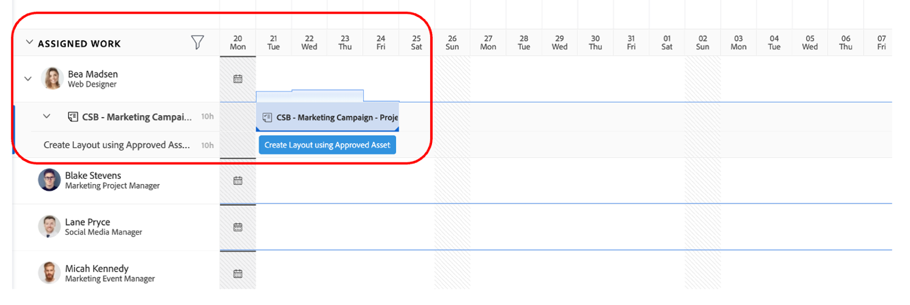

# Planning

>[!NOTE]
>
> Tijdens het Bootkamp draagt u verschillende hoofdletters: Aanvrager, Projectmanager, Designer en Bovenste Beheer. Zo krijgt u een overzicht van de gebruikerservaring van elk profiel.

Laten we nu eens kijken naar het Work Management Platform, Adobe Workfront. Workfront maakt uw doelstellingen zichtbaar voor de hele organisatie zodat iedereen strategisch prioriteit kan geven aan werk, de vooruitgang kan volgen en resultaten kan meten. En naarmate uw doelstellingen evolueren, verspreidt Workfront informatie over teams die werk uitvoeren op de grond. Het resultaat? Betere uitlijning, focus en snelheid om te slagen.

Logon aan uw profiel van Workfront door aan [ te doorbladeren adobebootcampemea-02032301.testdrive.workfront.com ](https://adobebootcampemea-02032301.testdrive.workfront.com) en het registreren met de geloofsbrieven het team van de Adobe verstrekte aan u.

Deze aanmeldingspagina wordt weergegeven.  Meld u aan met uw professionele e-mailadres waarop u zich als gebruikersnaam hebt geabonneerd bij het bootkamp:

Nadat u zich hebt aangemeld, krijgt u de volgende startpagina:

## Workfront voorbereiden voor gebruik

We zullen nu onze homepage voorbereiden alsof we Workfront regelmatig gebruiken.  Dat betekent dat we relevante pagina&#39;s voor onze workflow van later gaan ophalen en ze bovenop onze homepage &#39;pinnen&#39;.

Laten we eerst de werklastpagina van TEAM ophalen.  Klik op de wafel rechtsboven en selecteer Teams.

Als ons TEAM (Marketing - Digital) eenmaal op het scherm staat, kunt u het gewoon op uw bovenste lint pinnen:

Het bovenste lint moet er nu als volgt uitzien:

Laten we nu een project vastzetten dat we later nader gaan analyseren.  Klik op de PINNED van Projecten pagina en klik op de onderzoeksknoop.  Typ een &#39;bewustmakingscampagne voor mobiele apps&#39; en klik op de projectnaam:

Zodra het project op uw scherm is, SPEL het aan uw hoogste lint zoals wij vroeger deden:

Het bovenste lint moet er nu als volgt uitzien:

Klik ten slotte nogmaals op de rechterbovenhoek en selecteer PORTFOLIO&#39;S.

Klik op de zoekknop en typ TRANSFORM.  Klik op het Portfolio &#39;De ervaring van de Klant transformeren&#39; om het te openen:

Zodra het Portfolio open is, speld het aan uw hoogste lint:

Het bovenste lint moet er nu als volgt uitzien:

We zijn nu klaar om onze workflow te beginnen met een interface die ons precies laat zien wat we regelmatig nodig hebben.

## Aanvrager

We beginnen nu met de eigenlijke inname van werk met de hoed van de aanvrager. Een aanvrager, bijvoorbeeld een productmanager, willen wij een verzoek voor onze nieuwe Campagne van Adobe formaliseren en de informatie van het Marketing Brief verstrekken.

- Klik linksboven op Verzoeken:

- Klik vervolgens op Nieuwe aanvraag:

- Als verzoektype, uitgezochte &quot;Verzoeken van de Marketing&quot;, toen &quot;CSB - Verzoeken van de Campagne&quot;:

- Voer het onderwerp in: &quot;AdobeEngine-campagne - \*team\*&quot; (uw teamnummer invullen). U kunt een beschrijving en een prioriteit toevoegen.

- Alles onder de koptekst &quot;CSB - Marketing Campaign Brief&quot; is volledig aanpasbaar. In dit geval, zijn dit alle douanegebieden die u aan uw eigen het in de handel brengen korte behoeften kunt aanpassen. Hier zijn de Korte gebieden die wij voor dit Bootkamp hebben gecreeerd:

- Laten we beginnen met het invullen van het Kort:

   - Stel de begindatum in op 01.6.2023 - Stel de einddatum in op 30.6.2023:

  

   - Selecteer AEM Assets, omdat we een aantal middelen beschikbaar hebben om in deze campagne te gebruiken:

  

   - Bij Nieuwe inhoud wordt een extra (voorwaardelijk) veld weergegeven met een waarschuwing voor de tijd als u op Ja klikt:

  

   - Aangezien wij op een krappe termijn zijn, veranderen wij onze keus in &quot;NEE&quot;:

  

   - Op de kanalen maakten we de keuze om een voorselectie standaard uit te voeren. En dat zijn de stappen die we nodig hebben voor de volgende stap, dus er is hier geen verandering nodig:

  

   - Adobe Commerce, selecteer ja:

  

- Tot slot kunt u in de documentensectie alle relevante documentatie voor uw verzoek toevoegen.  Hier, gaan wij gebruik maken van de AEM schakelaar om u te tonen hoe u bestaande inhoud van onze instantie van AEM Assets kunt krijgen.

   - Klik op &#39;Bestanden toevoegen of koppelen&#39; en selecteer Koppeling in &#39;ervaringsbeheer&#39;.

   toe

   - U wordt nu geconfronteerd met de AEM Assets-mappen en u kunt deze door de mappen bladeren (en/of het zoekprogramma gebruiken) om de documenten/middelen te verkrijgen die u voor uw aanvraag nodig hebt:

  

   - Voel u vrij om items van AEM Assets toe te voegen die volgens u relevant kunnen zijn voor dit project, als die er zijn. Als u klaar bent, klikt u op &quot;Koppeling&quot; om een koppeling te maken naar elementen of op &quot;Sluiten&quot; als u geen mappen koppelt.

  

- We hebben ons verzoek nu voltooid en zijn klaar om het in te dienen:

## Projectmanager

Nu we ons verzoek hebben ingediend als &#39;aanvrager&#39; (bijvoorbeeld productmanager), gaan we de hoed veranderen en de naam van de projectmanager dragen.

- Klik op het logo &#39;Adobe&#39; en u start op de pagina &#39;Nieuwe marketingverzoeken&#39; (dit is een typische startpagina van &#39;Projectmanager&#39;):

- Onder de sectie &#39;Marketing - Nieuwe campagneverzoeken&#39; vindt u uw zojuist gemaakte verzoek:

- Klik op de naam van de aanvraag:

- Klik op &#39;Details aanvragen&#39;:

- Schuif omlaag naar de sectie &#39;CSB - Marketing Campaign Brief&#39; en vouw deze uit:

- U kunt alle details van het mandaat van de Aanvrager zien en met deze informatie, kunt u een projectplan beginnen dat op een malplaatje wordt gebaseerd.
   - Klik bovenaan op de drie stippen naast de naam van uw aanvraag:

  

   - Klik op Converteren naar project vanuit sjabloon:

  

   - Selecteer &#39;CSB - Marketing Campaign&#39; en klik op &#39;Sjabloon gebruiken&#39;:

  

   - Klik op Converteren naar project onder aan de pagina:

  

- We hebben nu onze workflow voor Campagne-projecten gebaseerd op de sjabloon. Laten we ons project voor later pinnen. Klik op &#39;Huidige pagina vastzetten&#39;:

- Enkele aandachtsgebieden:

1. Notie van Duur - Het is het venster van kans om een taak te voltooien.\
   Notie geplande uren - het is de daadwerkelijke tijd nodig om een taak te voltooien.

1. Notie van Predecessors (ook bekend als afhankelijkheden) - dit zijn de beperkingen die taken tussen elkaar kunnen hebben (deze taak kan normaal gesproken niet worden gestart voordat deze andere taak is voltooid). Dat stelt ons in staat een duidelijke Gant Chart met de kritieke weg voor elk project te hebben. Klik op het onderstaande pictogram om de Gant Chart weer te geven:
   

1. Toewijzingen - op het moment dat het project wordt gemaakt, zijn toewijzingen nog steeds generalistisch aangezien ze uit een sjabloon afkomstig zijn. Ze worden uitgevoerd op de taakrollen - vertegenwoordigd door het hamerpictogram (d.w.z. een groep mensen die de vaardigheden hebben om deze specifieke taak te voltooien) of op de teams - vertegenwoordigd door het personenpictogram (d.w.z. gedefinieerd door de groep personen in uw bedrijf). Nu is het het moment om die taken aan individuen toe te wijzen.

- Vandaag gaan we ons concentreren op de taken van teams en hoe we deze aan individuen kunnen toewijzen.

- Zoals u kunt zien, wordt taak 11 &quot;Sociale media-advertentie produceren&quot; toegewezen aan het &#39;Marketing - digitaal&#39; team:
  

- Laat ons zien hoe dit op de planning van dit team door het te openen van de pagina van het Beheer van het Middel weerspiegelt. Klik op de pincode &#39;Marketing - digitaal&#39; boven aan de pagina:
  

- U hebt nu de volgende planningsweergave voor teams:

1. In het bovenste deel wordt het niet-toegewezen werk voor dat specifieke team besproken. Het maakt een lijst van de projecten het Team heeft binnen taak(s) en door op de pijl hier te klikken, hebt u de zicht van de nauwkeurige taken die door project moeten worden behandeld:
   

1. Het onderste deel heeft betrekking op het toegewezen werk voor de personen in het team, maar niet alleen: het toont inderdaad de werkelijke werklast van elk lid van het team, maar ook hun planning (bv. Mon-Fri of Mon-Sat), hun vakantie, enz.
   

- Als u een taak aan een individu wilt toewijzen, sleept u de taak van het bovenste deel naar de regel van een individu in het onderste gedeelte. Zie hoe de werkbelasting van Bea is aangepast en de details van haar taken zijn toegevoegd:
  

Volgende Stap: [ Fase 1 - Planning: Andere pre-work ](./prework.md)

[Terug naar Creative Brief](../../creative-brief.md)

[Terug naar alle modules](../../overview.md)
