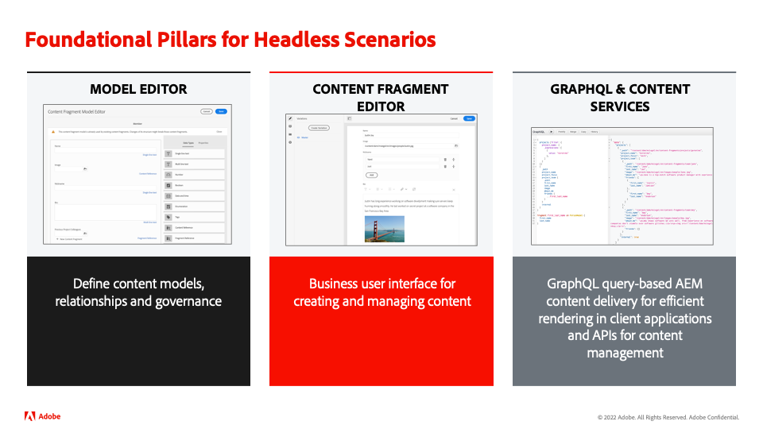
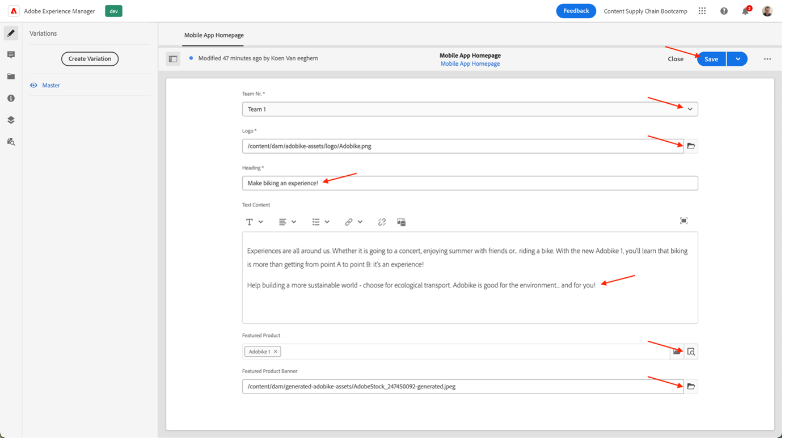

# Mobiele app-inhoud maken

## Wat is de levering van inhoud zonder kop?

Met een systeem voor inhoudsbeheer zonder kop zijn de back-end en frontend nu ontkoppeld. Het onderdeel zonder kop is de achterkant van de inhoud, omdat een CMS zonder kop een back-end alleen inhoudsbeheersysteem is, dat expliciet is ontworpen en gebouwd als een opslagplaats voor inhoud die inhoud toegankelijk maakt via een API, voor weergave op elk apparaat.

De front-end, die onafhankelijk van elkaar wordt ontwikkeld en onderhouden, haalt inhoud van de headless backend op met behulp van een Content Delivery API, typisch in formaat JSON. Dit kan bijvoorbeeld een webtoepassing zijn of in ons geval een mobiele toepassing.

Voor een CMS-achtergrond zonder kop is meestal de structuur van de inhoud vereist op basis van een model of schema. Hierdoor kunnen clienttoepassingen de juiste inhoud aanvragen voor het renderen van een ervaring. Sommige CMS kunnen, net als AEM, zowel gestructureerde als niet-gestructureerde inhoud in JSON-indeling toegankelijk maken.

Een zeer belangrijk kenmerk van deze topologie is dat de inhoud die door het hoofd CMS in formaat JSON wordt gediend zuivere inhoud, zonder ontwerp of lay-outinformatie is. In een CMS-implementatie zonder kop blijft alle opmaak en lay-out behouden door de ontkoppelde frontendtoepassing.

Een zeer belangrijk voordeel van een koploze topologie CMS is de capaciteit om inhoud over veelvoudige kanalen opnieuw te gebruiken, die verschillende cliënt-zij frontend implementaties kunnen gebruiken. Dit kan het vooruitstrevende ontwikkelingsproces efficiënter maken. Maar het betekent ook dat het ontwikkelingsproces van de frontendervaring zeer code en IT-centric kan worden, waarbij IT in wezen de ervaring bezit.

## Hoe werkt de levering van inhoud zonder kop in AEM?

AEM as a Cloud Service is een flexibel hulpmiddel voor het implementatiemodel zonder kop door drie krachtige functies te bieden:

1. Inhoudsmodellen
   - Inhoudsmodellen zijn een gestructureerde weergave van inhoud.
   - Inhoudsmodellen worden gedefinieerd door informatiearchitecten in de AEM Content Fragment Model-editor.
   - Inhoudsmodellen dienen als basis voor inhoudsfragmenten.
1. Inhoudsfragmenten
   - Inhoudsfragmenten worden gemaakt op basis van een inhoudsmodel.
   - Gemaakt door auteurs van inhoud met de AEM Content Fragment-editor.
   - Inhoudsfragmenten worden opgeslagen in AEM Assets en beheerd in de gebruikersinterface van Assets Admin.
1. Inhoud-API voor levering
   - De AEM GraphQL API ondersteunt de levering van inhoudsfragmenten.
   - De AEM Assets REST-API ondersteunt CRUD-bewerkingen voor inhoudsfragmenten.
   - De directe inhoudslevering is ook mogelijk met de [&#x200B; uitvoer JSON van de Component van de Kern van het Fragment van de Inhoud &#x200B;](https://experienceleague.adobe.com/docs/experience-manager-core-components/using/components/content-fragment-component.html?lang=nl-NL).

## Uitoefening

Voor dit bootkamp richten we ons op het &quot;content&quot;-gedeelte - het is immers de toeleveringsketen van content die we nastreven. We hebben al een inhoudsmodel en de vereiste API&#39;s voor levering voorzien, zodat u zich kunt richten op wat belangrijk is.

Laten we eerst ons inhoudsmodel verkennen: het is het &#39;contract&#39; dat we hebben met het headless CMS, dus we weten welke inhoud onze weg kan vinden en in welke vorm.

- Ga naar de AEM auteur op [&#x200B; https://author-p105462-e991028.adobeaemcloud.com/ &#x200B;](https://author-p105462-e991028.adobeaemcloud.com/) en login met de geloofsbrieven die wij verstrekten.

- Selecteer in het menu AEM Start de optie Gereedschappen \> Algemeen \> Modellen van inhoudsfragmenten

- Op het volgende scherm krijgt u een overzicht van alle sites die inhoud zonder kop gebruiken. Dit staat u toe om bestuur over veelvoudige hoofdloze plaatsen te houden, zonder het moeten vrezen zij zich met elkaar zullen mengen. In ons geval werken we met onze website van Adobe, dus selecteer dat model.

- In deze map kunnen we technische inhoud zonder kop zien die we gebruiken op de website van Adobe. Wil je meer weten? Voel je vrij om uit te reiken. Laten we ons nu concentreren op de taak die voor de hand ligt: de mobiele app. Houd de muisaanwijzer boven de Homepage van de Mobile App en klik op het potloodpictogram om het inhoudsmodel te openen.

- In de Editor van het inhoudsfragmentmodel ziet u de details van een bepaald inhoudsmodel. In ons geval zien we de homepage van onze mobiele app: het Adobe-logo, een kop, een optionele, gratis tekst en een optioneel product. Al deze punten zijn gemakkelijk te vormen en bij te werken, zodat als uw inhoudsmodel extra elementen nodig heeft, dit zonder ontwikkelaarsinterferentie op CMS kant kan worden gedaan.

>[!WARNING]
>
> **gelieve te merken op dat het veranderen van het inhoudsmodel implicaties verder onderaan de lijn** heeft, aangezien mobiele app zich op het ontvangen van bepaalde informatie baseert om de correcte elementen te kunnen tonen. Wees extra voorzichtig wanneer u velden bijwerkt of verwijdert, maar het toevoegen van velden heeft geen effect.

Nu we een idee hebben van waar onze inhoud van moet bestaan, kunnen we ons inhoudfragment maken.

- Klik op AEM logo in de linkerbovenhoek om de navigatie te openen en navigeer vervolgens naar Navigatie \> Inhoudsfragmenten.

- In de volgende interface krijgt u een overzicht van alle bestaande inhoud binnen AEM. De filters aan de linkerkant kunnen worden gebruikt om omlaag te versmallen als u naar een specifiek inhoudsfragment zoekt. Als u een nieuw inhoudsfragment wilt maken, klikt u rechtsboven op de knop Maken.

- In de modus die wordt geopend, ziet u dat sommige velden nog niet bewerkbaar zijn. Dit is logisch: op basis van waar we ons fragment maken, zijn er verschillende modellen beschikbaar.
  
   - Selecteer eerst waar het fragment wordt gemaakt door op het mappictogram naast het veld Locatie te klikken. Vouw de structuur van de inhoud uit door op de mappen &quot;adocycle&quot; \> &quot;en&quot; \> &quot;mobile-app&quot; te klikken en vervolgens uw selectie te bevestigen door op de knop &quot;Choose&quot; te klikken.

     
   - U zult merken dat het veld &quot;Inhoudsfragmentmodel&quot; nu bewerkbaar is. Klik op de pijl naast het veld om het vervolgkeuzemenu te openen en selecteer het inhoudsmodel waarnaar we eerder hebben gekeken: &#39;&#39;Mobiele startpagina van toepassing&#39;&#39;.
   - Geef uw inhoudsfragment vervolgens een betekenisvolle titel (tip: neem uw teamnummer op om de inhoud gemakkelijk terug te vinden). U zult merken dat het veld Naam automatisch wordt ingevuld. Dit is om uw leven makkelijker te maken: het is de naam die het systeem gebruikt om uw fragment te identificeren en mag niet worden aangeraakt.
   - Klik ten slotte op de knop &quot;Maken en openen&quot;. Deze knop geeft aan dat het inhoudsfragment wordt gemaakt en wordt geopend zodat u het direct kunt bewerken.

- Hier kan uw team bepalen welke inhoud u wilt weergeven in de mobiele app. 
   - Selecteer uw team nr., zodat u uw inhoud later in de mobiele app kunt controleren.
   - Als u afbeeldingselementen wilt selecteren, klikt u op het mappictogram om in AEM Assets naar de juiste afbeelding te bladeren.
   - Voor het aanbevolen product klikt u op het opzoekpictogram van het product, zodat u eenvoudig ons Commerce-product &quot;Adobe-1&quot; kunt selecteren, zodat de gegevens over de handel in de app worden geladen.
   - Klik op de knop Opslaan als u klaar bent om alle geschreven inhoud op te slaan en uw wijzigingen te publiceren.

     

Nu we de mobiele app met wat inhoud hebben voorzien, zijn we klaar om onze campagne te leveren.

Volgende Stap: [&#x200B; Fase 3 - Levering: Verifieer mobiele app &#x200B;](../delivery/app.md)

[Terug naar fase 2 - Productie: sociale media maken](./social.md)

[Terug naar alle modules](../../overview.md)
