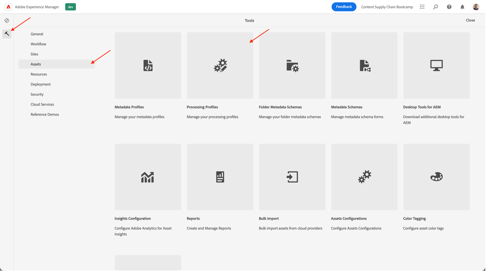
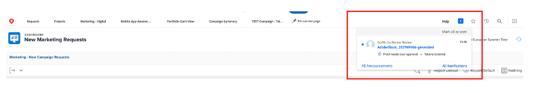

# Homepatiebanner voor producten maken

## Productie van de banner

Dankzij de automatisering van content beschikt Adobe Creative Cloud over de kracht van Experience Manager Assets. Zo kunnen marketers de productie van bedrijfsmiddelen op grote schaal automatiseren, waardoor het creëren van variaties aanzienlijk wordt versneld. Laten we deze functies gebruiken om een banner te genereren die op de startpagina moet worden gebruikt!

- Ga naar de AEM auteur op [https://author-p105462-e991028.adobeaemcloud.com/](https://author-p105462-e991028.adobeaemcloud.com/) en meld u aan met de gegevens die we hebben verstrekt.

- Navigeer vanaf de startpagina naar Gereedschappen \> Elementen \> Profielen verwerken.

- In de interface ziet u alle bestaande verwerkingsprofielen. Deze kunnen worden gebruikt tot om bepaalde automatiseringen toe te laten.

- De volgende zijn van belang voor u:
   - Donkere Adobe-banner: Hiermee maakt u een Adobe-banner met een donkere bedekking op basis van het geselecteerde element
      
   - AdobeCycleBanner Light: Hiermee maakt u een Adobe-banner met een lichtbedekking op basis van het geselecteerde element
      
   - AdobeCycleBanner Green: Hiermee maakt u een Adobe-banner met een groene overlay op basis van het geselecteerde element
      

- Nadat u het type banner hebt gekozen dat u wilt maken, selecteert u dat verwerkingsprofiel en selecteert u vervolgens Profiel toepassen op map(pen).

- Blader op het volgende scherm naar de map van uw team in AEM Assets. Selecteer vervolgens aan de linkerkant de knop &quot;Maken&quot; om een nieuwe map te maken en geef deze een betekenisvolle naam, bijvoorbeeld &quot;Donkere banner maken&quot;.

- Nadat u de map hebt gemaakt, schakelt u het vakje naast de naam in en klikt u op de knop Toepassen aan de rechterkant.

Nu we de noodzakelijke configuratie hebben gedaan, laten we onze banner genereren.

- Klik op AEM logo in de linkerbovenhoek om de navigatie te openen en navigeer vervolgens naar Navigatie \> Middelen \> Bestanden.

- Zoek de map &quot;Gegenereerde Adobe Assets&quot; en open deze door op de kaart te klikken. Hier worden de gegenereerde banners weergegeven.

- Open een nieuw tabblad en navigeer opnieuw naar AEM Assets. Navigeer vervolgens naar de map waarop we het verwerkingsprofiel hebben toegepast.

- Upload in de map de afbeelding waarvoor u een banner wilt maken door deze naar de browser te slepen of door op Maken te klikken. Kies in de rechterbovenhoek van de interface de optie Bestanden maken.

- Wacht een minuut tot uw element is verwerkt en laad vervolgens het scherm opnieuw. Als u uw middel in staat &quot;Nieuw&quot;ziet, weet u dat het klaar is verwerking.

- Navigeer terug naar de vorige tab en laad ook hier het scherm opnieuw. Een nieuw element met de status &quot;Nieuw&quot; wordt weergegeven. Dit is onze gegenereerde banner, allemaal van de DAM! Zie je het nog niet? Wacht nog een minuut en laad het scherm opnieuw.

>[!NOTE]
>
> Niet tevreden met het resultaat? U kunt een ander verwerkingsprofiel toepassen op uw map en uw element opnieuw uploaden om een andere banner te genereren (of natuurlijk een ander middel te uploaden). Tijdens het opnieuw uploaden wordt u door het systeem gevraagd wat u met het bestaande element wilt doen. Selecteer &quot;Vervangen&quot;.
> 

We hebben nu onze gegenereerde banner die we later kunnen gebruiken tijdens de uitvoering van onze campagne. Vergeet niet de banner te publiceren door deze te selecteren en vervolgens op de knop Snel publiceren op het lint te klikken.

## Follow-up in Workfront

Als je een formele en controleerbare controle- en goedkeuringsprocedure voor je middelen nodig hebt, is Workfront de plaats om te zijn.

>[!NOTE]
>
> Hoewel we het hier expliciet noemen, is het de bedoeling om de taken in Workfront bij te werken nadat u ze hebt voltooid. U moet altijd streven naar een stroom Maken > Revisie > Goedkeuren.

- Laten we teruggaan naar ons project en de &#39;Go/No Go Banner Review&#39;-accordeon uitvouwen om de taak te openen door erop te klikken:

- Klik op de documentensectie van de taak (linkerkolom) en klik vervolgens op de aan AEM Assets gekoppelde map &#39;Final&#39;. Selecteer ons element door op de desbetreffende zone te klikken en op Proef maken te klikken. Een bewijs hiervan is de mogelijkheid om inhoud, bijvoorbeeld beeld, tekst, video, website, enz., op een gestructureerde en gezamenlijke manier te controleren, waarbij opmerkingen, correcties, wijzigingen van de betrokken belanghebbenden worden verzameld, versies en resultaten kunnen worden vergeleken en de definitieve versie met één klik kan worden goedgekeurd.

- Als u een uitgebreid goedkeuringsproces wilt, selecteert u &quot;Geavanceerd bewijs&quot;.

>[!NOTE]
>
> We zullen handmatig beslissen wie ons bewijs in dit bootkamp zal bekijken en/of goedkeuren. In de meeste echte gebruiksgevallen gebruiken we een vooraf ingesteld model van goedkeuringsstroom(en) die al voor elk type bewijs is gedefinieerd.

- Standaard bevinden we ons in het workflowtype &#39;basic&#39; en we gaan uw Workfront Bootcampingspecialist selecteren als revisor en fiatteur. Typ de naam van de Workfront Specialist van Bootkamp waar staat: &#39;Typ de naam of het e-mailadres van de contactpersoon om een ontvanger toe te voegen:

- Stel deze in als Reviewer en fiatteur:

- Klik op Proefdruk maken. Workfront zal enkele ogenblikken duren om de bewijzen te genereren:

- Je Workfront Specialist heeft nu een nieuwe kennisgeving ontvangen waarin ze weten dat ze een bewijs hebben om te beoordelen en/of goed te keuren:

- Nadat ze op de melding hebben geklikt, kunnen ze uw proefdruk bekijken en opmerkingen maken en/of deze proefdruk goedkeuren.

   - Als ze opmerkingen hebben, kunnen ze op Opmerking toevoegen boven aan het scherm klikken:

   

   - Vervolgens kunnen ze niet alleen opmerkingen toevoegen, maar ook de kleine pointerwerkbalk gebruiken om duidelijk te definiëren welk gebied moet worden gewijzigd.

   

   - Door de opmerking toe te voegen, kunnen ze u laten weten dat u extra werk moet doen aan een nieuwe versie van de proefdruk. Vernieuw je Workfront tab en je krijgt een nieuwe melding met dit bericht. Als u eenmaal weet welke wijzigingen u moet aanbrengen, brengt u uw wijzigingen aan in AEM en uploadt u hier de nieuwe versie:

   

   - Selecteer uw bijgewerkte element (als er geen wijzigingen nodig zijn in het opstartscenario, uploadt u gewoon hetzelfde element nogmaals) en klik op &#39;Koppelen&#39;:

   

   - Klik vervolgens aan de rechterkant op &#39;proefdruk maken&#39;.

   

   - Zodra de proefdruk is gegenereerd (dit kan even duren), ontvangt uw Workfront-specialist een melding en kan deze nieuwe versie bekijken en hopelijk goedkeuren.  Met de knop Vergelijking proef zien ze bijvoorbeeld een vergelijking naast elkaar van V1 en V2 met alle opmerkingen die zijn gemaakt.

   

   

   

We hebben nu een formele goedkeuring voor het gebruik van onze banner. Het is gemakkelijk om te volgen waar in het proces wij zijn, en de updates u automatisch berichten teweegbrengt, zodat kunt u op een zo efficiënt mogelijke manier werken.

Volgende stap: [Fase 2 - Productie: Een advertentie voor sociale media maken](./social.md)

[Ga terug naar Fase 1 - Planning: Overige voorbereidende werkzaamheden](../planning/prework.md)

[Terug naar alle modules](../../overview.md)
