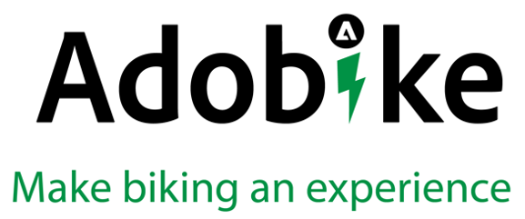

# Referentiemateriaal

## Schuifdeksel

Deze documentatie kan u helpen om met het concept dit bootkamp, evenals een inhoudsleveringsketen vertrouwd te worden. Er zijn echter altijd dingen die we wilden laten zien, maar die we niet meer konden opnemen. U kunt deze informatie terug in het [ volgende diakeck ](https://adobe.sharepoint.com/:p:/r/sites/SWEnterpriseMarketingTeam/Shared%20Documents/Bootcamps/Content%20Supply%20Chain%20Bootcamp/Experience%20Makers%20Content%20Supply%20Chain%20Slide%20Deck.pptx?d=w1a3787d39c3a43ab941cfd0069f8383a&amp;csf=1&amp;web=1&amp;e=57aFUU) en onze [ Kunst van de Mogelijke demo ](https://xd.adobe.com/view/45ea642f-69fb-4bbe-bba6-6915a3709a6d-10b9/?fullscreen) vinden.

## Ontmoet AdobeCycle

AdobeEngine is een in Brussel gevestigd bedrijf en heeft al een gevestigde positie op de markt. Ze hebben naast hen een gemeenschap van 50.000 ritten. Zij hebben onlangs een nieuwe revolutionaire e-cycle ontwikkeld, en in dat proces transformeert het bedrijf ook de opstelling van hun marketingteam, en aanverwante processen en technologieën.

Met de introductie van hun nieuwe fiets zien ze uitdagingen met betrekking tot de efficiëntie van het werk. Het is van cruciaal belang dat zij volledig zichtbaar zijn in de gehele levenscyclus van hun werk, van eerste aanvraag tot definitieve levering in één enkele oplossing. Het functioneren op een hoog niveau van orchestratie, moeten zij cross-team samenwerking toelaten.

Voor de nieuwe productlancering, willen zij nieuwe beelden, een nieuwe het landen pagina creëren en willen de touchpoints aanpassen zij met hun klanten hebben. Voor personalisatie op grote schaal hebben ze veel inhoud en variaties nodig, en ze hebben ook inhoud nodig voor hun aanwezigheid op sociale media.

Ook wil Adobe dat het voor klanten gemakkelijk is om de fiets online te bestellen. Zij beseffen dat zij de juiste instrumenten nodig hebben om de lancering te organiseren en de noodzakelijke inhoud op schaal te creëren en te leveren en dat de levering op tijd in gevaar is zonder duidelijke status van afdelingswerklast en budgetten.

## Nuttige koppelingen

### Inhoudstoeleveringsketen

- [ bouwend een Keten van de Levering van de Inhoud die schalen ](https://business.adobe.com/resources/webinars/building-a-content-supply-chain-that-scales.html)

### Adobe Experience Manager

- [ Overzicht van de Automatisering van de Inhoud met de diensten van het Creative Cloud ](https://experienceleague.adobe.com/docs/experience-manager-learn/assets/content-automation/overview.html?lang=en)
- [ Aan de slag met AEM Commerce as a Cloud Service ](https://experienceleague.adobe.com/docs/experience-manager-cloud-service/content/content-and-commerce/storefront/getting-started.html)
- [ Inleiding aan Adobe Experience Manager als Koploze CMS ](https://experienceleague.adobe.com/docs/experience-manager-cloud-service/content/headless/introduction.html?lang=en)

### Adobe Express

- [ Begonnen het worden met de malplaatjes van de Adobe Express ](https://helpx.adobe.com/express/using/work-with-templates.html)

### Adobe Workfront

- [ Documentatie van het Product Adobe Workfront ](https://experienceleague.adobe.com/docs/workfront/using/home.html?lang=en)
- [ Workfront voor AEM Assets ](https://exchange.adobe.com/apps/ec/101385/workfront-for-aem-assets)

[Terug naar alle modules](./overview.md)
