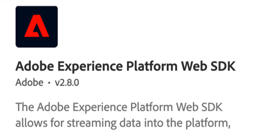

# Tutorials voor gegevensverzameling

Gegevensverzameling is de volgende generatie van websitetags en mobiele SDK-beheermogelijkheden van Adobe. De Inzameling van gegevens geeft klanten een eenvoudige manier om de analytische, marketing, en reclameoplossingen op te stellen en te beheren noodzakelijk om relevante klantenervaringen te drijven. Gebruik deze video&#39;s en zelfstudies om deze kritieke technologie onder de knie te krijgen.

## Personeelsselectie

<table>
<tr>
  <td>
    
    

      <a href="https://experienceleague.adobe.com/docs/platform-learn/implement-web-sdk/overview.html" target="_blank">
    <strong>Implementeer het Experience Cloud met Web SDK</strong>
    </a>
    

    

    <em>Tags gebruiken om Platform Web SDK te implementeren</em>
    

  </td>
  <td>
    
    

      <a href="https://experienceleague.adobe.com/docs/platform-learn/implement-mobile-sdk/overview.html" target="_blank">
    <strong>Het Experience Cloud implementeren in mobiele apps</strong>
    </a>
    

    

    <em>Tags gebruiken om Platform Mobile SDK te implementeren</em>
    

  </td>
  <td>
    
    

      <a href="https://experienceleague.adobe.com/docs/platform-learn/migrate-target-to-websdk/introduction.html" target="_blank">
    <strong>Adobe Target migreren naar Web SDK</strong>
    </a>
    

    

    <em>Migreren van at.js naar Web SDK</em>
    

  </td>
</tr>
</table>

*Apple, the Apple logo, iPad, iPhone, iPod, and iPod touch are trademarks of Apple Inc., registered in the U.S. and other countries. Swift en het Swift-logo zijn handelsmerken van Apple Inc.*
