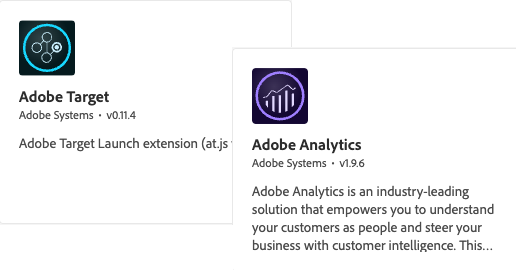

# Tutorials voor gegevensverzameling

Gegevensverzameling is de volgende generatie van websitetags en mobiele SDK-beheermogelijkheden van Adobe. De Inzameling van gegevens geeft klanten een eenvoudige manier om de analytische, marketing, en reclameoplossingen op te stellen en te beheren noodzakelijk om relevante klantenervaringen te drijven. Gebruik deze video&#39;s en zelfstudies om deze kritieke technologie onder de knie te krijgen.

## Migratiehulplijnen

<table>
<tr>
  <td>
    
    

      <a href="https://experienceleague.adobe.com/docs/platform-learn/migrate-target-to-websdk/introduction.html" target="_blank">
    <strong> Migreer Adobe Target aan Web SDK </strong>
    </a>
    

    

    <em> vervangt bij.js met Web SDK </em>
    

  </td>
  <td>
    
    

      <a href="https://experienceleague.adobe.com/en/docs/platform-learn/migrate-analytics-to-websdk/migration-to-websdk-overview" target="_blank">
    <strong> Migreer Adobe Analytics aan Web SDK in markeringen </strong>
    </a>
    

    

    <em> vervangt AppMeasurement.js met Web SDK met markeringen </em>
    

  </td>
  <td>
      
    </a>
    

      <strong> Migreer Adobe Audience Manager aan Web SDK </strong>
    

    

    <em> vervang <a href="https://experienceleague.adobe.com/nl/docs/audience-manager/user-guide/migrate-to-web-sdk/dil-extension-to-web-sdk" target="_blank"> dil.js </a> of <a href="https://experienceleague.adobe.com/nl/docs/audience-manager/user-guide/migrate-to-web-sdk/appmeasurement-to-web-sdk" target="_blank"> updateserverkant door:sturen </a> </em>
    

  </td>
</tr>
</table>

## Implementatiehulplijnen

<table>
<tr>
  <td>
    
    

      <a href="https://experienceleague.adobe.com/docs/platform-learn/implement-web-sdk/overview.html" target="_blank">
    <strong> voer het Experience Cloud met Web SDK </strong> uit
    </a>
    

    

    <em> de markeringen van het Gebruik om het Web SDK van het Platform uit te voeren </em>
    

  </td>
  <td>
    
    

      <a href="https://experienceleague.adobe.com/docs/platform-learn/implement-mobile-sdk/overview.html" target="_blank">
    <strong> voer het Experience Cloud in mobiele apps </strong> uit
    </a>
    

    

    <em> de markeringen van het Gebruik om Platform Mobiele SDK uit te voeren </em>
    

  </td>
  <td>
    
    

      <a href="https://experienceleague.adobe.com/docs/platform-learn/migrate-target-to-websdk/introduction.html" target="_blank">
    <strong> voer erfenisbibliotheken met markeringen </strong> uit
    </a>
    

    

    <em> de markeringen van het Gebruik om erfenisAnalytics, Doel, en de bibliotheken van de Audience Manager uit te voeren </em>
    

  </td>
</tr>
</table>

*Apple, het embleem van Apple, iPad, iPhone, iPod, en iPod aanraking zijn handelsmerken van Apple Inc., die in de V.S. en andere landen worden geregistreerd. Swift en het Swift embleem zijn handelsmerken van Apple Inc.*
