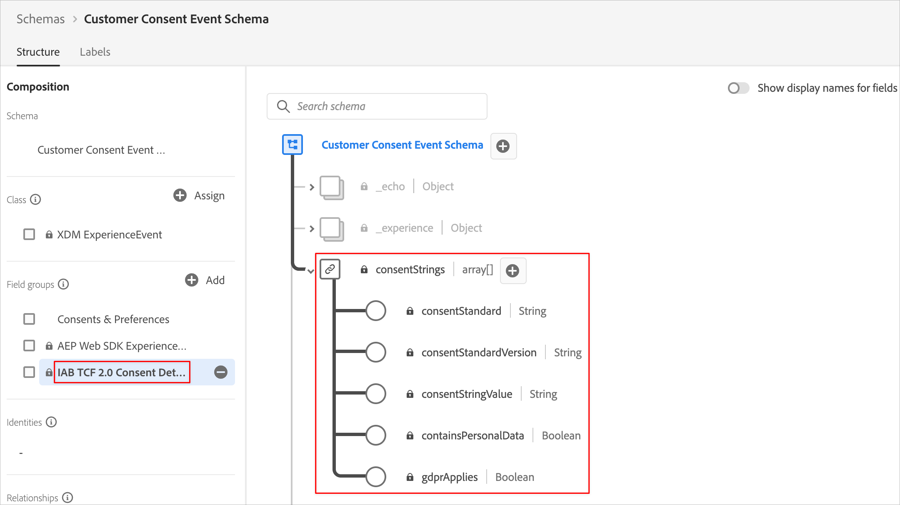
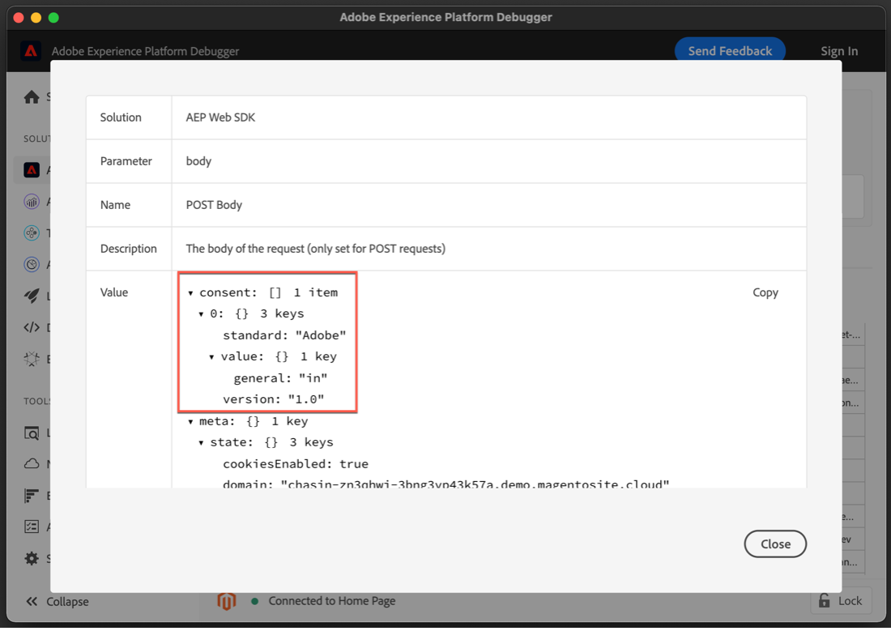

# Implementeren van toestemming met een toestemmingsbeheerplatform (CMP) die de uitbreiding van het Web SDK van het Platform gebruikt

Veel wettelijke privacyverordeningen hebben vereisten ingevoerd voor actieve en specifieke toestemming op het gebied van gegevensverzameling, personalisatie en andere gevallen van marketinggebruik. Om aan deze vereisten te voldoen, staat Adobe Experience Platform u toe om toestemmingsinformatie in individuele klantenprofielen te vangen en die voorkeur te gebruiken als bepalende factor in hoe de gegevens van elke klant in stroomafwaartse workflows van het Platform worden gebruikt.

>[!NOTE]
>
>Adobe Experience Platform Launch wordt in Adobe Experience Platform geïntegreerd als een reeks technologieën voor gegevensverzameling. Verschillende terminologiewijzigingen zijn geïmplementeerd in de interface die u tijdens het gebruik van deze inhoud moet onthouden:
>
> * Platform launch (de Kant van de Cliënt) is nu **[[!DNL tags]](https://experienceleague.adobe.com/docs/experience-platform/tags/home.html?lang=nl)**
> * De Server zijde van de platform launch is nu **[[!DNL event forwarding]](https://experienceleague.adobe.com/docs/experience-platform/tags/event-forwarding/overview.html)**
> * De configuraties van Edge zijn nu **[[!DNL datastreams]](https://experienceleague.adobe.com/docs/experience-platform/edge/fundamentals/datastreams.html)**

Deze zelfstudie laat zien hoe u toestemmingsgegevens die zijn verkregen van een CMP (Consent Management Platform) implementeert en activeert met de extensie Platform Web SDK in Gegevensverzameling. We doen dit met behulp van zowel de Adobe standaarden als de IAB TCF 2.0 toestemmingsstandaard, met OneTrust of SourcePoint als voorbeeld-CMP&#39;s.

Deze zelfstudie gebruikt de uitbreiding van SDK van het Web van het Platform om toestemmingsgegevens naar Platform te verzenden. Voor een overzicht van SDK van het Web, zie [ deze pagina ](https://experienceleague.adobe.com/docs/experience-platform/edge/home.html).

## Vereisten

De eerste vereisten voor het gebruiken van het Web SDK worden vermeld [ hier ](https://experienceleague.adobe.com/docs/experience-platform/edge/fundamentals/prerequisite.html#fundamentals).

Op die pagina, is er een vereiste voor een &quot;Dataset van de Gebeurtenis&quot;en, enkel zoals het klinkt, is dit een dataset om uw gegevens van de ervaringsgebeurtenis te houden. Om toestemmingsinformatie met gebeurtenissen te verzenden, moet de [&#128279;](https://experienceleague.adobe.com/docs/experience-platform/landing/governance-privacy-security/consent/iab/dataset.html) gebiedsgroep van de Details van de Toestemming 0&rbrace; IAB TCF 2.0 worden toegevoegd aan uw schema van de Gebeurtenis van de Ervaring:


Voor de toestemmingsnorm van het Platform v2.0, zullen wij ook toegang tot Adobe Experience Platform nodig hebben om een XDM Individueel schema en dataset van het Profiel tot stand te brengen. Voor een leerprogramma op schemaverwezenlijking, zie [ een schema creëren gebruikend de Redacteur van het Schema ](https://experienceleague.adobe.com/docs/experience-platform/xdm/tutorials/create-schema-ui.html#tutorials) en voor de vereiste de gebiedsgroep van de Details van de Toestemming en van de Voorkeur zie [ een dataset vormen om toestemmings en voorkeursgegevens ](https://experienceleague.adobe.com/docs/experience-platform/landing/governance-privacy-security/consent/adobe/dataset.html) te vangen.

Dit leerprogramma veronderstelt u toegang tot de Inzameling van Gegevens hebt en een cliënt-kant bezit van Markeringen met de geïnstalleerde uitbreiding van SDK van het Web en een werkende bibliotheek gecreeerd en voor ontwikkeling gebouwd. Deze onderwerpen worden in de volgende documenten gedetailleerd en geïllustreerd:

* [ creeer of vorm een bezit ](https://experienceleague.adobe.com/docs/experience-platform/tags/admin/companies-and-properties.html?lang=en#create-or-configure-a-property)
* [ Overzicht van bibliotheken ](https://experienceleague.adobe.com/docs/experience-platform/tags/publish/libraries.html)
* [ het Publiceren overzicht ](https://experienceleague.adobe.com/docs/experience-platform/tags/publish/overview.html)

Wij zullen ook de [&#128279;](https://chrome.google.com/webstore/detail/adobe-experience-platform/bfnnokhpnncpkdmbokanobigaccjkpob) uitbreiding van Chrome gebruiken Debugger van het 0&rbrace; Platform &lbrace;om onze implementatie te inspecteren en te bevestigen.

Als u het TCF-voorbeeld voor IAB wilt implementeren met een CMP op uw eigen site, hebt u toegang tot een CMP nodig, zoals OneTrust of SourcePoint, om de gegevens te genereren die ze aanleveren, of u kunt hier eenvoudig volgen en de onderstaande resultaten bekijken.

## De SDK van het Web gebruiken met de Standaard van de Adobe van de Toestemming (v1.0 of v2.0)

>[!NOTE]
>
>De 1.0-standaard wordt geleidelijk vervangen door v2.0. Met de 2.0-standaard kunt u aanvullende gegevens over toestemming toevoegen die u kunt gebruiken om voorkeuren voor toestemming handmatig af te dwingen. De schermafbeeldingen onder de uitbreiding van SDK van het Web van het Platform zijn van versie [ 2.4.0 ](https://experienceleague.adobe.com/docs/experience-platform/edge/release-notes.html#version-2.4.0) van de uitbreiding die met of v1.0 of v2.0 van de Standaard van de Adobe van de Toestemming compatibel is.

Voor meer informatie over deze normen, zie [ Ondersteunende voorkeur van de klantentoestemming ](https://experienceleague.adobe.com/docs/experience-platform/edge/consent/supporting-consent.html).

### Stap 1: Vorm Toestemming in de uitbreiding van SDK van het Web

Nadat wij de uitbreiding van SDK van het Web van het Platform in een bezit van Markeringen hebben geïnstalleerd, kunnen wij de opties vormen om toestemmingsgegevens op het scherm van de uitbreidingsconfiguratie te richten:


In de sectie &#39;Privacy&#39; wordt het machtigingsniveau voor de SDK ingesteld als de gebruiker nog geen voorkeuren voor toestemming heeft opgegeven. Hiermee stelt u de standaardstatus in voor het verzamelen van toestemmings- en gebeurtenisgegevens in de SDK. Met de gekozen instelling wordt de vraag beantwoord wat de SDK moet doen als de gebruiker nog geen expliciete voorkeuren voor toestemming heeft opgegeven.

* In - Verzamel gebeurtenissen die voorkomen alvorens de gebruiker toestemmingsvoorkeur verstrekt.
* Uit - Gebeurtenissen voor neerzetten die plaatsvinden voordat de gebruiker voorkeuren voor toestemming geeft.
* In behandeling - de gebeurtenissen van de Rij die voorkomen alvorens de gebruiker toestemmingsvoorkeur verstrekt.
* Verstrekt door gegevenselement

Als de standaardinstelling voor toestemming &quot;In&quot; is, wordt de SDK hiermee verteld dat deze niet moet wachten op expliciete toestemming en dat deze de gebeurtenissen moet verzamelen die plaatsvinden voordat de gebruiker voorkeuren voor toestemming geeft. Deze voorkeuren worden meestal verwerkt en opgeslagen in een CMP.

Als de standaardinstelling voor toestemming &quot;Out&quot; is, wordt de SDK hiermee verteld dat deze geen gebeurtenissen mag verzamelen die plaatsvinden voordat de gebruikersvoorkeuren worden ingesteld. Bezoekersactiviteiten die plaatsvinden voordat de voorkeur voor toestemming wordt ingesteld, worden niet opgenomen in gegevens die door de SDK worden verzonden nadat toestemming is ingesteld. Als u bijvoorbeeld door een webpagina bladert en deze weergeeft voordat u de machtigingsbanner selecteert en deze instelling &quot;Uit&quot; gebruikt, worden die schuifactiviteit en weergavetijd niet verzonden als de gebruiker later expliciet toestemming geeft voor gegevensverzameling.

Als de standaardinstelling voor toestemming &quot;In behandeling&quot; is, plaatst de SDK alle gebeurtenissen in de wachtrij die plaatsvinden voordat de gebruiker voorkeuren voor toestemming verleent. De gebeurtenissen kunnen dus worden verzonden nadat de voorkeuren voor toestemming zijn ingesteld en nadat de SDK voor het eerst tijdens een bezoek is geconfigureerd.

Als u deze instelling &quot;In behandeling&quot; gebruikt en probeert opdrachten uit te voeren waarvoor gebruikersvoorkeuren (bijvoorbeeld de opdracht voor gebeurtenissen) zijn vereist, wordt de opdracht in de SDK in de wachtrij geplaatst. Deze opdrachten worden pas verwerkt nadat u de aanmeldingsvoorkeuren van de gebruiker aan de SDK hebt doorgegeven.

Zodra een CMP de voorkeur van de gebruiker verzamelt, dan kunnen wij die voorkeur aan SDK meedelen. In een recentere sectie hieronder, zullen wij zien hoe te om die opt-in gegevens te verkrijgen en het met de uitbreiding van SDK van het Web te gebruiken.

Met &quot;Opgegeven door gegevenselement&quot; hebben we toegang tot een gegevenselement dat voorkeurgegevens voor toestemming bevat die zijn vastgelegd door aangepaste code of een CMP op uw site of in uw gegevenslaag. Een gegevenselement dat voor dit doel wordt gebruikt, moet worden omgezet in &quot;in&quot;, &quot;uit&quot; of &quot;in behandeling&quot;.

Opmerking: deze configuratie-instelling voor de SDK blijft niet behouden voor gebruikersprofielen. Het is specifiek voor het instellen van het gedrag van de SDK voordat de bezoeker expliciete voorkeuren voor toestemming heeft opgegeven.

Meer leren over het vormen van de uitbreiding van SDK van het Web ziet de [ de uitbreidingsoverzicht van SDK van het Web van het Platform ](https://experienceleague.adobe.com/docs/experience-platform/edge/extension/web-sdk-extension-configuration.html?lang=en#configure-the-extension) en [ Ondersteunende voorkeur van de klantentoestemming ](https://experienceleague.adobe.com/docs/experience-platform/edge/consent/supporting-consent.html).

Voor dit voorbeeld, kiezen de optie voor &quot;In afwachting van&quot;en selecteren **sparen** om onze configuratiemontages te bewaren.

### Stap 2: Voorkeuren voor het verzenden van toestemming

Nu wij het standaardgedrag van SDK hebben geplaatst, kunnen wij markeringen gebruiken om de expliciete toestemmingsvoorkeur van een bezoeker naar Platform te verzenden. Het verzenden van toestemmingsgegevens die de Adobe 1.0 of 2.0 norm gebruiken wordt gemakkelijk uitgevoerd gebruikend de `setConsent` actie van SDK van het Web in uw markeringsregels.

#### Instellen van toestemming met de standaard 1.0 voor platformgoedkeuring

Laten we een regel maken om dit aan te tonen. In uw de markeringsbezit van het Platform, uitgezochte Regels, dan op blauw voegt Regels toe. Geef de regel &quot;setAdobeConsent&quot; een naam en selecteer deze om een gebeurtenis toe te voegen. Kies bij Type gebeurtenis de optie &quot;Venster geladen&quot; waarmee deze regel wordt geactiveerd wanneer een pagina op onze website wordt geladen. Selecteer vervolgens onder &quot;Acties&quot; de optie &quot;Toevoegen&quot; om het scherm voor actieconfiguratie te openen. Dit is waar we de toestemmingsgegevens zullen plaatsen. Selecteer het vervolgkeuzemenu &quot;Extensie&quot; en selecteer &quot;Platform Web SDK&quot;, selecteer vervolgens &quot;Handelingstype&quot; en selecteer &quot;Toestemming instellen&quot;.

Kies onder &quot;Informatie over toestemming&quot; de optie &quot;Een formulier invullen&quot;. In deze regelactie, zullen wij SDK van het Web gebruiken om toestemming voor de Adobe 1.0 toestemmingsnorm te plaatsen door de getoonde vorm in te vullen:


We kunnen ervoor kiezen om &quot;In&quot;, &quot;Uit&quot; of &quot;Verstrekt door gegevenselement&quot; door te geven met deze actie Toestemming instellen. Een gegevenselement hier moet worden omgezet in &quot;in&quot; of &quot;uit&quot;.

In dit voorbeeld, zullen wij &quot;binnen&quot;selecteren om erop te wijzen de bezoeker heeft ingestemd met het toestaan van het Web SDK om gegevens naar Platform te verzenden. Selecteer de blauwe knop Wijzigingen behouden om deze handeling op te slaan en vervolgens &quot;Opslaan&quot; om deze regel op te slaan.

Opmerking: als een websitebezoeker de optie heeft uitgeschakeld, kunt u met de SDK niet meer instellen op welke gebruikers toestemming wordt gegeven.

Uw markeringsregels kunnen door een verscheidenheid van ingebouwde of douane [ gebeurtenissen ](https://experienceleague.adobe.com/docs/experience-platform/tags/extensions/adobe/core/overview.html) worden teweeggebracht die kunnen worden gebruikt om deze toestemmingsgegevens op de aangewezen tijd tijdens een bezoekerszitting over te gaan. In het bovenstaande voorbeeld hebben we de geladen gebeurtenis van het venster gebruikt om de regel te activeren. In een recentere sectie, zullen wij een gebeurtenis van de toestemmingsvoorkeur van CMP gebruiken om een Vastgestelde Actie van de Toestemming teweeg te brengen. U kunt een actie van de Stem van de Reeks in een regel gebruiken die door om het even welke gebeurtenis wordt teweeggebracht u verkiest die opt-in voorkeur het plaatsen wijst.

#### Instellen van toestemming met de standaard 2.0 voor platformgoedkeuring

Versie 2.0 van de de toestemmingsnorm van het Platform werkt met [ XDM ](https://experienceleague.adobe.com/docs/platform-learn/tutorials/schemas/schemas-and-experience-data-model.html) gegevens. U moet ook de veldgroep Toestemming en Details voorkeuren toevoegen aan uw profielschema in Platform. Zie [ de verwerking van de Toestemming in Platform ](https://experienceleague.adobe.com/docs/experience-platform/landing/governance-privacy-security/consent/adobe/overview.html) voor meer informatie over de standaardversie 2.0 van de Adobe en deze gebiedsgroep.

Wij zullen een element van de douanegegevens van de codegegevens tot stand brengen om gegevens tot verzamelen en meta-gegevenseigenschappen van het toestemmingsvoorwerp over te gaan dat in het hieronder schema wordt getoond:


Deze Consents en de het gebiedsgroep van Details van de Voorkeur bevat gebieden voor het [ toestemmingen &amp; het gegevenstype van Voorkeur XDM ](https://experienceleague.adobe.com/docs/experience-platform/xdm/data-types/consents.html#prerequisites) dat de gegevens van de toestemmingsvoorkeur zal bevatten wij naar Platform met de uitbreiding van SDK van het Web van het Platform in onze regelactie verzenden. Momenteel zijn de enige vereiste eigenschappen voor het implementeren van de Platform Consent Standard 2.0 de verzamelwaarde (val) en de tijdwaarde van de metagegevens, die hierboven in rood zijn gemarkeerd.

Laten we een gegevenselement voor deze gegevens maken. Selecteer Gegevenselementen en de blauwe knop Gegevenselement toevoegen. Laten we dit &#39;xdm-toestemming 2.0&#39; noemen en met de extensie Core selecteren we een type aangepaste code. U kunt de volgende gegevens invoeren of kopiëren en in het venster van de douaneredacteur van de code kleven:

```js
var dateString = new Date().toISOString();

return {
  collect: {
    val: "y"
  },
  metadata: {
    time: dateString
  }
}
```

In het tijdveld moet worden opgegeven wanneer de gebruiker zijn voorkeuren voor toestemming voor het laatst heeft bijgewerkt. We maken hier een tijdstempel als voorbeeld met een standaardmethode voor het object Date van JavaScript. Selecteer Opslaan om de aangepaste code op te slaan en selecteer Opnieuw opslaan om het gegevenselement op te slaan.

Vervolgens selecteert u Regels en vervolgens blauw voegt u de knop Regel toe en typt u de naam &quot;setConsent onLoad - Consent 2.0&quot;. Kies de gebeurtenis Window Loaded als de regeltrigger en selecteer vervolgens Toevoegen onder Handelingen. Kies de Uitbreiding van SDK van het Web van het Platform, en voor het Type van Actie, kies Vastgestelde Toestemming. De standaard moet Adobe zijn en Versie moet 2.0 zijn. Voor Waarde, zullen wij het gegevenselement gebruiken wij enkel creeerden dat de inzameling en tijdwaarden bevat die wij aan Platform moeten verzenden:


Om deze voorbeeldactie te herzien, roepen wij Vastgestelde Toestemming van de uitbreiding van SDK van het Web van het Platform en het overgaan in de Norm en de Versie van de vorm, terwijl het overgaan van de waarden voor inzameling en tijd van het gegevenselement dat wij vroeger creeerden.

Selecteer de blauwe knop Opslaan en nogmaals om de regel op te slaan.

We hebben nu twee regels, één voor elk van de normen voor platforminstemming. In de praktijk zult u waarschijnlijk één standaard kiezen op de verschillende sites. Daarna, zullen wij tot een voorbeeld leiden gebruikend IAB TCF 2.0 toestemmingsnorm.

## Het gebruiken van het Web SDK met IAB TCF 2.0 Standaard van de Toestemming

U kunt meer over versie 2.0 van het IAB Kader van de Transparantie en van de Toestemming bij de [ IAB Europa website ](https://iabeurope.eu/transparency-consent-framework/) leren.

Om de gegevens van de toestemmingsvoorkeur gebruikend deze norm te plaatsen, moeten wij de IAB TCF 2.0 het schemagebiedgroep van de Details van de Toestemming aan ons schema van de Gebeurtenis van de Ervaring in Platform toevoegen:



Deze veldgroep bevat de gebieden van de toestemmingsvoorkeur die door de norm IAB TCF 2.0 worden vereist. Voor meer op schema&#39;s en gebiedsgroepen, zie het [ Overzicht van het Systeem XDM ](https://experienceleague.adobe.com/docs/experience-platform/xdm/home.html?lang=nl).

### Stap 1: Een gegevenselement voor toestemming maken

Om gegevens van toestemmingsgebeurtenissen van markeringen te verzenden gebruikend IAB TCF 2.0 toestemmingsnorm, eerst opstelling een xdm gegevenselement met de vereiste toestemmingsgebieden:


Selecteer in de client-side eigenschap voor tags de optie Gegevenselementen en de blauwe knop Gegevenselement toevoegen. We geven dit gegevenselement de naam &quot;xdm-permissionStrings&quot; voor dit voorbeeld. Deze xdm- gebieden zullen de gegevens van de gebruikerstoestemming bevatten die voor de norm IAB TCF 2.0 worden vereist.

Kies in het vervolgkeuzemenu Extensie de optie &quot;Platform Web SDK&quot; en kies bij Type gegevenselement de optie &quot;XDM-object&quot;. Het xdm-mapper moet worden weergegeven, zodat u het item &quot;permissionStrings&quot; kunt selecteren en uitbreiden, zoals in de bovenstaande schermafbeelding wordt weergegeven.

We stellen elk van de toestemmingStrings als volgt in:

* **`consentStandard`**: `IAB TCF`
* **`consentStandardVersion`**: `2.0`
* **`consentStringValue`**: `%IAB TCF Consent String%`
* **`containsPersonalData`**: `False` (gekozen uit de knop Waarde selecteren)
* **`gdprApplies`**: `%IAB TCF Consent GDPR%`

De velden `consentStandard` en `consentStandardVersion` zijn allebei gewoon tekenreeksen voor de standaard die we gebruiken, namelijk IAB TCF versie 2.0. `consentStringValue` verwijst naar een gegevenselement met de naam &quot;IAB TCF Consent String&quot;. De procenttekens rondom de tekst geven de naam van een data-element aan. Daar zullen we zo meteen naar kijken. Het veld `containsPersonalData` geeft aan of de toestemmingstekenreeks IAB TCF 2.0 persoonlijke gegevens bevat met de waarde &quot;Waar&quot; of &quot;Onwaar&quot;. Het veld `gdprApplies` geeft ‘true’ aan voor GDPR, ‘false’ voor GDPR is niet van toepassing of ‘undefined’ voor onbekend of GDPR van toepassing is. Op dit moment behandelt de Web SDK &quot;undefined&quot; als &quot;true&quot;, zodat toestemmingsgegevens die met &quot;gdprApplies: undefined&quot; worden verzonden, worden behandeld alsof de bezoeker zich in een gebied bevindt waar GDPR wel van toepassing is.

Zie de [ toestemmingsdocumentatie ](https://experienceleague.adobe.com/docs/experience-platform/edge/consent/iab-tcf/with-launch.html#getting-started) voor meer op deze eigenschappen en op IAB TCF 2.0 in markeringen.

### Stap 2: Creeer een Regel om Toestemming met de Standaard IAB TCF 2.0 te plaatsen

Daarna, creëren wij een regel om toestemming met SDK van het Web te plaatsen wanneer de toestemmingsgegevens voor deze norm door een websitebezoeker worden geplaatst of worden veranderd. In deze regel, zullen wij ook zien hoe te om die signalen van de toestemmingsverandering van een CMP als [ OneTrust ](https://www.onetrust.com/products/cookie-consent/) of [ Bronpunt ](https://www.sourcepoint.com/cmp/) te vangen.

#### Een regelgebeurtenis toevoegen

Selecteer de sectie Regels in de tageigenschap Platform en klik vervolgens op de blauwe knop Regel toevoegen. Geef de regel setConsent - IAB een naam en selecteer Add under Events. Noem dit gebeurtenistype cfapi addEventListener en selecteer Open Redacteur om de redacteur van de douanecode te openen.

Kopieer en plak de volgende code in het editorvenster:

```js
// Wait for window.__tcfapi to be defined, then trigger when the customer has completed their consent and preferences.
function addEventListener() {
  if (window.__tcfapi) {
    window.__tcfapi("addEventListener", 2, function (tcData, success) {
      if (success && (tcData.eventStatus === "useractioncomplete" || tcData.eventStatus === "tcloaded")) {
        // save the tcData.tcString properties in data elements
        _satellite.setVar("IAB TCF Consent String", tcData.tcString);
        _satellite.setVar("IAB TCF Consent GDPR", tcData.gdprApplies);
        trigger();
      }
    });
  } else {
    // window.__tcfapi wasn't defined. Check again in 100 milliseconds
    setTimeout(addEventListener, 100);
  }
}
addEventListener();
```

Met deze code wordt eenvoudig een functie met de naam `addEventListener` gemaakt en uitgevoerd. De functie controleert of het `window.__tcfapi` -object bestaat en of dit wel het geval is, voegt een gebeurtenislistener toe volgens de specificaties van de API. U kunt meer over die specs in de [ IAB repo ](https://github.com/InteractiveAdvertisingBureau/GDPR-Transparency-and-Consent-Framework) op GitHub lezen. Als deze gebeurtenislistener is toegevoegd en de websitebezoeker zijn toestemming en voorkeuren heeft voltooid, stelt de code aangepaste variabelen voor de `tcData.tcString` -gebeurtenis en de indicator voor GDPR-gebieden in. Opnieuw, om meer over IAB TCF te leren, zie de IAB [ website ](https://iabeurope.eu/transparency-consent-framework/) en [ reactie GitHub ](https://github.com/InteractiveAdvertisingBureau/GDPR-Transparency-and-Consent-Framework) voor technische details. Na het plaatsen van die waarden, voert de code de trekkerfunctie uit die deze regel teweegbrengt om in werking te stellen.

Als het `window.__tcfapi` -object niet bestond toen deze functie voor het eerst werd uitgevoerd, controleert de functie er elke 100 milliseconden opnieuw op, zodat de gebeurtenislistener kan worden toegevoegd. De laatste coderegel voert eenvoudig de `addEventListener` functie uit die in de lijnen van code hierboven wordt bepaald.

Samenvattend, creeerden wij een functie om de status van toestemming te controleren dat een websitebezoeker gebruikend een CMP (of douane) toestemmingsbanner plaatst. Wanneer die toestemmingsvoorkeur wordt geplaatst, leidt deze code tot twee douanevariabelen (de elementen van de douanecodegegevens) die wij in onze regelactie kunnen gebruiken. Nadat u de bovenstaande code in het venster van de aangepaste code-editor van de gebeurtenis hebt geplakt, selecteert u de blauwe knop Opslaan om de regelgebeurtenis op te slaan.

Stel nu de regelactie Goedkeuring instellen in om deze waarden te gebruiken en naar Platform te verzenden.

#### Een regelactie toevoegen

Selecteer Toevoegen in de sectie Handelingen. Kies in het vervolgkeuzemenu onder Extensie de optie Platform Web SDK. Kies Toestemming instellen onder Type handeling. Laten we deze handeling setConsent een naam geven.

Kies Formulieren invullen in de actieconfiguratie onder Informatie over toestemming. Kies IAB TCF bij Standaard en Versie 2.0. Voor de Waarde, zullen wij de douanevariabele van onze gebeurtenis gebruiken en `%IAB TCF Consent String%` ingaan die uit [ tcData ](https://github.com/InteractiveAdvertisingBureau/GDPR-Transparency-and-Consent-Framework/blob/master/TCFv2/IAB%20Tech%20Lab%20-%20CMP%20API%20v2.md#tcdata) komt wij hierboven in onze functie van de regelgebeurtenis gevangen.

Onder GDPR is van toepassing, gebruiken we de andere aangepaste variabele van onze gebeurtenis en voeren we `%IAB TCF Consent GDPR%` in, die ook afkomstig is van de `tcData` die we hierboven in onze aangepaste functie voor regelgebeurtenissen hebben vastgelegd. Als u weet dat GDPR zeker van toepassing zal of niet zal zijn voor bezoekers aan deze website, kunt u Ja of Nee selecteren, al naar gelang van toepassing, in plaats van de keuze voor de aangepaste variabele (gegevenselement) te gebruiken. U kunt ook voorwaardelijke logica in een gegevenselement gebruiken om te controleren of GDPR wordt toegepast en de juiste waarde retourneren.

Selecteer onder GDPR Bevat persoonsgegevens de optie om aan te geven of de gegevens voor deze gebruiker persoonlijke gegevens bevatten. Een gegevenselement hier moet worden omgezet in waar of onwaar.


Selecteer de blauwe knop Opslaan om de handeling op te slaan en de blauwe knop Opslaan (of Opslaan in bibliotheek) om de regel op te slaan. Op dit punt hebt u met succes het gegevenselement en de regel in markeringen uitgevoerd om toestemming te plaatsen gebruikend de uitbreiding van SDK van het Web met IAB TCF 2.0 toestemmingsnorm.

### Stap 3: Opslaan in bibliotheek en bouwen

Als u de [ werkende bibliotheek ](https://experienceleague.adobe.com/docs/platform-learn/implement-in-websites/configure-tags/add-data-elements-rules.html#use-the-working-library-feature) voorwaarde gebruikt, hebt u reeds deze veranderingen opgeslagen en uw ontwikkelingsbibliotheek gebouwd:


### Stap 4: Inspect en validatie van gegevensverzameling

Op onze plaats, verfrissen wij de pagina en bevestigen de bibliotheek bouwt in de [ Debugger ](https://chromewebstore.google.com/detail/adobe-experience-platform/bfnnokhpnncpkdmbokanobigaccjkpob) uitbreiding van Chrome, in de sectie van het markeringsmenu:


Wij kunnen de setConsent vraag naar Adobe 1.0 of 2.0 normen in de sectie van SDK van het Web van het Debugger Platform ook inspecteren, door op de lijn van het Lichaam van de POST in het netwerkverzoek te selecteren waar u `{"consent":[{"value":{"general":"in"},"version…` ziet:



Om de setConsent vraag en onze regel voor de norm IAB TCF 2.0 te bevestigen, zullen wij de OneTrust toestemmingsbanner op onze testplaats gebruiken om onze toestemmingsvoorkeur te plaatsen en tcData tot stand te brengen die vroeger wordt beschreven:


Na het selecteren van &quot;I Accepteert&quot;, kunnen wij de vraag setConsent voor de norm IAB TCF 2.0 in de sectie van SDK van het Web van het Debugger Platform inspecteren, door op de lijn van het Lichaam van de POST in het netwerkverzoek te selecteren waar u `{"consent":[{"value":"someAlphaNumericCharacters…` ziet.


Hier zien we de gegevens die we eerder hebben ingesteld in onze gegevenselementen en labelregel. De eigenschap value bevat de gecodeerde tcString-gegevens die we eerder hebben gezien.

OneTrust, SourcePoint en andere CMP&#39;s die de IAB TCF 2.0-standaard implementeren, produceren allemaal vergelijkbare gegevens op onze pagina&#39;s. Wij kunnen die gegevens vangen en het gebruiken met de uitbreiding van SDK van het Web in markeringen gebruikend de gebeurtenis van de douanecode in de regel gebruiken wij hierboven creeerden. De aangepaste code is hetzelfde, ongeacht het CMP dat wordt gebruikt om de IAB TCF 2.0-gegevens te genereren. De aangepaste code kan ook worden gebruikt met een van de standaarden voor platformgoedkeuring (1.0 of 2.0).

## Goedkeuringsgegevens verzenden met ervaringsgebeurtenissen

U hebt misschien gemerkt dat we in geen van onze regels verwezen hebben naar het gegevenselement &quot;xdm-permissionStrings&quot; dat we eerder in een gegevenselementveld hebben gemaakt. Dit gegevenselement is bestemd voor gebruik wanneer u toestemmingsgegevens met een Gebeurtenis van de Ervaring moet verzenden.


Aangezien dit gegevenselement alle gebieden bevat die voor de norm IAB TCF 2.0 worden vereist, kunt u eenvoudig naar het gegevenselement verwijzen wanneer het verzenden van deze xdm gegevens met uw Gebeurtenissen van de Ervaring:


## Conclusie

Nu wij de gegevens hebben geïnspecteerd en bevestigd, zou u moeten zien hoe te om toestemmingsgegevens uit CMP uit te voeren en te activeren gebruikend de uitbreiding van SDK van het Web van het Platform van het Platform.
