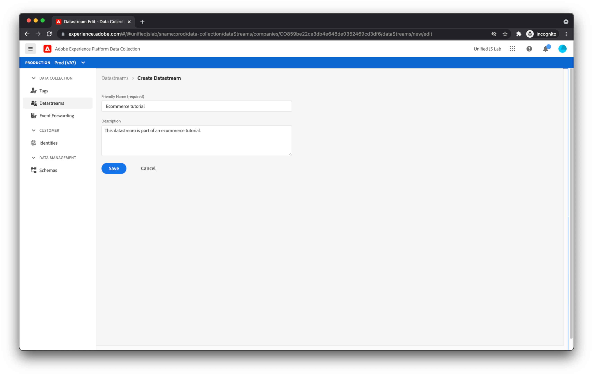

# Een gegevensstroom maken

De gegevens die u van uw website verzendt, bereiken een set Adobe-servers die [Adobe Experience Platform Edge](https://business.adobe.com/products/experience-platform/experience-platform-edge-network.html). Dit netwerk kan uw gegevens naar verzenden [Adobe Experience Platform-gegevensset die u eerder hebt gemaakt](create-a-schema.md) en andere producten in Adobe Experience Cloud. Deze Adobe-producten reageren mogelijk ook met gegevens op uw webpagina. Edge Network kan bijvoorbeeld personalisatie-inhoud uit Adobe Target retourneren.

Om te vormen welke de producten van de Rand van het Netwerk van de Adobe gegevens aan en van, u een gegevensstroom moet creëren. Wanneer Edge Network gegevens van uw webpagina ontvangt, raadpleegt het de gegevensstroom die u hebt gemaakt, leest het zijn configuratie en stuurt het vervolgens gegevens door naar de juiste Adobe-producten.

Als u een gegevensstroom wilt maken, navigeert u eerst naar de [!UICONTROL DataStreams] weergeven binnen [!UICONTROL Gegevensverzameling]. Klikken [!UICONTROL DataStream maken] in de rechterbovenhoek. Geef een naam op voor de gegevensstroom.

In het volgende scherm kunt u configureren welke Adobe-producten de gegevens moeten ontvangen die u van uw website verzendt. Voor deze zelfstudie schakelt u alleen Adobe Experience Platform in en selecteert u de eerder gemaakte gegevensset (die in de standaardset wordt gebruikt) [!UICONTROL Prod] sandbox) en klik op [!UICONTROL Opslaan].

Uw gegevensstroom is gemaakt.

## DataStream-omgevingen

Bedrijven hebben doorgaans een promotiepad voor updates van websites. Iemand bij het bedrijf (een marketeer of ingenieur, afhankelijk van de veranderingen) test typisch hun veranderingen in een ontwikkelomgeving die slechts die persoon gebruikt. Zodra ze zich vertrouwd voelen met de veranderingen, worden de veranderingen bevorderd tot een het opvoeren milieu waar zij verdere tests ontvangen. Tot slot worden de wijzigingen gepubliceerd naar de productiewebsite die gebruikers zien. Dit promotiepatroon wordt ondersteund door gegevensstromen.

Nadat u hebt geklikt [!UICONTROL Opslaan], had u moeten opmerken dat er automatisch drie gegevensstroomomgevingen voor u zijn gemaakt: [!UICONTROL Ontwikkelingsomgeving], [!UICONTROL Stationele omgeving], en [!UICONTROL Productie-omgeving].

Als u op elke gegevensstroommilieu klikt, zult u merken dat zij allen de zelfde configuratie hebben gekregen u verstrekte. Deze omgevingen kunnen echter afzonderlijk worden aangepast.

Als u vertrouwd bent met Adobe Experience Platform-tags, kunt u zich al vertrouwd voelen met het concept van een ontwikkelings-, staging- en productieomgeving. Omgevingen binnen tags zijn gerelateerd aan omgevingen binnen een gegevensstroom. Als u een tagbibliotheek verplaatst via de publicatieworkflow voor tags, van ontwikkeling tot ophaling tot productie, wordt ook automatisch overgeschakeld van [!UICONTROL Ontwikkelingsomgeving], naar [!UICONTROL Stationele omgeving], naar [!UICONTROL Productie-omgeving]. Dit staat u toe, bijvoorbeeld, om gegevens in één dataset te verzenden terwijl uw veranderingen in ontwikkeling zijn en gegevens naar een verschillende dataset verzenden zodra uw veranderingen in productie zijn. Dit kan uw productiegegevens van om het even welke huisvuilgegevens houden u tijdens het ontwikkelingsproces kunt produceren. Tijdens het configureren van extensies in uw tag-eigenschap bespreken we later de gegevensstroomomgevingen.

De server is nu volledig geconfigureerd voor het ontvangen van gegevens van uw webpagina.
