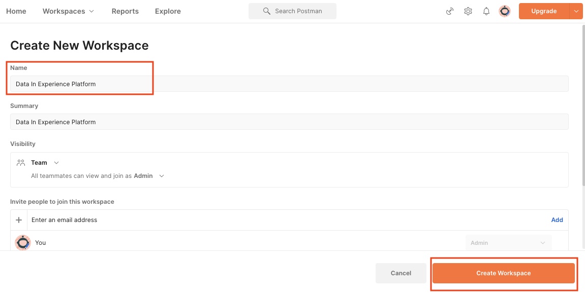

# Voorbeeldgegevens importeren naar Adobe Experience Platform

Leer hoe u een Experience Platform-sandboxomgeving instelt met voorbeeldgegevens. Met behulp van een Postman-verzameling kunt u veldgroepen, schema&#39;s, gegevenssets maken en vervolgens voorbeeldgegevens importeren in Experience Platform.

## Voorbeeld van gebruik van gegevens

Zakelijke gebruikers van Experience Platform moeten vaak een reeks stappen doorlopen die het identificeren van veldgroepen, het creëren van schema&#39;s, het voorbereiden van gegevens, het creëren van datasets, en dan het opnemen van gegevens omvatten alvorens zij de marketing mogelijkheden kunnen onderzoeken die door Experience Platform worden aangeboden. In deze zelfstudie worden enkele stappen geautomatiseerd, zodat u gegevens zo snel mogelijk in een platformsandbox kunt plaatsen.

Deze zelfstudie richt zich op een fictief, handelsmerk genaamd Luma. Zij investeren in Adobe Experience Platform om loyaliteit, CRM, productcatalogus, en off-line aankoopgegevens in klantenprofielen in real time te combineren en deze profielen te activeren om hun marketing aan het volgende niveau te brengen. We hebben voorbeeldgegevens gegenereerd voor Luma en in de rest van deze zelfstudie importeert u deze gegevens in een van uw Experience Platform-sandboxomgevingen.

>[!NOTE]
>
>Het eindresultaat van dit leerprogramma is een zandbak die gelijkaardige gegevens aan [ bevat die met Adobe Experience Platform voor het leerprogramma van de Architecten van Gegevens en van de Ingenieurs van Gegevens ](https://experienceleague.adobe.com/docs/platform-learn/getting-started-for-data-architects-and-data-engineers/overview.html) worden begonnen. Het werd bijgewerkt in April 2023 om de [ uitdagingen van Journey Optimizer ](https://experienceleague.adobe.com/docs/journey-optimizer-learn/challenges/introduction-and-prerequisites.html) te steunen. Het werd bijgewerkt in juni 2023 om de authentificatiemethode op OAuth te schakelen.

## Vereisten

* U hebt toegang tot Experience Platform API&#39;s en u weet hoe u deze kunt verifiëren. Als niet, herzie dit [ leerprogramma ](https://experienceleague.adobe.com/docs/platform-learn/tutorials/platform-api-authentication.html?lang=nl).
* U hebt toegang tot een Experience Platform-ontwikkelingssandbox.
* Je kent je Experience Platform huurder-id. U kunt het verkrijgen door een voor authentiek verklaard [ API verzoek ](https://experienceleague.adobe.com/docs/experience-platform/xdm/api/getting-started.html?lang=en#know-your-tenant_id) te maken
of door deze uit de URL te halen wanneer u zich aanmeldt bij uw Platform-account. In de volgende URL is de huurder bijvoorbeeld &quot;`techmarketingdemos`&quot; `https://experience.adobe.com/#/@techmarketingdemos/sname:prod/platform/home` .

## [!DNL Postman] gebruiken {#postman}

### Omgevingsvariabelen instellen

Alvorens u de stappen volgt, zorg ervoor dat u de [ toepassing van Postman ](https://www.postman.com/downloads/) hebt gedownload. Laten we beginnen!

1. Download het {[ dossier 0} platform-utils-main.zip, dat alle dossiers bevat die voor dit leerprogramma worden vereist.](../assets/data-generator/platform-utils-main.zip)

   >[!NOTE]
   >
   >De gegevens van de gebruiker in het {[ dossier 0} platform-utils-main.zip zijn fictief en moeten slechts voor demonstratiedoeleinden worden gebruikt.](../assets/data-generator/platform-utils-main.zip)

1. Verplaats het `platform-utils-main.zip` -bestand vanuit de downloadmap naar de gewenste locatie op de computer en decomprimeer het bestand.
1. Open in de map `luma-data` alle `json` -bestanden in een teksteditor en vervang alle instanties van `_yourTenantId` door uw eigen huurder-id, voorafgegaan door een onderstrepingsteken.
1. Open `luma-offline-purchases.json` , `luma-inventory-events.json` en `luma-web-events.json` in een teksteditor en werk alle tijdstempels bij, zodat de gebeurtenissen in de laatste maand plaatsvinden (zoek bijvoorbeeld naar `"timestamp":"2022-11` en vervang het jaar en de maand)
1. Noteer de locatie van de uitgevouwen map, zoals u deze later nodig hebt bij het instellen van de omgevingsvariabele `FILE_PATH` [!DNL Postman] :

   >[!NOTE]
   > Om dossierweg op uw Mac te verkrijgen, navigeer aan de `platform-utils-main` omslag, klik op de omslag met de rechtermuisknop aan en selecteer **krijgt Info** optie.
   >
   > 

   >[!NOTE]
   > U verkrijgt dossierweg op uw vensters, klik om de plaats van de gewenste omslag te openen, en dan met de rechtermuisknop aan het recht van de weg in de adresbar te klikken. Kopieer het adres om het bestandspad te verkrijgen.
   > 
   > 

1. Open [!DNL Postman] en creeer een werkruimte van het **2} dropdown menu van de Werkruimten {:**\
   
1. Ga a **Naam** en facultatieve **Samenvatting** voor uw werkruimte in en klik **creeer Workspace**. [!DNL Postman] schakelt over naar de nieuwe werkruimte wanneer u deze maakt.
   
1. Pas nu enkele instellingen aan om de [!DNL Postman] -verzamelingen in deze werkruimte uit te voeren. In de kopbal van [!DNL Postman], klik het tandwielpictogram en selecteer **Montages** om de montages modaal te openen. U kunt ook de sneltoets (CMD/CTRL + ,) gebruiken om het modaal te openen.
1. Werk onder het tabblad `General` de time-out van de aanvraag in ms bij naar `5000 ms` en schakel `allow reading file outside this directory` in
   

   >[!NOTE]
   > Als bestanden vanuit de werkmap worden geladen, worden ze op alle apparaten probleemloos uitgevoerd als dezelfde bestanden op de andere apparaten worden opgeslagen. Als u echter bestanden van buiten de werkmap wilt uitvoeren, moet een instelling worden ingeschakeld om dezelfde intentie aan te geven. Als uw `FILE_PATH` niet hetzelfde is als het pad naar de werkmap van [!DNL Postman] , moet deze optie zijn ingeschakeld.

1. Sluit het **paneel van Montages**.
1. Selecteer de **Milieu&#39;s** en selecteer dan **Invoer**:
    in
1. Importeer het gedownloade JSON-omgevingsbestand, `DataInExperiencePlatform.postman_environment`
1. Selecteer in Postman de omgeving in het vervolgkeuzemenu rechtsboven en klik op het oogpictogram om de omgevingsvariabelen weer te geven:
   

1. Controleer of de volgende omgevingsvariabelen zijn gevuld. Leren hoe te om de waarde van de milieuvariabelen te verkrijgen, controleer [ voor authentiek verklaart aan Experience Platform APIs ](/help/platform/api/platform-api-authentication.md) leerprogramma voor geleidelijke instructies.

   * `CLIENT_SECRET`
   * `API_KEY`—`Client ID` in Adobe Developer Console
   * `SCOPES`
   * `TECHNICAL_ACCOUNT_ID`
   * `IMS`
   * `IMS_ORG`—`Organization ID` in Adobe Developer Console
   * `SANDBOX_NAME`
   * `TENANT_ID` - Zorg dat u met een onderstrepingsteken gaat werken, bijvoorbeeld `_techmarketingdemos`
   * `CONTAINER_ID`
   * `platform_end_point`
   * `FILE_PATH` - gebruik het lokale mappad waar u het `platform-utils-main.zip` -bestand hebt uitgepakt. Zorg ervoor dat de map de mapnaam bevat, bijvoorbeeld `/Users/dwright/Desktop/platform-utils-main`

1. **sparen** het bijgewerkte milieu

### Postman-verzamelingen importeren

Vervolgens moet u de verzamelingen importeren in Postman.

1. Selecteer **Verzamelingen** en kies dan de de invoeroptie:

   

1. Importeer de volgende verzamelingen:

   * `0-Authentication.postman_collection.json`
   * `1-Luma-Loyalty-Data.postman_collection.json`
   * `2-Luma-CRM-Data.postman_collection.json`
   * `3-Luma-Product-Catalog.postman_collection.json`
   * `4-Luma-Offline-Purchase-Events.postman_collection.json`
   * `5-Luma-Product-Inventory-Events.postman_collection.json`
   * `6-Luma-Test-Profiles.postman_collection.json`
   * `7-Luma-Web-Events.postman_collection.json`

   

### Verifiëren

Vervolgens moet u een gebruikerstoken verifiëren en genereren. Houd er rekening mee dat de methoden voor het genereren van tokens die in deze zelfstudie worden gebruikt, alleen geschikt zijn voor niet-productiedoeleinden. Bij Lokaal ondertekenen wordt een JavaScript-bibliotheek geladen van een externe host en bij Extern ondertekenen wordt de persoonlijke sleutel naar een door Adobe beheerde webservice verzonden. Hoewel Adobe deze persoonlijke sleutel niet opslaat, mogen productietoetsen nooit met iemand worden gedeeld.

1. Open de `0-Authentication` -verzameling, selecteer de `OAuth: Request Access Token` -aanvraag en klik op `SEND` om de toegangstoken te verifiëren en te verkrijgen.

   

1. Bekijk de omgevingsvariabelen en merk op dat de `ACCESS_TOKEN` nu is gevuld.

### Gegevens importeren

Nu kunt u de gegevens voorbereiden en importeren in uw platformsandbox. De Postman-verzamelingen die u hebt geïmporteerd, maken het hele heft!

1. Open de `1-Luma-Loyalty-Data` inzameling en klik **Looppas** op het overzichtslusje om een Runner van de Inzameling te beginnen.

   

1. In het venster van de inzamelings runner, zorg ervoor om het milieu van dropdown te selecteren, werk de **Vertraging** aan `4000ms` bij, controleer **sparen reacties** optie, en zorg ervoor dat de looppasorde correct is. Klik de **knoop van de Gegevens van de Loyalty van de Loyalty van de Loyalty van de Loyalty van de Loyalty van de Loyalty van de Loyalty van de Loyalty van de Loyalty van de Luma**

   

   >[!NOTE]
   >
   >**1-Luma-Loyalty-Gegevens** leidt tot een schema voor de gegevens van de klantenloyaliteit. Het schema is gebaseerd op de individuele klasse van het Profiel XDM, standaardgebiedsgroep, en een groep en een gegevenstype van het douanegebied. De inzameling leidt tot een dataset gebruikend het schema en uploadt de gegevens van de steekproefklantenloyaliteit aan Adobe Experience Platform.

   >[!NOTE]
   >
   >Als om het even welke inzamelingsverzoeken tijdens de de inzamelingsloopler van Postman ontbreken, houd de uitvoering tegen en stel de inzamelingsverzoeken één voor één in werking.

1. Als alles goed gaat, moeten alle aanvragen in de `Luma-Loyalty-Data` -verzameling worden doorgegeven.

   

1. Nu login aan [ interface van Adobe Experience Platform ](https://platform.adobe.com/) en navigeer aan datasets.
1. Open de `Luma Loyalty Dataset` dataset, en onder het venster van de datasetactiviteit, kunt u een succesvolle partijlooppas bekijken die 1000 verslagen opnam. U kunt ook op de optie van de voorproefdataset klikken om de opgenomen verslagen te verifiëren. Mogelijk moet u enkele minuten wachten om te bevestigen dat er 1000 [!UICONTROL New Profile Fragments] is gemaakt.
   
1. Herhaal stap 1-3 om de andere verzamelingen uit te voeren:
   * `2-Luma-CRM-Data.postman_collection.json` leidt tot een schema en bevolkte dataset voor de gegevens van CRM van klanten. Het schema is gebaseerd op de klasse van het Profiel van Individuele XDM die Demografische Details, Persoonlijke Details van het Contact, de Details van de Voorkeur en een groep van het het gebiedsveld van de douaneidentiteit omvat.
   * `3-Luma-Product-Catalog.postman_collection.json` leidt tot een schema en bevolkte dataset voor de informatie van de productcatalogus. Het schema is gebaseerd op een aangepaste productcatalogusklasse en gebruikt een aangepaste productcatalogusveldgroep.
   * `4-Luma-Offline-Purchase-Events.postman_collection.json` maakt een schema en een gevulde gegevensset voor offlineaankoopgebeurtenisgegevens van klanten. Het schema is gebaseerd op de klasse XDM ExperienceEvent en bestaat uit een aangepaste identiteit en Commerce Details-veldgroepen.
   * `5-Luma-Product-Inventory-Events.postman_collection.json` maakt een schema en een gevulde dataset voor gebeurtenissen die betrekking hebben op producten die in- en uitkomen. Het schema is gebaseerd op een aangepaste bedrijfsgebeurtenisklasse en een aangepaste veldgroep.
   * `6-Luma-Test-Profiles.postman_collection.json` maakt een schema en een gevulde gegevensset met testprofielen voor gebruik in Adobe Journey Optimizer
   * `7-Luma-Web-Events.postman_collection.json` leidt tot een schema en bevolkte dataset met eenvoudige historische Webgegevens.

## Validatie

De voorbeeldgegevens zijn zodanig ontworpen dat, wanneer de verzamelingen zijn uitgevoerd, realtime profielen van klanten worden gemaakt waarin gegevens van meerdere systemen worden gecombineerd. Een goed voorbeeld hiervan is de eerste record van de gegevens over loyaliteit, CRM en offline aankopen. Zoek dat profiel op om te bevestigen dat de gegevens zijn opgenomen. In de [ interface van Adobe Experience Platform ](https://experience.adobe.com/platform/):

1. Ga naar **[!UICONTROL Profiles]** > **[!UICONTROL Browse]**
1. Selecteer `Luma Loyalty Id` als de **[!UICONTROL Identity namespace]**
1. Zoeken naar `5625458` als de **[!UICONTROL Identity value]**
1. Het profiel `Daniel Wright` openen

>[!TIP]
>
>Als u het profiel niet ziet, controleert u de pagina [!UICONTROL Datasets] om te bevestigen dat alle datasets zijn gemaakt en opgenomen. Als dat er goed uitziet, wacht u vijftien minuten en controleert u of het profiel beschikbaar is in de viewer.  Als er problemen zijn met de gegevensinvoer, controleert u de foutberichten om te proberen het probleem op te sporen. U kunt ook proberen foutdiagnostiek in te schakelen op de pagina [!UICONTROL Datasets] en het JSON-gegevensbestand slepen en neerzetten om de gegevens opnieuw in te voeren.

 openen

Door de gegevens op de tabbladen **[!UICONTROL Attributes]** en **[!UICONTROL Events]** te doorbladeren, ziet u dat het profiel gegevens uit de verschillende gegevensbestanden bevat:

## Volgende stappen

Als u over Adobe Journey Optimizer zou willen leren, bevat deze zandbak alles u de [ uitdagingen van Journey Optimizer ](https://experienceleague.adobe.com/docs/journey-optimizer-learn/challenges/introduction-and-prerequisites.html) moet nemen

Als u over samenvoegingsbeleid, gegevensbeheer, vraagdienst, en de segmentbouwer zou willen leren, over aan [ les 11 in het Begonnen krijgen voor de Architecten van Gegevens en het leerprogramma van de Ingenieurs van Gegevens ](https://experienceleague.adobe.com/docs/platform-learn/getting-started-for-data-architects-and-data-engineers/create-merge-policies.html?lang=en) springen. De vroegere lessen van dit andere leerprogramma hebben u manueel alles bouwen dat enkel door deze inzameling van Postman bevolkt was—geniet van het hoofdbegin!

Als u een voorbeeld van een SDK-implementatie voor het web wilt maken om een koppeling naar deze sandbox te maken, doorloopt u de
[ voert Adobe Experience Cloud met het leerprogramma van SDK van het Web uit ](https://experienceleague.adobe.com/docs/platform-learn/implement-web-sdk/overview.html). Nadat u de lessen &quot;Eerste configuratie&quot;, &quot;Configuratie tags&quot; en &quot;Experience Platform instellen&quot; van de zelfstudie van Web SDK hebt ingesteld, meldt u zich aan bij de Luma-website met behulp van de eerste tien e-mailadressen in het `luma-crm.json` -bestand met behulp van het wachtwoord `test` om te zien hoe de profielfragmenten worden samengevoegd met gegevens die in deze zelfstudie zijn geüpload.

Als u een voorbeeld wilt maken van een mobiele SDK-implementatie voor koppeling naar deze sandbox, doorloopt u de
[ voert Adobe Experience Cloud in mobiele apps leerprogramma uit ](https://experienceleague.adobe.com/docs/platform-learn/implement-mobile-sdk/overview.html). Nadat u de lesbestanden &quot;Eerste configuratie&quot;, &quot;App-implementatie&quot; en &quot;Experience Platform&quot; van de zelfstudie voor Web SDK hebt ingesteld, meldt u zich aan bij de Luma-website met de eerste e-mailadressen in het `luma-crm.json` -bestand om een profielfragment samen te voegen met gegevens die in deze zelfstudie zijn geüpload.

## Sandbox-omgeving opnieuw instellen {#reset-sandbox}

Als u een niet-productiesandbox opnieuw instelt, worden alle bronnen verwijderd die aan die sandbox zijn gekoppeld (schema&#39;s, gegevenssets, enzovoort), terwijl de naam van de sandbox en de bijbehorende machtigingen behouden blijven. Deze &#39;schone&#39; sandbox blijft onder dezelfde naam beschikbaar voor gebruikers die er toegang toe hebben.

Volg de stappen [ hier ](https://experienceleague.adobe.com/docs/experience-platform/sandbox/ui/user-guide.html?lang=en#reset-a-sandbox) om een zandbakmilieu terug te stellen.
