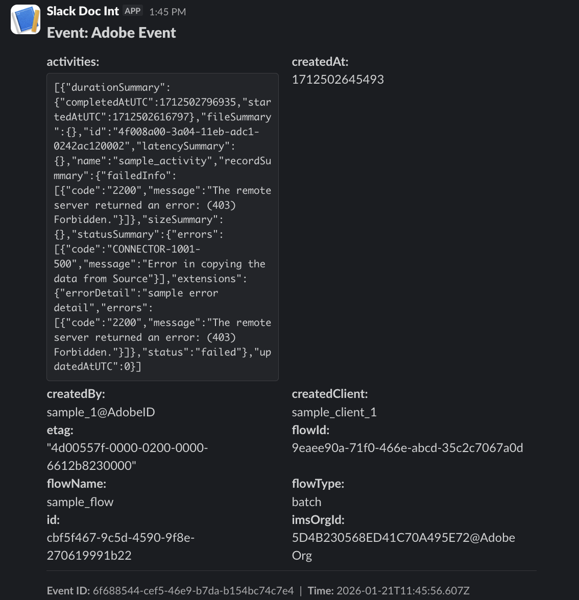

# Experience Platform-gebeurtenissen in Slack volgen

Leer hoe u Experience Platform-meldingen in Slack kunt ontvangen door te integreren met een Adobe App Builder-proxy voor webhaken. Gegevenstechnici en beheerders willen mogelijk proactieve meldingen in Slack van Adobe Experience Platform ontvangen om de status van hun platformimplementaties te controleren. In deze zelfstudie worden de architectuur- en implementatiestappen beschreven waarmee Adobe I/O Events via Adobe App Builder kan worden verbonden met Slack.


>[!VIDEO](https://video.tv.adobe.com/v/3480183?learn=on)

## Waarom een webhaakproxy?

Rechtstreeks verbinding maken van Adobe I/O Events met een Slack Incoming Webhaak is niet mogelijk vanwege een protocolprobleem in het verificatieproces.

* **de Uitdaging**: Wanneer u een webhaak met Adobe I/O Events registreert, verzendt Adobe een &quot;Uitdagingsverzoek&quot;verzoek (of a `GET` of `POST`) naar uw eindpunt. Uw eindpunt moet deze uitdaging met succes verwerken en de specifieke waarde terugkeren om eigendom te bevestigen.

* **de Beperking**: De Inkomende Webhooks van Slack worden ontworpen slechts om JSON nuttige lasten voor overseinen in te voeren. Ze hebben geen logica om de handshake voor de controle van Adobe te herkennen of erop te reageren.

* **de Oplossing**: Stel een intermediaire webshvolmacht op gebruikend Adobe App Builder. Deze proxy bevindt zich tussen Adobe en Slack aan:
   1. Neem het verzoek van Adobe op en reageer op de verificatieaanvraag.
   1. Maak de payload op in een Slack-compatibel bericht en stuur dit door naar Slack.

* **methode van de Levering**: Runtime Acties.  Runtimeacties worden verpakt met Adobe App Builder. Wanneer u een Runtime-actie (niet-webactie) gebruikt als gebeurtenishandler, verwerkt Adobe I/O Events automatisch de verificatie van handtekeningen en antwoorden op uitdagingen. Runtime de acties zijn de geadviseerde benadering aangezien het minder code vereist en ingebouwde veiligheid verstrekt.

## Overzicht van architectuur

### Wat is Adobe Developer Console?

Adobe Developer Console is het centrale portaal voor het beheer van uw Adobe-projecten, API&#39;s en gegevens. Dit is de locatie waar u uw project maakt, verificatie configureert en uw websites registreert.

### Wat is App Builder?

Adobe App Builder is een compleet raamwerk waarmee ontwikkelaars van ondernemingen cloudnative toepassingen kunnen ontwikkelen.

* **Levering**: App Builder wordt niet toegelaten door gebrek; het moet voor uw organisatie als eigenschap worden provisioned. Zorg ervoor dat uw organisatie de machtiging **[!DNL App Builder]** heeft.

* **Malplaatje van het Project**: De projecten van App Builder worden gecreeerd specifiek gebruikend het **[!UICONTROL App Builder]** malplaatje in [!DNL Developer Console] ([!UICONTROL Project from Template] > [!UICONTROL App Builder]). De sjabloon stelt automatisch de vereiste werkruimten en runtimeomgevingen in.

* **App Builder die Begonnen Gids** wordt: Verwijs naar de documentatie [&#x200B; aan voorziening en creeer uw eerste project van het malplaatje &#x200B;](https://developer.adobe.com/app-builder/docs/get_started/app_builder_get_started/first-app){target=_blank}.

### Wat is Adobe I/O Runtime?

Adobe I/O Runtime is het serverloze platform dat App Builder macht geeft. Het staat ontwikkelaars toe om code (Functions-as-a-Service) op te stellen die in antwoord op HTTP- verzoeken zonder het beheren van serverinfrastructuur loopt.

In deze implementatie, gebruiken wij een **Actie**. Een handeling is een stateless functie (geschreven in Node.js) die op de Adobe I/O Runtime wordt uitgevoerd. Onze actie fungeert als het openbare HTTP-eindpunt waar Adobe I/O Events het over heeft.

Voor meer informatie, zie de [&#x200B; documentatie van Adobe I/O Runtime &#x200B;](https://developer.adobe.com/runtime/){target=_blank}.

## Implementatiehandleiding

### Vereisten

Zorg ervoor dat u het volgende hebt voordat u begint:

* **de Toegang van Adobe Developer Console**: U moet toegang tot Admin van het Systeem of [&#x200B; rol van de Ontwikkelaar &#x200B;](../admin/add-developers.md) binnen een organisatie hebben die App Builder toegelaten heeft.

  >[!TIP]
  > Om App Builder levering te verifiëren, login [&#x200B; Adobe Developer Console &#x200B;](https://developer.adobe.com/console/){target=_blank}, zorg ervoor u in de gewenste organisatie bent, selecteer **[!UICONTROL Create project from template]**, en verifieer dat het malplaatje van App Builder beschikbaar is. Als het niet is, gelieve de sectie van FAQ van App Builder &quot;[&#x200B; te herzien hoe te App Builder &#x200B;](https://developer.adobe.com/app-builder/docs/intro_and_overview/faq#how-to-get-app-builder){target=_blank} krijgen&quot;


* **Node.js &amp; npm**: Dit project vereist Node.js, die NPM (de Manager van het Pakket van de Knoop) omvat. NPM wordt gebruikt om Adobe CLI te installeren en projectgebiedsdelen te beheren.

   * [&#x200B; Download Node.js (Aanbevolen versie LTS) &#x200B;](https://nodejs.org/){target=_blank}
   * [&#x200B; npm Begonnen Gids &#x200B;](https://docs.npmjs.com/downloading-and-installing-node-js-and-npm){target=_blank} - een gids op hoe te om uw installatie te verifiëren.

* **`aio CLI`**: Geïnstalleerd via uw terminal: `npm install -g @adobe/aio-cli`
* **de Configuratie van de Toepassing van Slack**: U hebt een opstelling van de Toepassing van Slack in uw werkruimte met **Inkomende WebHaak** geactiveerd nodig.

   * [&#x200B; creeer een app van Slack &#x200B;](https://api.slack.com/apps){target=_blank}
   * [&#x200B; Inkomende Gids van Webhooks van Slack &#x200B;](https://docs.slack.dev/messaging/sending-messages-using-incoming-webhooks/){target=_blank} - volg deze gids om uw app tot stand te brengen en WebHaak URL (begint met `https://hooks.slack.com/`..) te produceren.

### Stap 1: Een project maken in Adobe Developer Console

Maak eerst een project met de App Builder-sjabloon in Adobe Developer Console:

1. Logboek in [&#x200B; Adobe Developer Console &#x200B;](https://developer.adobe.com/console)
1. Selecteren **[!UICONTROL Create project from template]**
1. De App Builder-sjabloon selecteren
1. Voer een projecttitel in, bijvoorbeeld `Slack webhook integration`
1. Selecteren **[!UICONTROL Save]**

### De runtimeomgeving initialiseren

Voer de volgende opdrachten in uw terminal uit om de projectstructuur te maken:

#### Aanmelden bij `aio`

```
aio login
```

#### Stap 2: Initialiseer een nieuw App Builder-project

```
aio app init slack-webhook-proxy
```

1. Selecteer uw Organisatie en druk **binnen**
1. Selecteer het Project dat u in de vorige stap (bijvoorbeeld, `Slack webhook integration`) creeerde en druk **binnengaan**
1. Selecteer de optie **[!UICONTROL Only Templates Supported By My Org]**
1. Skip de steekproefsectie door **te drukken gaat** binnen
1. Wanneer ertoe aangezet, zorg ervoor dat de volgende componenten worden geselecteerd (de cirkel zou moeten worden ingevuld) en druk **binnengaan**:
   1. **[!UICONTROL Actions: Deploy Runtime actions]**
   1. **[!UICONTROL Events: Publish to Adobe I/O Events]**
   1. **[!UICONTROL Web Assets: Deploy to hosted static assets]**
1. Met uw &quot;Omhoog&quot;en &quot;Omlaag&quot;pijlen, navigeer de inkomende lijst en kies **[!UICONTROL Adobe Experience Platform: Realtime Customer Profile]** en druk **binnengaan**
1. **[!UICONTROL Generic]** acties worden automatisch gegenereerd
1. Kies **[!UICONTROL Pure HTML/JS]** voor UI en druk **binnen**
1. Houd **[!UICONTROL generic]** als steekproefactie om te tonen hoe te om tot een externe API naam toegang te hebben en **te drukken gaat** binnen
1. Houd **[!UICONTROL publish-events]** als naam van de steekproefactie om berichten in het formaat van wolkengebeurtenissen tot stand te brengen en **te drukken gaat** binnen

De initialisatie van uw app moet zijn voltooid.

#### Ga naar de projectmap

```
cd slack-webhook-proxy
```

#### De webactie toevoegen

```
aio app add action
```

1. Kies **[!UICONTROL Only Templates Supported By My Org]** en druk **binnen**
2. Zie de **[!UICONTROL publish-events]** actie in de lijst die wordt voorgesteld; druk **Ruimte** om de actie te selecteren. Als de cirkel naast de naam zoals aangetoond in het videoleerprogramma wordt gevuld, druk **binnengaan**
3. De handeling een naam geven `webhook-proxy`

### Stap 3: Werk de code van de volmachtsactie bij

Maak/wijzig het bestand `actions/webhook-proxy/index.js` in een IDE of teksteditor met de volgende code. Deze implementatie stuurt gebeurtenissen door naar Slack. Handtekeningverificatie en probleemverwerking zijn automatisch wanneer u de registratie van runtimeacties gebruikt.

```javascript
const fetch = require("node-fetch");
const { Core } = require("@adobe/aio-sdk");
 
/**
 * Adobe I/O Events to Slack Runtime Proxy
 *
 * Receives events from Adobe I/O Events and forwards them to Slack.
 * Signature verification and challenge handling are automatic when
 * using Runtime Action registration (non-web action).
 */
async function main(params) {
  const logger = Core.Logger("webhook-proxy", { level: params.LOG_LEVEL || "info" });
 
  try {
    logger.info(`Event received: ${JSON.stringify(params)}`);
 
    // Forward to Slack
    return forwardToSlack(params, params.SLACK_WEBHOOK_URL, logger);
 
  } catch (error) {
    logger.error(`Error: ${error.message}`);
    return { statusCode: 500, body: { error: "Internal server error" } };
  }
}
 
/**
 * Forwards the event payload to Slack
 */
async function forwardToSlack(payload, webhookUrl, logger) {
  if (!webhookUrl) {
    logger.error("SLACK_WEBHOOK_URL not configured");
    return { statusCode: 500, body: { error: "Server configuration error" } };
  }
 
  // Extract Adobe headers passed to runtime action
  const headers = {
    "x-adobe-event-code": payload["x-adobe-event-code"],
    "x-adobe-event-id": payload["x-adobe-event-id"],
    "x-adobe-provider": payload["x-adobe-provider"]
  };
 
  const slackMessage = buildSlackMessage(payload, headers);
 
  const response = await fetch(webhookUrl, {
    method: "POST",
    headers: { "Content-Type": "application/json" },
    body: JSON.stringify(slackMessage)
  });
 
  if (!response.ok) {
    const errorText = await response.text();
    logger.error(`Slack API error: ${response.status} - ${errorText}`);
    return { statusCode: response.status, body: { error: errorText } };
  }
 
  logger.info("Event forwarded to Slack");
  return { statusCode: 200, body: { success: true } };
}
 
/**
 * Builds a Slack Block Kit message from the event payload
 */
function buildSlackMessage(payload, headers) {
  // Adobe passes event code as x-adobe-event-code header (available in params for runtime actions)
  const eventType = headers["x-adobe-event-code"] ||
                    payload["x-adobe-event-code"] ||
                    payload.event_code ||
                    payload.type ||
                    payload.event_type ||
                    "Adobe Event";
  const eventId = headers["x-adobe-event-id"] || payload["x-adobe-event-id"] || payload.event_id || payload.id || "N/A";
  const eventData = payload.data || payload.event || payload;
 
  return {
    blocks: [
      {
        type: "header",
        text: { type: "plain_text", text: `Event: ${eventType}`, emoji: true }
      },
      {
        type: "section",
        fields: formatDataFields(eventData)
      },
      { type: "divider" },
      {
        type: "context",
        elements: [{
          type: "mrkdwn",
          text: `*Event ID:* ${eventId}  |  *Time:* ${new Date().toISOString()}`
        }]
      }
    ]
  };
}
 
/**
 * Formats event data as Slack mrkdwn fields
 */
function formatDataFields(data, maxFields = 10) {
  if (typeof data !== "object" || data === null) {
    return [{ type: "mrkdwn", text: `*Payload:*\n${String(data)}` }];
  }
 
  const entries = Object.entries(data);
  if (entries.length === 0) {
    return [{ type: "mrkdwn", text: "_No data provided_" }];
  }
 
  return entries.slice(0, maxFields).map(([key, value]) => ({
    type: "mrkdwn",
    text: `*${key}:*\n${typeof value === "object" ? `\`\`\`${JSON.stringify(value)}\`\`\`` : value}`
  }));
}
 
exports.main = main;
```

### Stap 4: Vorm de actie

De actieconfiguratie in `app.config.yaml` is essentieel. Gebruik Web: nee om een niet-Webactie tot stand te brengen die als Runtime Actie in Developer Console kan worden geregistreerd.

```yaml
application:
  runtimeManifest:
    packages:
      slack-webhook-proxy:
        license: Apache-2.0
        actions:
          webhook-proxy:
            function: actions/webhook-proxy/index.js
            web: no
            runtime: nodejs:22
            inputs:
              LOG_LEVEL: info
              SLACK_WEBHOOK_URL: $SLACK_WEBHOOK_URL
            annotations:
              require-adobe-auth: false
              final: true
```

#### Waarom `web: no?`

Wanneer u een niet-webactie gebruikt en registreert via de optie &quot;Runtime Action&quot; in de Developer Console, wordt Adobe I/O Events automatisch:

* Verwerkt controle van uitdagingen (zowel `GET` als `POST`)
* Hiermee worden digitale handtekeningen geverifieerd voordat de handeling wordt aangeroepen
* Hiermee wordt een handtekeningvalidatie-actie vóór uw handeling geketend

Dit betekent dat uw code slechts de bedrijfslogica (door:sturen aan Slack) moet behandelen.

### Stap 4: De omgevingsvariabelen bijwerken

Om geloofsbrieven veilig te beheren, gebruiken wij omgevingsvariabelen. Maak/wijzig het `.env` -bestand in de hoofdmap van uw project om de URL van de Slack-webhaak toe te voegen. Verborgen bestanden weergeven op uw systeem als het `.env` -bestand niet wordt weergegeven:

```
# ... other .env file content ...
 
SLACK_WEBHOOK_URL=https://hooks.slack.com/services/YOUR/WEBHOOK/URL
```

### Stap 5: De handeling implementeren

Zodra de milieuvariabelen worden geplaatst, stel de actie op. Zorg ervoor dat u zich in de hoofdmap van uw project bevindt, namelijk `slack-webhook-proxy`, wanneer u deze opdracht uitvoert in de terminal.

```
aio app deploy
```

Je actie wordt uitgevoerd naar Adobe I/O Runtime en is beschikbaar in de Developer Console voor registratie.

### Stap 6: De handeling registreren in Adobe Developer Console

Nu uw handeling is geïmplementeerd, registreert u deze als de bestemming voor Adobe Events.

1. Navigeer aan [&#x200B; Adobe Developer Console &#x200B;](https://developer.adobe.com/console){target=_blank} en open uw project van App Builder.
1. Kies uw **[!UICONTROL Workspace]**
1. Selecteer **[!UICONTROL Add Service]** en selecteer **[!UICONTROL Event]** .
1. Selecteer **[!UICONTROL Adobe Experience Platform]** als het product.
1. Selecteer **[!UICONTROL Platform Notifications]** als het type gebeurtenis.
1. Selecteer de specifieke gebeurtenissen (of alle gebeurtenissen) waarvan u een melding wilt ontvangen in Slack en selecteer **[!UICONTROL Next]** .
1. Selecteer of [&#x200B; creeer uw referentie OAuth &#x200B;](https://experienceleague.adobe.com/nl/docs/platform-learn/tutorials/api/platform-api-authentication){target=_blank}.
1. Configureer **[!UICONTROL Event registration details]**:
   1. **[!UICONTROL Registration Name]**: geef uw registratie een beschrijvende naam.
   1. **[!UICONTROL Registration Description]**: Zorg ervoor dat dit expliciet is, zodat andere contribuanten weten wat het doet.
   1. Selecteren **[!UICONTROL Next]**
   1. **[!UICONTROL Delivery Method]**: selecteer **[!UICONTROL Runtime Action]** (niet &quot;Webhaak&quot;).
   1. **[!UICONTROL Runtime Action]**: Kies `webhook-proxy` in het vervolgkeuzemenu (vernieuw de pagina als u deze niet ziet).
1. Selecteer **[!UICONTROL Save Configured Events]**.


### Stap 7: Valideren met een voorbeeldgebeurtenis

U kunt de volledige stroom van begin tot eind testen door het &quot;Send steekproefgebeurtenis&quot;pictogram naast om het even welke gevormde gebeurtenis te klikken.

De voorbeeldgebeurtenis wordt verzonden naar het kanaal dat u hebt geconfigureerd bij het maken van uw Slack-app en het maken van de webhaak. Er wordt iets gelijkaardigs weergegeven als:



Gefeliciteerd, u hebt Slack geïntegreerd met Experience Platform-gebeurtenissen!

### Vaak voorkomende problemen

Hier zijn sommige kwesties die u kunt lopen wanneer het vormen van de volmacht en sommige potentiële manieren om hen te richten.

* **Onbekwaam om IMS organismen** te zien: Als u uw lijst van IMS organen niet ziet wanneer het lopen `aio app init` probeer het volgende. Voer `aio logout` uit in uw Terminal, meld u af bij Experience Cloud in uw standaardwebbrowser en voer `aio login` opnieuw uit.
* **Actie die niet in dropdown** verschijnt: verzeker `web: no` wordt geplaatst in `app.config.yaml`. Alleen niet-webhandelingen worden weergegeven in het vervolgkeuzemenu Handeling bij uitvoering. Vernieuw de Developer Console-pagina na de implementatie.
* **ontbroken de verificatie van de Handtekening**: Als u dit in de activeringslogboeken ziet, betekent het dat ingebouwde validator van Adobe het verzoek verwierp. Dit moet niet gebeuren voor legitieme Adobe-gebeurtenissen. Controleer of de gebeurtenisregistratie correct is geconfigureerd.
* **Slack die geen berichten** ontvangt: Controle dat `SLACK_WEBHOOK_URL` correct in uw `.env` dossier wordt geplaatst en dat Slack app de Inkomende toegelaten Webhaak heeft.
* **onderbreking van de Actie**: De acties van Runtime hebben een onderbreking van 60 seconden. Als uw actie langer duurt, kunt u in plaats daarvan de benadering voor het opnemen van journalisten gebruiken.
