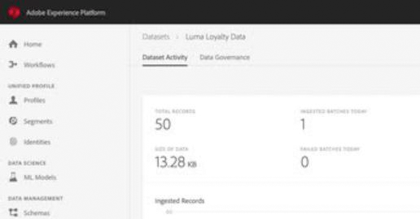

# Adobe Experience Platform-zelfstudies

Adobe Experience Platform is het krachtigste, meest flexibele en open systeem op de markt voor het ontwikkelen en beheren van volledige oplossingen die de ervaring van klanten stimuleren. Experience Platform stelt organisaties in staat om klantgegevens en -inhoud van elk systeem te centraliseren en te standaardiseren en datamateriaal en computerleren toe te passen om het ontwerp en de levering van rijke, gepersonaliseerde ervaringen drastisch te verbeteren. Gebruik deze video&#39;s en zelfstudies om de vele componenten van Experience Platform te leren.

## Personeelsselectie

<table style="margin-top: 0 !important">
<tr>
  <td>
    
    

      <a href="intro-to-platform/a-customer-experience-powered-by-experience-platform.md">
    <strong>Een klantervaring met Experience Platform</strong>
    </a>
    

    

    <em>Ontdek hoe Platform kan worden gebruikt om een klantervaring aan te zwengelen</em>
    

  </td>
  <td>
    
    

      <a href="https://experienceleague.adobe.com/docs/platform-learn/getting-started-for-data-architects-and-data-engineers/overview.html">
    <strong>Aan de slag met gegevensarchitecten en -engineers</strong>
    </a>
    

    

    <em>Aan de slag met handenoefeningen</em>
    

  </td>
  <td>
    
    

      <a href="sources/overview.md">
    <strong>Inzicht in bronconnectors</strong>
    </a>
    

    

    <em>Eenvoudig uw gegevens in te nemen</em>
    

  </td>
   <!--
   <td>
    
    

      <a href="data-ingestion/create-datasets-and-ingest-data.md">
    <strong>Create Datasets and Ingest Data</strong>
    </a>
    

    

    <em>Ingest your dataset.</em>
    

  </td>
  <td>
    
    

      <a href="segments/create-segments.md">
    <strong>Create Segments</strong>
    </a>
    

    

    <em>Build segments based on your data.</em>
    

  </td>-->
</tr>
</table>

