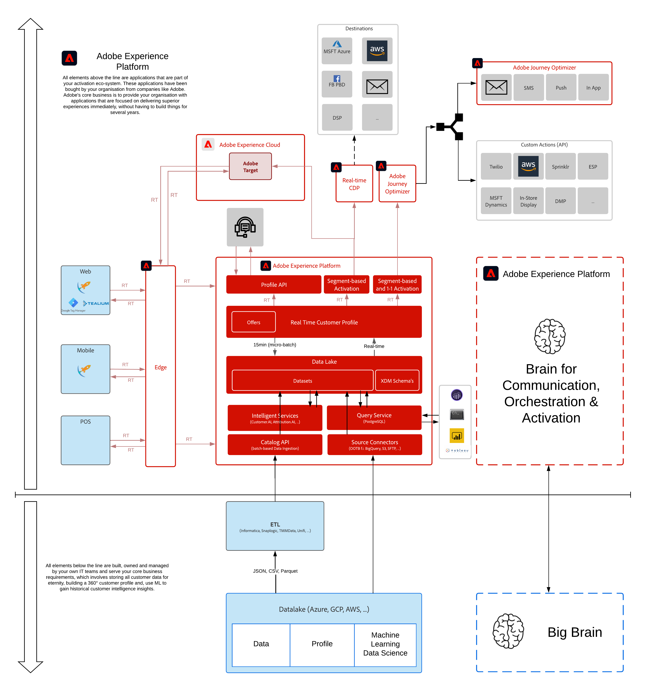

# Architectuur

## Leerdoelen

- Leer hoe u de architectuur achter Adobe Experience Platform beschrijft en deze zelfstudie
- Begrijp de positionering van Adobe Experience Platform in het ecosysteem van uw organisatie.

## YouTube

U vindt aanvullende interessante video&#39;s [op ons YouTube-kanaal](https://www.youtube.com/channel/UCUKG2dkZ9pYuZUPebQ21jUw).

## Overzicht van Adobe Experience Platform-architectuur

>[!VIDEO](https://video.tv.adobe.com/v/35266?quality=12&learn=on)

## Overzicht van architectuur

Hier is het beeld van whiteboard aangezien u het in de bovengenoemde video hebt gezien wordt gecreeerd:

Hier is de verbinding aan het document van Lucidchart dat u kunt kopiëren en hergebruiken indien gewenst:

[Luciddiagramarchitectuur](https://lucid.app/documents/view/69c2a0e4-9135-47d7-ae86-7f88cec9bc34)

[Terug naar alle modules](./overview.md)
