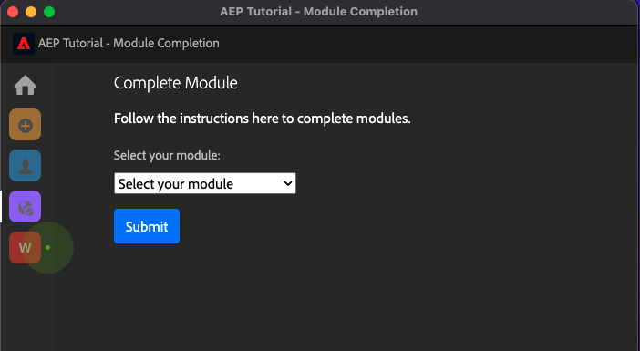

# Uitgebreide technische zelfstudie voor Adobe Experience Platform - Hoe wordt Voltooiing gemeten?

U kunt de voltooiing van de uitgebreide technische zelfstudie voor Adobe Experience Platform bijwerken met de Chrome-extensie die is gemaakt.

Na het volgen van de instructies in Module 0, ging u uw organisatie in **Configuratie-id** in de Chrome-extensie en u hebt zich aangemeld. Uw Chrome-extensie moet er nu zo uitzien. Klik op het paarse pictogram om de voltooiing van een module te verzenden.

U zult dan dit zien:

Door het vervolgkeuzemenu te openen, kunt u selecteren welke module u wilt voltooien:

Als u een module wilt voltooien, moet u een bewijs van voltooiing leveren.

Hieronder ziet u de verwachte voltooiingsproeven voor elke module.

## Aan de slag

Verwacht bewijs van voltooiing voor module **Aan de slag** is identiteitskaart van het project van het Systeem van de Demo voor Web dat u creeerde.

ID van het project van het Systeem van de Manifestatie voor Webformaat kijkt als dit: `--demoProfileLdap-- - OCUC`.

Selecteren **Aan de slag** in het vervolgkeuzemenu voert u uw **ID van het project van het Systeem van de Demo** en klik op de knop **Verzenden** - knop.

## Gegevensverzameling en web SDK

Verwacht bewijs van voltooiing voor module **Gegevensverzameling en web SDK** is de naam van het bezit van de Inzameling van Gegevens voor Web.

De naam van het bezit van de Inzameling van Gegevens voor Webformaat kijkt als dit: `--demoProfileLdap-- - Demo System (05/02/2022) (enablement) 1644046719474`.

Selecteren **Gegevensverzameling en web SDK** in het vervolgkeuzemenu voert u uw **Naam van eigenschap voor gegevensverzameling voor web** en klik op de knop **Verzenden** - knop.

## Gegevensinname

Verwacht bewijs van voltooiing voor module **Gegevensinname** is identiteitskaart van de Dataset voor de 2 datasets die u creeerde.

De indeling van de gegevensset-id ziet er als volgt uit: **5f069724723ef41916a8b5d2**.

`--demoProfileLdap-- - Demo System - Event Dataset for Website`

`--demoProfileLdap-- - Demo System - Profile Dataset for Website`

Selecteren **Gegevensinname** in het vervolgkeuzemenu voert u uw **Dataset-id** voor beide datasets in de inputgebieden en klik **Verzenden** - knop.

## Klantprofiel in realtime

Verwacht bewijs van voltooiing voor module **Klantprofiel in realtime** is de **Segment-id** van het segment dat u door UI creeerde, `--demoProfileLdap-- - Male customers with interest in Montana Wind Jacket`.

De indeling Segment-id ziet er als volgt uit: **8cb7034d-d4ae-4d26-a61f-a76559c12457**.

Selecteren **Klantprofiel in realtime** in het vervolgkeuzemenu voert u uw **Segment-id** in het invoerveld en klik op de knop **Verzenden** - knop.

## Query-service

Verwacht bewijs van voltooiing voor module **Query-service** is de gegevensset-id voor uw `--demoProfileLdap--_callcenter_interaction_analysis` - dataset die u na de voltooiing van de module krijgt.

De indeling ziet er als volgt uit: **62076f68f14a9d194995d4e2**.

Selecteren **Query-service** in het vervolgkeuzemenu voert u uw **Dataset-id** in het invoerveld en klik op de knop **Verzenden** - knop.

## Intelligente services

Verwacht bewijs van voltooiing voor module **Intelligente services** is de id voor je **Propensiteit voor aanschaf van product - AI-service van klant**.

De indeling ziet er als volgt uit: **12729** en u kunt het van URL terugwinnen wanneer het openen van uw dienst.

Selecteren **Intelligente services** in het vervolgkeuzemenu voert u uw **AI-service-id van klant** in het invoerveld en klik op de knop **Verzenden** - knop.

## Real-Time CDP

Verwacht bewijs van voltooiing voor module **Real-Time CDP** is de id van uw **Adobe Target-activiteit**.

De indeling ziet er als volgt uit: **11804**.

Selecteren **Real-Time CDP** in het vervolgkeuzemenu voert u uw **Adobe Target Activity ID** in het invoerveld en klik op de knop **Verzenden** - knop.

## AJO: Orchestratie

Verwacht bewijs van voltooiing voor module **AJO: Orchestratie** is de eventID voor uw `--demoProfileLdap--AccountCreationEvent`.

De indeling ziet er als volgt uit: **227402c540eb8f8855c6b2333adf6d54d7153d9d7d56fa475a686081c5747 16**.

Selecteren **AJO: Orchestratie** in het vervolgkeuzemenu typt u de ** eventID** in het invoerveld en klikt u op de knop **Verzenden** - knop.

## AJO: Aangepaste handelingen

Verwacht bewijs van voltooiing voor module **AJO: Aangepaste handelingen** is de eventID voor uw gebeurtenis `--demoProfileLdap--GeofenceEntry`.

De indeling ziet er als volgt uit: **fa42ab7982ba55f039eacec24c1e32e5c51b310c67f0fa55ab49b89b63f4934**.

Selecteren **AJO: Aangepaste handelingen** in het vervolgkeuzemenu voert u uw **eventID** in het invoerveld en klik op de knop **Verzenden** - knop.

## AJO: Aanbiedingen

Verwacht bewijs van voltooiing voor module **AJO: Aanbiedingen** is de id van de **Beslissing voorstel** die u hebt gemaakt.

U kunt de **Beslissings-ID voorstel**, die er zo uitziet **xcore:offer-activity:1122fcc4603ea499**, hier:

Selecteren **AJO: Aanbiedingen** in het vervolgkeuzemenu voert u uw **Beslissings-ID voorstel** in het invoerveld en klik op de knop **Verzenden** - knop.

## AJO: Gebeurtenissen

Verwacht bewijs van voltooiing voor module **AJO: Gebeurtenissen** is de eventID voor uw `--demoProfileLdap--StoreEntryEvent`.

De indeling ziet er als volgt uit: **e3a8f0bdc0b609667cd96a72a6b1e5aafa0ddaf6ccf121c574e6a2030860a633**.

Selecteren **AJO: Gebeurtenissen** in het vervolgkeuzemenu voert u uw **eventID** in het invoerveld en klik op de knop **Verzenden** - knop.

## CJA

Verwacht bewijs van voltooiing voor module **CJA** is de id van uw project `--demoProfileLdap-- - Omnichannel Analysis`.

De indeling ziet er als volgt uit: **6217344f6249ac70c726db60**, kunt u het in URL vinden wanneer u uw project hebt geopend.

Selecteren **CJA** in het vervolgkeuzemenu voert u uw **Project-id** in het invoerveld en klik op de knop **Verzenden** - knop.

## CJA: BigQuery

Verwacht bewijs van voltooiing voor module **CJA: BigQuery** is de id van uw **BigQuery**-connection.

U kunt de **BigQuery Connection-id**, die er zo uitziet **85a2394d-8b94-410c-a239-4d8b94b10c38**, hier:

Selecteren **CJA: BigQuery** in het vervolgkeuzemenu voert u uw **BigQuery Connection-id** in het invoerveld en klik op de knop **Verzenden** - knop.

## RTCDP: EventHub

Verwacht bewijs van voltooiing voor module **RTCDP: EventHub** is de id van uw **Microsoft Azure Event Hub** bestemming in Adobe Experience Platform.

U kunt de **Microsoft Azure Event Hub Destination ID**, die er zo uitziet **fa3f7ce5-86fd-4096-bf7c-e586fdc096ba**, hier:

Selecteren **RTCDP: EventHub** in het vervolgkeuzemenu voert u uw **Microsoft Azure Event Hub Destination ID** in het invoerveld en klik op de knop **Verzenden** - knop.

## RTCDP-verbindingen

Verwacht bewijs van voltooiing voor module **RTCDP-verbindingen** is uw **Id van eigenschap voor doorsturen van gebeurtenis**.

U kunt de **Id van eigenschap voor doorsturen van gebeurtenis**, die er zo uitziet **PR40f44184c88472e9c19d8d602aab0de**, hier:

Selecteren **RTCDP-verbindingen** in het vervolgkeuzemenu voert u uw **Id van eigenschap voor doorsturen van gebeurtenis** in het invoerveld en klik op de knop **Verzenden** - knop.

## Apache Kafka

Verwacht bewijs van voltooiing voor module **Apache Kafka** is identiteitskaart van uw bronschakelaar `--demoProfileLdap-- - Kafka`.

De id ziet er zo uit **f843d50a-ee30-4ca8-a766-0e4f3d29a2f7** en je kunt het hier vinden:

Selecteren **Apache Kafka** in het vervolgkeuzemenu voert u uw **Stroom-id** in het invoerveld en klik op de knop **Verzenden** - knop.

[Terug naar alle modules](./overview.md)
