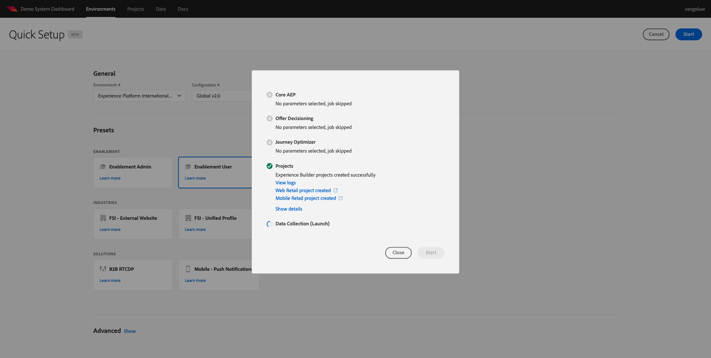

# 0.2 Het Systeem van de Demo van het Gebruik naast opstelling uw de cliëntbezit van de Inzameling van Gegevens van Adobe Experience Platform

Nadat u zich hebt aangemeld voor de uitgebreide technische zelfstudie voor Adobe Experience Platform, is er een geautomatiseerd proces dat u toegang biedt tot het demosysteem, zodat u de onderstaande configuratie kunt openen en uitvoeren.

Als u toegang hebt tot het demosysteem, gaat u verder met de onderstaande stappen.

Ga naar [https://dashboard.adobedemo.com/](https://dashboard.adobedemo.com/). Selecteer uw sandbox en klik op **Snelle installatie**.

Dit ziet u:

Onder **Algemeen** - **Omgeving** selecteert u in dit geval uw Adobe Experience Platform-instantie en sandbox:

- **Experience Platform International**
- **aepenablementfy22**
- Configuratie: Selecteer **Globaal v2.0**

Selecteer vervolgens de voorinstelling **Gebruiker inschakelen** en klik op **Start**.

In popup, ga een naam voor uw bezit van de Inzameling van Gegevens in. Gebruik deze naamgevingsconventie: **Demosysteem (DD/MM/JJJJ)**. FYI: de LDAP wordt automatisch toegevoegd, u hoeft deze niet zelf toe te voegen.

Klikken **Start**.

Deze pop-up toont u de voortgang tijdens het maken van uw website en mobiele app-projecten en de eigenschappen van uw gegevensverzameling.

Zodra het snelle opstellingsproces heeft voltooid, zult u hebben:

- 1 Web Retail-project, dat het mogelijk maakt een demo-website te gebruiken met het Luma-demo-merk
- 1 Mobile Retail-project, dat het mogelijk maakt een mobiele demo-app te gebruiken met het Luma-demo-merk
- 1 CX App Retail-project, dat het mogelijk maakt een callcenter en een clienteling-app te gebruiken met het Luma-demo-merk
- 1 eigenschap Gegevensverzameling voor web, dat u gaat gebruiken om gegevens van de website te verzamelen
- 1 eigenschap voor gegevensverzameling voor mobiele apparaten, die u gebruikt om gegevens te verzamelen van de mobiele app

Zorg dat dit scherm open blijft, zoals u het in de volgende stappen nodig hebt.

Volgende stap: [0.3 Maak uw gegevensstroom](./ex3.md)

[Ga terug naar module 0](./getting-started.md)

[Terug naar alle modules](./../../overview.md)
